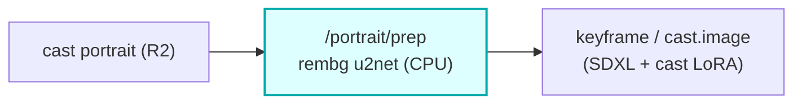

# image-prep

A CPU **HTTP container** reached over Workers VPC: **rembg (u2net) background removal** for cast
portraits. The Worker presigns an R2 GET (source portrait) + PUT (cleaned PNG) and POSTs both to
`/portrait/prep`; the container strips the background, optionally composites onto black, and PUTs the
result. Stateless and credentialless -- image bytes never touch the Worker, CPU-only onnxruntime, no R2
binding (presign keeps credentials on the Worker).

## Where it fits

It cleans cast reference portraits **before** they condition the keyframe / `cast.image` path. A clean
cutout makes the SDXL + cast-LoRA keyframe (and the cloud-keyframe reference conditioning) sharper than a
busy-background portrait would. The core's bundle assembler calls `IMAGE_PREP_VPC` when preparing cast
portraits, ahead of keyframe generation.

## HTTP contract

| Route | Method | Purpose |
|---|---|---|
| `/health` | GET | readiness (`{ok:true}`); the u2net model is warmed at boot before `:8000` binds |
| `/portrait/prep` | POST | strip background -> cleaned PNG (optional black composite) |

`/portrait/prep` body: `{ sourceUrl (presigned GET), outputUrl (presigned PUT), composite? }` ->
`{ ok, ... }`. Failures return as data (`{ ok: false, error }`).

## DSP

rembg `u2net` background removal on onnxruntime (CPU); optional composite onto a black matte; PNG out.
The model is baked into the image and warmed before the port-ready probe so the container never reports
healthy before it can serve.

## Memory: why this container buffers, when the others stream

`audio-master`, `audio-mix` and `video-finish` all stream their uploads from a file handle, because
each writes a produced artifact to disk first and a Cloudflare Container has no swap: reading a
film-length artifact into a `bytes` before the PUT restarts the instance, and the ephemeral work dir
dies with it, so the job fails as though it never ran (cf#802, #808, cf#814).

`/portrait/prep` is the deliberate exception, and it is kept that way on purpose.

- **It has no file to stream from.** rembg produces the cleaned PNG in memory and the route PUTs
  that buffer directly; nothing is ever written to disk. Streaming here would mean spilling the
  result to a temp file solely so it could be read back, which is a redesign of the route, not the
  call-site swap the audio containers took.
- **The buffer is bounded, and by a small number.** The download is capped at `MAX_INPUT_BYTES`
  (32 MB) and rejects with 413 the moment the running total crosses it, so the request body cannot
  grow unbounded. The subject is a single cast reference portrait, which in practice is a few MB.
  Peak is on the order of the input plus its decoded bitmap plus the output PNG, all one image --
  not a function of film length, which is what makes the audio and video paths dangerous.
- **It is not on the no-swap path today.** `wrangler.toml.example` binds only `video-finish` to
  Cloudflare Containers. This container runs as a compose service on a host with real swap.

The residual, stated rather than hidden: `MAX_INPUT_BYTES` bounds the COMPRESSED bytes, and the
decoded bitmap is a function of pixel dimensions, so a small, highly compressed image still decodes
large. That is a decode-time bound this container does not have; it is a separate question from the
upload shape cf#814 closed, and it is not fixed here.

## Operations

- compose service `image-prep` on `127.0.0.1:8781:8000`, `vivijure` network.
- Binding: `IMAGE_PREP_VPC` on the core. Service host name MUST match the compose service name.
- Deploy on your container host: `docker compose -p vivijure-media -f containers/compose.yaml up -d --build image-prep`;
  health: `curl http://127.0.0.1:8781/health`.

## Soft-degrade

A prep failure falls back to the original portrait (the keyframe path still runs, just without the clean
cutout); recorded, never silent.

## License

**AGPL-3.0-only.** A labor of love, given freely: use it, learn from it, self-host it, build your own creative visions on it. Run it as a network service and the AGPL has you share your changes back, so it stays a commons. It is not for sale, and not to be resold as a SaaS.
