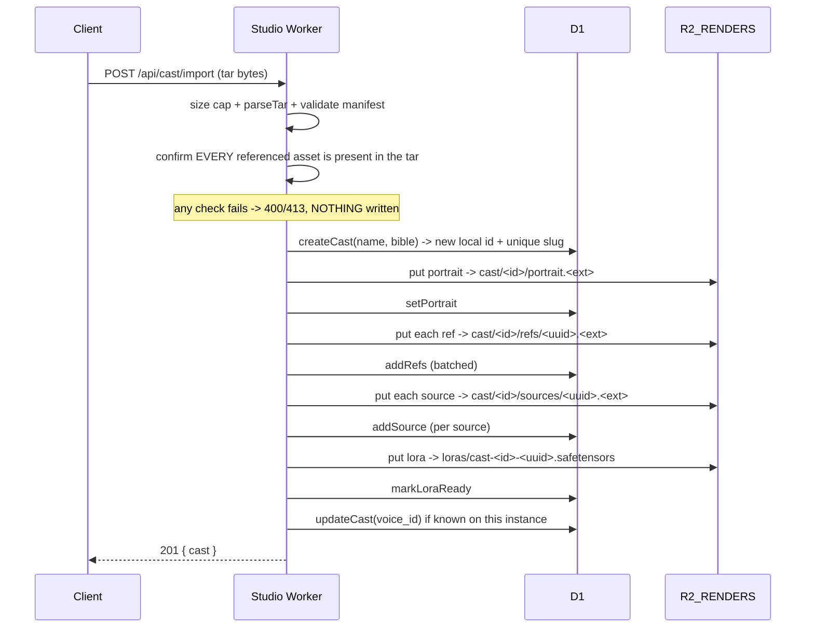

# Cast Bundle: portable cast import / export (ICD)

This document is the **complete** interface-control reference for the vivijure cast **bundle** format
and its two endpoints (issue #324). It is authored to the aviation standard: a reader reproduces the
ENTIRE bundle contract from this file alone, never needing to open a `.ts` file. The companion
endpoints are also catalogued in `docs/CONTRACT.md`; this file is the deep reference for the bundle
itself.

## Purpose

A cast member is a whole character: a portrait, a reference-image training set, the raw human source
photos, a trained LoRA, the bible/persona text, and a dialogue voice. A **cast bundle** packages all
of that into ONE portable file so a character can be shared between users and moved between instances
(the same way AI-art communities share LoRAs), enabling a community cast ecosystem.

## Design decisions (and why)

| Decision | Choice | Rationale |
| --- | --- | --- |
| Coupling | **Identity-free** | The bundle carries the CHARACTER only: no user, tenant, instance id, or source R2 key. Asset paths are bundle-relative and re-keyed on import. Preserves the single-operator / anti-SaaS model and lets a bundle move freely. |
| LoRA artifact (~50MB) | **Inline** (not a hosted URL) | A by-reference bundle dies when the exporting instance or its URL goes away. Inline keeps the bundle fully self-contained and reproducible offline. Cost: size, bounded by the import cap. |
| Container | **Uncompressed USTAR tar** (`.vvcast`) | A documented, universally-readable standard (inspect with `tar tf cast.vvcast`, no vivijure tooling); zero runtime dependency; the payload (safetensors + png/webp/jpeg) is already compressed, so gzip would add CPU + a dep for ~no win. |
| Schema | **Versioned manifest** | `schema_version` lets future fields land without breaking old bundles; an unknown `format` or a newer-than-supported `schema_version` fails LOUD. |
| Attribution | Optional `creator` field | Free-form, advisory; supports licensing/credit for shared casts without coupling to any identity system. |

## Bundle layout

A `.vvcast` file is a plain tar. `manifest.json` is **always the first entry** so a reader (today
in-memory, a streaming parser tomorrow) gets metadata before any asset bytes.

```
manifest.json             <- first entry; schema-versioned
assets/portrait.<ext>     <- 0 or 1
assets/refs/<i>.<ext>     <- 0..N (the LoRA training set)
assets/sources/<i>.<ext>  <- 0..N (raw human photos)
assets/lora.safetensors   <- 0 or 1 (the trained LoRA, inline)
```

`<ext>` is derived from each asset's MIME (`png` / `jpg` / `webp`; the LoRA is always
`.safetensors`). Tar headers use a fixed `mtime` of 0, so a given cast serializes to byte-identical
headers (reproducible export).

## `manifest.json` schema (v1)

```jsonc
{
  "format": "vivijure-cast-bundle",   // REQUIRED, exact string; anything else is rejected
  "schema_version": 1,                // REQUIRED integer; > current supported -> rejected
  "exported_at": "2026-06-24T22:00:00.000Z", // optional, ISO 8601 (informational)
  "creator": null,                    // optional attribution string, or null
  "cast": {
    "name": "Nova the Pilot",         // REQUIRED non-empty
    "slug": "nova-the-pilot",         // advisory only; importer re-allocates a locally-unique slug
    "bible": "A weary ace ...",       // string or null
    "voice_id": "luna",               // Aura-1 speaker id, or null; unknown-on-import -> dropped
    "lora_status": "ready",           // idle | training | ready | failed (informational)
    "lora_trained_at": "2026-01-01"   // string or null (informational)
  },
  "assets": {
    "portrait": { "path": "assets/portrait.png", "mime": "image/png" },     // or null
    "refs":    [ { "path": "assets/refs/0.png", "mime": "image/png" } ],     // array (may be empty)
    "sources": [ { "path": "assets/sources/0.jpg", "mime": "image/jpeg" } ], // array (may be empty)
    "lora":    { "path": "assets/lora.safetensors", "mime": "application/octet-stream" } // or null
  }
}
```

Every asset object is `{ path, mime }`. `path` MUST name an entry that physically exists in the tar
(import verifies this up front). `mime` is advisory for the importer's key extension; a missing
`mime` defaults to `application/octet-stream`.

## Endpoints

### `GET /api/cast/export/:id` (also accepts `POST`)

Stream cast `:id` as a `.vvcast` bundle. **GET is canonical** (side-effect-free download; the UI can
use a plain `<a download>` link). `POST` is also routed to the same handler to match the verb named
in issue #324.

- **200** -> body is the tar; headers:
  - `Content-Type: application/x-tar`
  - `Content-Disposition: attachment; filename="<slug>.vvcast"`
  - `Cache-Control: no-store`
- **404** `{ "error": "cast not found" }` -- no such cast id.

The export STREAMS each asset straight from R2 (the LoRA is never fully buffered in the Worker).

**Honest soft-degrade:** if a referenced artifact has vanished from R2 (e.g. a partially GC'd cast),
it is DROPPED from both the tar and the manifest with a `console.warn`, never a 500. The manifest
stays truthful about what the bundle actually contains (no fake reference to absent bytes).

### `POST /api/cast/import`

Body: the raw `.vvcast` tar bytes (`Content-Type` is not enforced; the bytes are magic-validated via
the manifest). Recreates the cast on THIS instance.

- **201** `{ "cast": <CastMember>, "imported_from_schema": <int> }` -- the newly created cast.
- **400** `{ "error": "..." }` -- malformed bundle (see below).
- **413** `{ "error": "bundle too large (... > ... cap)" }` -- body exceeds `CAST_BUNDLE_MAX_IMPORT_BYTES` (80 MB).

Import sequence:



**Re-keying:** every asset is written under fresh keys scoped to the new local id; the exporter's
keys never leak in. The LoRA is preserved under the `loras/` prefix so the LoRA picker
(`cast-loras.ts`) reuses it and the imported cast renders identically.

**Voice:** a `voice_id` is persisted only if THIS instance's TTS knows it; an unknown voice from
another instance is dropped (with a warn), never persisted (it would poison the dialogue path).

### Failure model (malformed = LOUD)

A bundle is a contract, so bad input fails loud BEFORE any D1/R2 write -- there is no half-import:

| Condition | Status | Message (substring) |
| --- | --- | --- |
| empty body | 400 | `empty bundle body` |
| body over the cap | 413 | `bundle too large` |
| not a readable tar | 400 | `not a readable tar bundle` |
| no `manifest.json` | 400 | `bundle missing manifest.json` |
| manifest not valid JSON | 400 | `not valid JSON` |
| `format` not `vivijure-cast-bundle` | 400 | `not a vivijure cast bundle` |
| `schema_version` missing / non-integer | 400 | `schema_version missing` |
| `schema_version` newer than supported | 400 | `newer than this instance supports` |
| `cast.name` missing/empty | 400 | `cast.name missing` |
| `assets` missing | 400 | `assets missing` |
| manifest references an asset absent from the tar | 400 | `no such entry` |

## Limits and future work

- **Import size cap:** `CAST_BUNDLE_MAX_IMPORT_BYTES = 80 MB`. The import parses the tar in memory,
  so the cap keeps it within a Worker's memory budget. A realistic single cast (portrait + ~10 refs +
  a few sources + one ~50MB LoRA) is well under it. Over-cap is rejected loud, never truncated.
- **Streaming import** is the documented upgrade path if casts ever outgrow the cap (export already
  streams).
- **Partial-import cleanup:** validation runs before any write, so malformed bundles create nothing.
  If a mid-import infrastructure error (e.g. an R2 put failure) interrupts a *valid* import, the
  partially created cast can be removed via the normal `DELETE /api/cast/:id` path
  (which reclaims its R2 artifacts).

## Source map

| Concern | File |
| --- | --- |
| Tar container (writer/reader) | `@skyphusion-labs/vivijure-core/tar` |
| Manifest types, validate, export, import | `src/cast-bundle.ts` |
| Route wiring + handlers | `src/index.ts` (`hExportCast`, `hImportCast`) |
| Tests | `tests/tar.test.ts`, `tests/cast-bundle.test.ts` |
