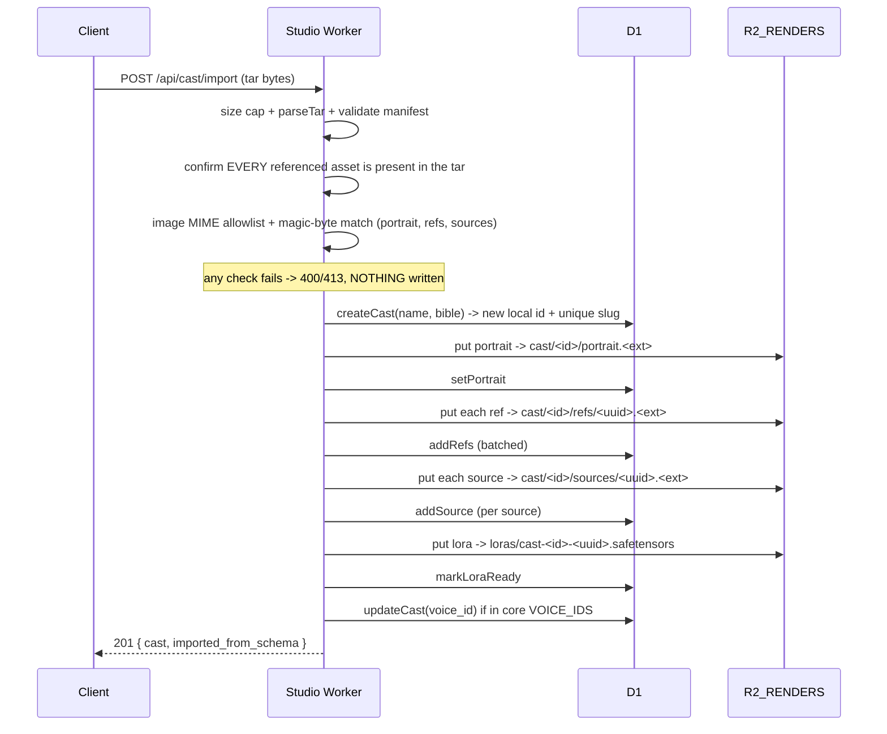

# Cast Bundle: portable cast import / export (ICD)

This document is the **complete** interface-control reference for the vivijure cast **bundle** format
and its two endpoints (issue #324). It is authored to the aviation standard: a reader reproduces the
ENTIRE bundle contract from this file alone, never needing to open a `.ts` file. The companion
endpoints are also catalogued in `docs/CONTRACT.md`; this file is the deep reference for the bundle
itself.

## Purpose

A cast member is a whole character: a portrait, a reference-image training set, the raw human source
photos, a trained LoRA, the bible/persona text, and a dialogue voice. A **cast bundle** packages all
of that into ONE portable file so a character can be shared between users and moved between instances
(the same way AI-art communities share LoRAs), enabling a community cast ecosystem.

## Design decisions (and why)

| Decision | Choice | Rationale |
| --- | --- | --- |
| Coupling | **Identity-free** | The bundle carries the CHARACTER only: no user, tenant, instance id, or source R2 key. Asset paths are bundle-relative and re-keyed on import. Preserves the single-operator / anti-SaaS model and lets a bundle move freely. |
| LoRA artifact (~50MB) | **Inline** (not a hosted URL) | A by-reference bundle dies when the exporting instance or its URL goes away. Inline keeps the bundle fully self-contained and reproducible offline. Cost: size, bounded by the import cap. |
| Container | **Uncompressed USTAR tar** (`.vvcast`) | A documented, universally-readable standard (inspect with `tar tf cast.vvcast`, no vivijure tooling); zero runtime dependency; the payload (safetensors + png/webp/jpeg) is already compressed, so gzip would add CPU + a dep for ~no win. |
| Schema | **Versioned manifest** | `schema_version` lets future fields land without breaking old bundles; an unknown `format` or a newer-than-supported `schema_version` fails LOUD. |
| Attribution | Optional `creator` field | Free-form, advisory; supports licensing/credit for shared casts without coupling to any identity system. Today export always writes `creator: null`, and import reads it (preferring `cast.creator`, then top-level `creator`) but does NOT persist it anywhere; it is not present on the imported cast. |

## Bundle layout

A `.vvcast` file is a plain tar. `manifest.json` is **always the first entry** so a reader (today
in-memory, a streaming parser tomorrow) gets metadata before any asset bytes.

```
manifest.json             <- first entry; schema-versioned
assets/portrait.<ext>     <- 0 or 1
assets/refs/<i>.<ext>     <- 0..N (the LoRA training set)
assets/sources/<i>.<ext>  <- 0..N (raw human photos)
assets/lora.safetensors   <- 0 or 1 (the trained LoRA, inline)
```

`<ext>` is derived from each asset's MIME (`png` / `jpg` / `webp`; the LoRA is always
`.safetensors`). Tar headers use a fixed `mtime` of 0, so a given cast serializes to byte-identical
headers (reproducible export).

## `manifest.json` schema (v1)

```jsonc
{
  "format": "vivijure-cast-bundle",   // REQUIRED, exact string; anything else is rejected
  "schema_version": 1,                // REQUIRED integer; > current supported -> rejected
  "exported_at": "2026-06-24T22:00:00.000Z", // optional, ISO 8601 (informational)
  "creator": null,                    // optional attribution string, or null (export always writes null;
                                      //   import accepts cast.creator or top-level creator, persists neither)
  "cast": {
    "name": "Nova the Pilot",         // REQUIRED non-empty
    "slug": "nova-the-pilot",         // advisory only; importer re-allocates a locally-unique slug
    "bible": "A weary ace ...",       // string or null
    "voice_id": "luna",               // Aura-1 speaker id, or null; not in core VOICE_IDS on import -> dropped
    "lora_status": "ready",           // idle | training | ready | failed (informational)
    "lora_trained_at": "2026-01-01"   // string or null (informational)
  },
  "assets": {
    "portrait": { "path": "assets/portrait.png", "mime": "image/png" },     // or null
    "refs":    [ { "path": "assets/refs/0.png", "mime": "image/png" } ],     // array (may be empty)
    "sources": [ { "path": "assets/sources/0.jpg", "mime": "image/jpeg" } ], // array (may be empty)
    "lora":    { "path": "assets/lora.safetensors", "mime": "application/octet-stream" } // or null
  }
}
```

Every asset object is `{ path, mime }`. `path` MUST name an entry that physically exists in the tar
(import verifies this up front). A missing (or non-string) `mime` defaults to
`application/octet-stream`.

`mime` is **enforced** for the image assets (`portrait`, every `refs[]`, every `sources[]`): the
claimed type (parameters after `;` ignored, case-insensitive) must match
`^image/(png|jpe?g|webp)$` (`image/jpg` is normalized to `image/jpeg`), AND the entry's bytes must
sniff (magic bytes) as that same png / jpeg / webp type. Any mismatch fails the import with 400
before anything is written (see the failure table). The normalized MIME picks the stored key
extension and R2 `contentType`. For the `lora` asset `mime` is advisory only: it is not checked, and
the LoRA is always stored as `.safetensors` with `contentType: application/octet-stream`.

`refs` / `sources` may be absent or `null` (treated as empty); `portrait` / `lora` may be absent or
`null`. A present `refs` / `sources` that is not an array, or any asset entry that is not an object
with a string `path`, is rejected with 400.

## Endpoints

### `GET /api/cast/export/:id` (also accepts `POST`)

Export cast `:id` as a `.vvcast` bundle. `:id` is the cast member's opaque **public id** (the `id`
field of every cast API response), never the internal integer row id. **GET is canonical** (side-effect-free download; the UI can
use a plain `<a download>` link). `POST` is also routed to the same handler to match the verb named
in issue #324.

- **200** -> body is the tar; headers:
  - `Content-Type: application/x-tar`
  - `Content-Disposition: attachment; filename="<slug>.vvcast"`
  - `Cache-Control: no-store`
- **404** `{ "error": "cast member" }` -- `:id` is not a well-formed public id, or no cast has it
  (the route's public-id resolver rejects it before the export runs). The export function's own
  `{ "error": "cast not found" }` 404 is reachable only if the row disappears between resolution
  and read.

The export does **not** stream today: each present asset is read fully from R2 into Worker memory
(the LoRA included), and the whole tar is then assembled in memory before the response is returned.
Export memory is therefore roughly the bundle size (see "Limits and future work").

**Honest soft-degrade:** if a referenced artifact has vanished from R2 (e.g. a partially GC'd cast),
it is DROPPED from both the tar and the manifest with a `console.warn`, never a 500. The manifest
stays truthful about what the bundle actually contains (no fake reference to absent bytes).

### `POST /api/cast/import`

Body: the raw `.vvcast` tar bytes (`Content-Type` is not enforced; the bytes are magic-validated via
the manifest). Recreates the cast on THIS instance.

- **201** `{ "cast": <PublicCast>, "imported_from_schema": <int> }` -- the newly created cast, in the
  same public projection every cast endpoint returns (`id` is the opaque public id, the internal
  integer id is never exposed; plus the additive `sdxl_lora_ready` / `wan_lora_ready` booleans).
  `imported_from_schema` is the bundle manifest's `schema_version`.
- **400** `{ "error": "..." }` -- malformed bundle (see below).
- **413** `{ "error": "bundle too large (... > ... cap)" }` -- body exceeds `CAST_BUNDLE_MAX_IMPORT_BYTES` (80 MB).
  The cap is checked against the body length AFTER the whole request body has been read into memory;
  there is no `Content-Length` pre-check.

Import sequence:


```mermaid
sequenceDiagram
    participant C as Client
    participant W as Studio Worker
    participant D as D1
    participant R as R2_RENDERS
    C->>W: POST /api/cast/import (tar bytes)
    W->>W: size cap + parseTar + validate manifest
    W->>W: confirm EVERY referenced asset is present in the tar
    W->>W: image MIME allowlist + magic-byte match (portrait, refs, sources)
    Note over W: any check fails -> 400/413, NOTHING written
    W->>D: createCast(name, bible) -> new local id + unique slug
    W->>R: put portrait -> cast/<id>/portrait.<ext>
    W->>D: setPortrait
    W->>R: put each ref -> cast/<id>/refs/<uuid>.<ext>
    W->>D: addRefs (batched)
    W->>R: put each source -> cast/<id>/sources/<uuid>.<ext>
    W->>D: addSource (per source)
    W->>R: put lora -> loras/cast-<id>-<uuid>.safetensors
    W->>D: markLoraReady
    W->>D: updateCast(voice_id) if in core VOICE_IDS
    W-->>C: 201 { cast, imported_from_schema }
```

**Re-keying:** every asset is written under fresh keys scoped to the new local id; the exporter's
keys never leak in. The LoRA is preserved under the `loras/` prefix so the LoRA picker
(`resolveCastLoras` in `@skyphusion-labs/vivijure-core/cast-loras`) reuses it and the imported cast renders identically.

**Voice:** a `voice_id` is persisted only if it is in the static Aura-1 speaker catalog shipped in
`@skyphusion-labs/vivijure-core/voices` (`VOICE_IDS`, checked with `isValidVoiceId`; the same list
`PATCH /api/cast/:id` accepts). There is no live query of the TTS provider. Any other value is
dropped (with a warn that logs a label, never the value), never persisted (it would poison the
dialogue path).

### Failure model (malformed = LOUD)

A bundle is a contract, so bad input fails loud BEFORE any D1/R2 write -- there is no half-import:

| Condition | Status | Message (substring) |
| --- | --- | --- |
| empty body | 400 | `empty bundle body` |
| body over the cap | 413 | `bundle too large` |
| not a readable tar | 400 | `not a readable tar bundle` |
| no `manifest.json` | 400 | `bundle missing manifest.json` |
| manifest not valid JSON | 400 | `not valid JSON` |
| `format` not `vivijure-cast-bundle` | 400 | `not a vivijure cast bundle` |
| `schema_version` missing / non-integer | 400 | `schema_version missing` |
| `schema_version` newer than supported | 400 | `newer than this instance supports` |
| `cast.name` missing/empty | 400 | `cast.name missing` |
| manifest is not a JSON object | 400 | `bundle manifest is not an object` |
| `assets` missing | 400 | `assets missing` |
| `assets.refs` / `assets.sources` present but not an array | 400 | `bundle asset list is not an array` |
| an asset entry is not an object with a string `path` | 400 | `bundle asset entry missing path` |
| manifest references an asset absent from the tar | 400 | `no such entry` |
| image asset `mime` not png/jpeg/webp | 400 | `<label>: mime <type> not allowed (png/jpeg/webp only)` |
| image asset bytes are not png/jpeg/webp | 400 | `<label>: bytes are not a recognizable png/jpeg/webp image` |
| image asset bytes sniff as a different type than `mime` | 400 | `<label>: claimed mime <type> does not match content (<sniffed>)` |

`<label>` is `bundle portrait`, `bundle ref <path>`, or `bundle source <path>`. The image checks run
on the portrait first, then refs, then sources; the first failure is returned.

## Limits and future work

- **Import size cap:** `CAST_BUNDLE_MAX_IMPORT_BYTES = 80 MB`. The import parses the tar in memory.
  The cap is enforced only after the full request body has been read (`req.arrayBuffer()`); there is
  no `Content-Length` pre-check, so an oversized body is still fully buffered before it is rejected.
  The cap bounds what the parse and R2 writes work on, not the initial read. A realistic single cast
  (portrait + ~10 refs + a few sources + one ~50MB LoRA) is well under it. Over-cap is rejected loud,
  never truncated.
- **Export has no size cap** and buffers every asset plus the assembled tar in memory.
- **Streaming export and streaming import** are the documented upgrade path if casts ever outgrow the
  in-memory approach (neither streams today). `manifest.json` is already written as the first tar
  entry so a streaming reader can get metadata before asset bytes.
- **Partial-import cleanup:** validation runs before any write, so malformed bundles create nothing.
  If a mid-import infrastructure error (e.g. an R2 put failure) interrupts a *valid* import, the
  partially created cast can be removed via the normal `DELETE /api/cast/:id` path
  (which reclaims its R2 artifacts).

## Source map

| Concern | File |
| --- | --- |
| Tar container (writer/reader) | `@skyphusion-labs/vivijure-core/tar` |
| Manifest types, validate, export, import | `src/cast-bundle.ts` |
| Image MIME allowlist + magic-byte sniff | `src/cast-media.ts` (`resolveCastImageMime`) |
| Public cast projection | `src/cast-public.ts` (`toPublicCast`) |
| Voice catalog | `@skyphusion-labs/vivijure-core/voices` (`VOICE_IDS`, `isValidVoiceId`) |
| Route wiring + handlers | `src/index.ts` (`hExportCast`, `hImportCast`, `resolveCastId`) |
| Tests | `tests/tar.test.ts`, `tests/cast-bundle.test.ts` |
