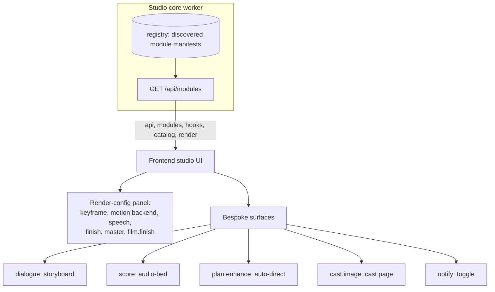
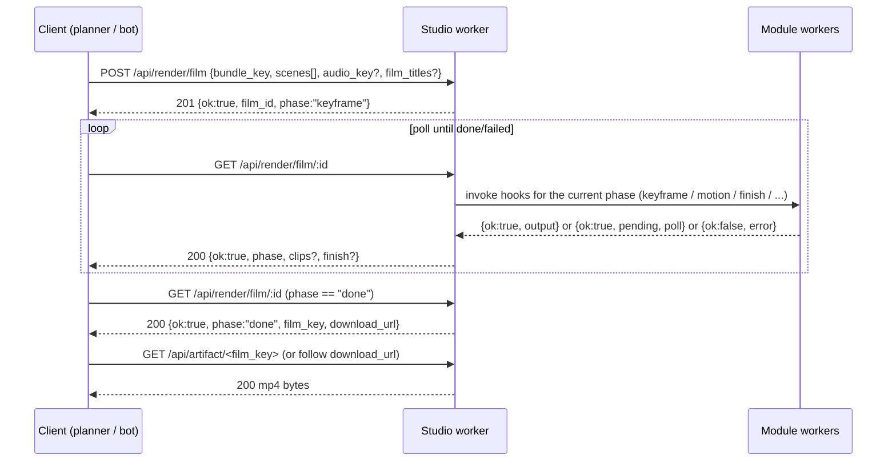
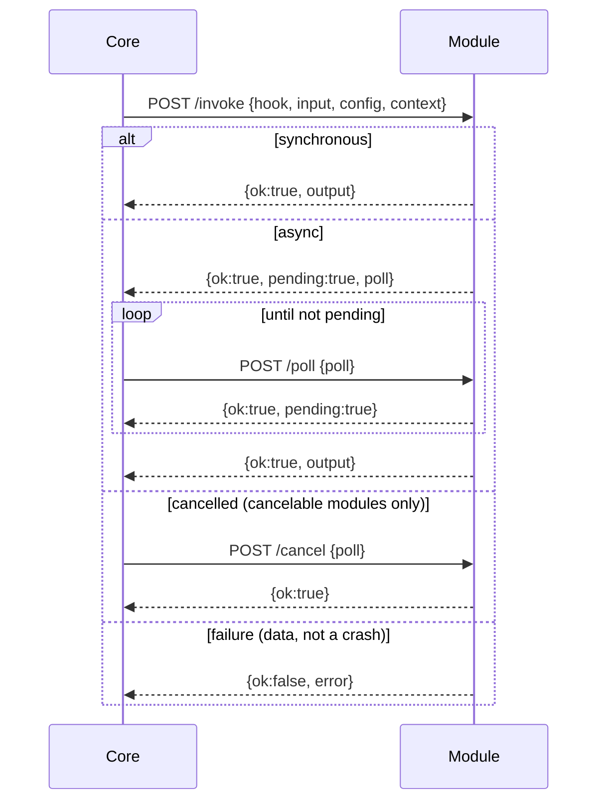
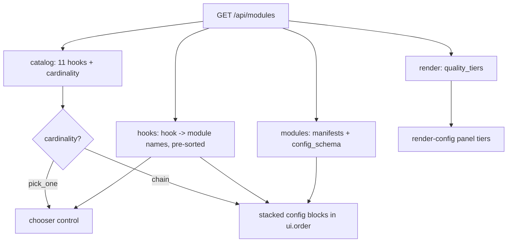
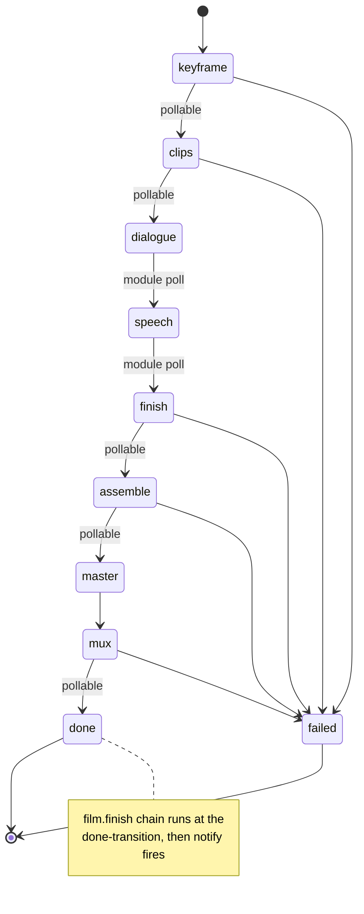

# Vivijure Studio: Frontend <-> Backend Contract (ICD)

This document is the **complete** interface-control reference for the Vivijure Studio worker. It is
authored to the aviation standard: **total coverage, no omissions.** Every HTTP route, every request
and response field (required AND optional), every enum value, every default, every status/error code,
every hook input/output, every manifest field, and the rules that turn the registry into the UI are
documented here. Where something is intentionally undocumented-by-design (internal-only topology), it
says so explicitly rather than omit.

The test of this document: a reader reproduces the ENTIRE contract schema from CONTRACT.md alone,
never once needing to open a `.ts` file.

> ## MAINTAINER RULE (read first)
>
> **This doc is the source of truth, and changes cannot bypass it.** Any change to the contract --
> a new route, a new hook, a new field, a new manifest config type, a new enum value, a changed
> default -- MUST be made in this document **in the same PR** as the typed source change. The contract
> evolves only through the doc and the typed sources moving together, never silently in code.
>
> The reason is resilience, not bureaucracy: **no one should be the person that knowledge dies with.**
> The doc IS the institutional memory, so no single head is a point of failure. See section 0.

Contract version: **`vivijure-module/2`** (the `MODULE_API` constant). It bumps only on a breaking
change to the hook or manifest shapes. The host accepts only the currently-supported epoch
(`SUPPORTED_MODULE_APIS` = {`vivijure-module/2`}); the `/1` deprecation window has CLOSED (#294), so a
`/1` module is now rejected at registration.

**Epoch history**
- **`/1` -> `/2`** (the identity strip): `user_email` removed from `NotifyInput` and `InvokeContext`.
  The studio is single-operator; identity was legacy multi-tenant cruft and a SaaS seam, so it is
  removed by design (anti-SaaS by architecture). Every first-party module has since migrated to `/2` and
  the `/1` window is now CLOSED (#294), so `/1` is no longer in `SUPPORTED_MODULE_APIS`; the notify
  recipient lives in the notify-email module's OWN config (`notify_email`), not in any core-sent field.

Conventions in this doc:
- "R2 key" = an object key in the `R2_RENDERS` bucket (the studio's render store).
- "presigned GET / PUT" = a time-limited signed URL the core mints so a module (or a browser) can
  fetch / upload an R2 object directly without bucket credentials.
- A field name suffixed `?` is optional. "req" column: yes = required, no = optional.
- A double hyphen `--` stands in for a dash (house style: no em/en dashes, including in diagrams).
- Unless a route documents otherwise, every JSON request body that fails to parse returns
  `400 { "error": "invalid JSON body" }`, and every numeric `:id` that is not a positive integer
  returns `400 { "error": "invalid id" }`. A successful body is JSON with
  `content-type: application/json; charset=utf-8`.

---

## 0. Contract versioning & change control

**Why this section exists.** "You document it, you change control it, because no one should be the
person that knowledge dies with." The contract is institutional memory. The version + the change
rules below are how the contract stays true over time without depending on any single person's head.

### 0.1 The version

- **`vivijure-module/2`** is the current contract version, carried as the `MODULE_API` constant and
  echoed on the wire in `GET /api/modules.api` and in every module manifest's `api` field; the `/1`
  window is closed (see Epoch history).
- It covers: the 11 hook names + their cardinality, every hook's Input/Output shape, the module
  manifest schema (including the `ConfigField` union), the invoke/poll envelopes, and the
  `GET /api/modules` projection payload.
- It bumps to a NEW epoch (the next `/N`) ONLY on a breaking change to those shapes (a removed/renamed
  hook, a changed required field, a changed envelope -- e.g. the `/1` -> `/2` `user_email` removal).
  Additive changes (a new optional field, a new hook, a new module) do NOT bump it; they are
  forward-compatible within the current epoch.

### 0.1.1 Supported versions (the deprecation window)

The host loads any module whose `api` is in `SUPPORTED_MODULE_APIS` -- currently `{ vivijure-module/2 }`
-- checked by `validateManifest` (the registry gate) and the conformance harness via `.has()`. The set
is what makes a version bump a DEPRECATION WINDOW rather than a hard cutover:

- When the contract moved to `/2` (the identity strip), `/1` was kept in the set so the ~28 first-party
  modules still declaring `/1` kept loading and serving while they migrated -- runtime-compatible because
  none read the removed `user_email`, and a `/2` host simply sends none.
- That migration is now COMPLETE: every first-party module declares `/2`, so `/1` was removed from
  `SUPPORTED_MODULE_APIS` (#294) and the window is CLOSED. A module still declaring `/1` is now rejected.
- The set (vs the older exact-match gate `m.api !== MODULE_API`) is what expressed that migration -- a
  `/2` host under the exact-match gate would have rejected all 28 `/1` modules at once instead.

Only an api NOT in the set is rejected (`unsupported api ...`).

### 0.2 How the contract evolves (the mechanics)

Each kind of change moves the same set of artifacts together, in one PR, with this doc:

| Change | Typed-source edits (all in the same PR as this doc) |
|--------|-----------------------------------------------------|
| **New hook** | Add to `HookName` union + `HOOK_NAMES` + `HOOK_CARDINALITY` + `HOOK_BLURBS`; add a named `XInput` / `XOutput` interface in `src/modules/types.ts`; add a branch to `HOOK_OUTPUT_CHECKS` in `src/modules/conformance.ts` (tsc's `Record<HookName, ...>` FORCES this, so a missing branch fails the typecheck gate); orchestrate it; add a section here. |
| **New manifest config field type** | Add to the `ConfigField` union in `src/modules/types.ts`; add to `FIELD_TYPES` + a `checkConfigField` branch in `src/modules/conformance.ts`; document it in section 4.1 here. |
| **New config field scope** | Add to the `ConfigScope` union in `src/modules/types.ts`; add to `FIELD_SCOPES` in `src/modules/conformance.ts`; if it needs a new value source, wire it into the invoke path; document it in section 4.1.1 here. |
| **New / changed API route** | Add to `API_ROUTES` (or the inline dispatch) in `src/index.ts` with its handler; document the full request/response schema + status codes in section 2 here. |
| **New hook field** | Add to the `XInput`/`XOutput` interface; if required, add to the conformance validator; update the field table here. |
| **New render quality tier / render projection field** | Edit `QUALITY_TIERS` / `RenderConfigProjection` in `src/render-module-config.ts`; update section 2.2.1 / 2.2 here. |

The `Record<HookName, ...>` maps (`HOOK_CARDINALITY`, `HOOK_BLURBS`, `HOOK_OUTPUT_CHECKS`) are the
enforcement spine: TypeScript will not compile if a hook is added to the union without filling in
every map, so a new hook cannot ship half-wired.

### 0.3 Governance

- **Conventional Commits**: `feat(...)`, `fix(...)`, `docs(...)`, etc. The body explains the WHY; the
  footer lists files touched.
- **PRs are reviewed** before merge; the crew lead integrates. A contract change without the matching
  CONTRACT.md update in the same PR is incomplete and should be sent back.
- **SemVer + tag-gated deploy**: studio releases are SemVer `vX.Y.Z`; the studio deploys ONLY on a
  SemVer tag. PATCH for fixes / backend-only tweaks, MINOR for new features.
- **The promise:** because the typed sources are the law (tsc gates them) and this doc must move with
  them in the same reviewed PR, the contract cannot drift silently. If it is not in this doc, it is
  not in the contract.

---

## 1. Overview: the module-host model

Vivijure Studio is **not** a monolith. It is a thin **module host**: a Cloudflare Worker that owns
the render API, the planner/cast UI, and job orchestration, plus a typed **hook contract** that
opt-in **module workers** plug into. The core invokes hooks; it does not know who answers. Each
module is a separate Worker that:

1. Serves `GET /module.json` -- its **manifest** (which hooks it serves, its config knobs, UI hints).
2. Serves `POST /invoke` -- the single entry point the core calls to run a hook.
3. Optionally serves `POST /poll` -- for async (long-running) work.
4. Optionally serves `POST /cancel` (and sets `cancelable: true`) -- to STOP an in-flight async job
   so a cancelled render or a stall-recovery adopt never orphans the GPU (#327 / #328).

The core discovers modules from its env bindings, fetches each manifest, and builds a **registry**.

> **The frontend is a projection of the registry.** The studio UI does not hardcode the pipeline. It
> reads `GET /api/modules` and renders the panels, choosers, and config controls from that payload.
> Install a module (bind it) and it appears in the UI; remove it and it disappears. One source of
> truth (the registry); the frontend is a view of it.



There are **11 hooks** (extension points). A hook is either:
- **`pick_one`** -- exactly one installed module serves it (rendered as a chooser), or
- **`chain`** -- every installed module serving it runs in order, each consuming the previous output
  (rendered as stacked config blocks).

A module failure is **data, never an exception across the wire**: a module returns `{ ok: false }`
and the core degrades; it does not crash. Polish steps (finish, speech, score, master, film.finish)
soft-degrade (pass their input through honestly with a `degraded` reason) rather than fail the
render. Only malformed I/O fails loud.

### 1.1 Auth model

The studio is **single-operator and identity-free**. There is no per-user/tenant scoping anywhere:
all data is global to the one operator, and no route reads an identity field. Auth gating is enforced
by the studio auth gate -- the built-in token gate in-worker by default (`AUTH_MODE = "token"`), or
Cloudflare Access at the edge as optional hardening. `/api/whoami` returns a fixed studio identity and
does NOT echo any caller email (no identity leak). Per-operator settings (`/api/prefs`)
are a global singleton. The `notify` hook carries completion facts only -- the email recipient lives
in the notify-email module's OWN config, not in any core-sent field. (The legacy per-user ownership
key was removed in the identity strip; see Epoch history above.)

---

## 2. HTTP API routes (frontend -> backend)

### 2.0 Dispatch + global behavior

- `GET /health` and `GET /api/modules` are handled inline (before the route table).
- Studio HTML/JS/CSS pages are served from the `ASSETS` binding for `GET`/`HEAD` (static assets, not
  part of the API contract).
- All other API routes dispatch through the `API_ROUTES` table (method + path pattern -> handler).
- Path patterns use `:param` (one URL segment, percent-decoded) and `*param` (greedy trailing
  catch-all that captures the rest of the path, slashes included -- used for R2 keys). A pattern with
  no star must match the path segment count exactly; a star pattern matches when the path has at
  least as many segments.
- Errors: a handler throwing an `HttpError` returns `{ "error": "<message>" }` with that status
  (`badRequest` -> 400, `notFound` -> 404). Some handlers return a non-throw error body directly
  (e.g. `503`, `422`, `502`, `504`); those are documented per route. Any other uncaught error returns
  `500 { "error": "internal error" }`.
- A `:id` that addresses a film job is the `film-<...>` string id; a `:jobId` may be `film-*` or
  `scatter-*`. Render-library / cast / project ids are opaque public ids (UUID strings); cast
  lookups additionally accept the internal numeric row id (#576).
- No route requires a request auth field (see 1.1).

### 2.1 Full route enumeration

Every route the worker serves. The detail subsection for each follows in 2.2+. (Count: 64.)

**Resource ids (`:id`).** `storyboard_projects`, `cast_members`, and `renders` are addressed by an
**opaque public id** -- a UUID v4 minted per row (migration `0010_public_ids.sql`, S9/F13), never the
internal sequential integer PK. Every `:id` route on these three resources accepts ONLY the public id
(a bare integer matches no row and 404s), and the API returns it as `id` -- and, on a RenderRow, as the
referenced `project_id` / `parent_id` (the FKs are resolved to their referents' public ids). Job ids
(`/api/render/film/:id`, `/api/render/clips/:id`, `/api/job/:id`) are already opaque job UUIDs and are
unchanged.

| # | Method | Path | Detail |
|---|--------|------|--------|
| 1 | GET | `/health` | 2.2 |
| 2 | GET | `/api/modules` | 2.3 |
| 3 | GET | `/api/voices` | 2.4 |
| 4 | GET | `/api/storyboard/projects` | 2.5 |
| 5 | POST | `/api/storyboard/projects` | 2.5 |
| 6 | GET | `/api/storyboard/projects/:id` | 2.5 |
| 7 | PATCH | `/api/storyboard/projects/:id` | 2.5 |
| 8 | POST | `/api/storyboard/projects/:id/storyboard` | 2.5 |
| 9 | DELETE | `/api/storyboard/projects/:id` | 2.5 |
| 10 | GET | `/api/cast` | 2.6 |
| 11 | POST | `/api/cast` | 2.6 |
| 12 | GET | `/api/cast/:id` | 2.6 |
| 13 | PATCH | `/api/cast/:id` | 2.6 |
| 14 | DELETE | `/api/cast/:id` | 2.6 |
| 15 | POST | `/api/cast/:id/portrait` | 2.7 |
| 16 | DELETE | `/api/cast/:id/portrait` | 2.7 |
| 17 | POST | `/api/cast/:id/ref` | 2.7 |
| 18 | DELETE | `/api/cast/:id/ref` (or `/refs/*refKey`) | 2.7 |
| 19 | POST | `/api/cast/:id/source` | 2.7 |
| 20 | DELETE | `/api/cast/:id/source` (or `/source/*sourceKey`) | 2.7 |
| 21 | POST | `/api/cast/:id/generate-refs` | 2.8 |
| 22 | GET | `/api/cast/:id/refs-job/:jobId` | 2.8 |
| 23 | POST | `/api/cast/:id/train-lora` | 2.9 |
| 24 | GET | `/api/cast/:id/lora-status` | 2.9 |
| 25 | POST | `/api/upload` | 2.10 |
| 26 | GET | `/api/artifact/*key` | 2.11 |
| 27 | POST | `/api/storyboard/preflight` | 2.12 |
| 28 | POST | `/api/storyboard/plan` | 2.13 |
| 29 | POST | `/api/storyboard/refine` | 2.13 |
| 30 | POST | `/api/chat` | 2.13 |
| 31 | POST | `/api/storyboard/score-bed` (alias `/music-generate`) | 2.14 |
| 32 | GET | `/api/job/:id` | 2.14 |
| 33 | POST | `/api/storyboard/enhance` | 2.15 |
| 34 | GET | `/api/storyboard/models` | 2.16 |
| 35 | POST | `/api/storyboard/yaml` | 2.16 |
| 36 | POST | `/api/storyboard/markers` | 2.16 |
| 37 | POST | `/api/storyboard/bundle` | 2.16 |
| 38 | POST | `/api/storyboard/audio-upload` | 2.10 |
| 39 | POST | `/api/storyboard/character-ref` | 2.10 |
| 40 | POST | `/api/audio/analyze` | 2.17 |
| 41 | POST | `/api/storyboard/render` | 2.18 |
| 42 | POST | `/api/storyboard/render-plan` | 2.18 |
| 43 | POST | `/api/render/clips` | 2.19 |
| 44 | GET | `/api/render/clips/:id` | 2.19 |
| 45 | POST | `/api/render/film` | 2.20 |
| 46 | GET | `/api/render/film/:id` | 2.21 |
| 47 | POST | `/api/storyboard/renders/:id/regen-shot` | 2.22 |
| 48 | POST | `/api/storyboard/render/scatter` | 2.23 |
| 49 | POST | `/api/storyboard/render-from-keyframes` | 2.18 |
| 50 | GET | `/api/storyboard/render/:jobId` | 2.24 |
| 51 | DELETE | `/api/storyboard/render/:jobId` | 2.24 |
| 52 | GET | `/api/storyboard/renders` | 2.25 |
| 53 | GET | `/api/storyboard/renders/tags` | 2.25 |
| 54 | PATCH | `/api/storyboard/renders/:id` | 2.25 |
| 55 | DELETE | `/api/storyboard/renders/:id` | 2.25 |
| 56 | POST | `/api/storyboard/renders/:id/add-audio` | 2.26 |
| 57 | POST | `/api/storyboard/renders/:id/add-narration` | 2.26 |
| 58 | POST | `/api/storyboard/renders/:id/finalize` | 2.27 |
| 59 | POST | `/api/storyboard/renders/:id/animate-cloud` | 2.27 |
| 60 | POST | `/api/storyboard/renders/:id/animate-hybrid` | 2.27 |
| 61 | POST | `/api/storyboard/renders/adopt` | 2.28 |
| 62 | GET | `/api/whoami` | 2.29 |
| 63 | GET | `/api/prefs` | 2.29 |
| 64 | PATCH | `/api/prefs` | 2.29 |
| 65 | GET | `/api/modules/:name/config` | 4.1.2 |
| 66 | PATCH | `/api/modules/:name/config` | 4.1.2 |
| 67 | GET/POST | `/api/cast/export/:id` | 2.9a |
| 68 | POST | `/api/cast/import` | 2.9a |

### 2.2 GET /health

**Request:** none. **Response 200:** `{ "ok": true, "service": "vivijure-studio", "phase": 1 }`.

### 2.3 GET /api/modules -- the projection payload

The single payload the frontend renders the whole pipeline from. Unauthenticated-safe: the internal
env `binding` that serves each hook is **stripped** (info-disclosure guard, #18). Cached 60s per
isolate (a refresh storm does not re-fetch every module manifest).

**Request:** no params, no body.

**Response 200** (`ModulesResponse`):

| Field | Type | Meaning |
|-------|------|---------|
| `api` | `"vivijure-module/2"` | Contract version (the `/1` window is closed; `/2` only). |
| `modules` | `PublicModule[]` | Every installed module's manifest, **minus** `binding`. Each is the manifest shape from section 4. |
| `hooks` | `{ [hook]: string[] }` | Map of hook name -> module **names** serving it, **pre-sorted** in canonical `ui.order` then name order (section 5). The frontend consumes this verbatim and never re-sorts. A hook with no installed module is absent from the map. |
| `catalog` | `HookCatalogEntry[]` | Every hook (independent of what is installed): `{ name, blurb, cardinality }`. |
| `render` | `RenderConfigProjection` | Core-owned render config: `{ quality_tiers: { value, label, blurb }[], default_tier }`. See 2.3.1. |

`HookCatalogEntry`: `{ name: HookName, blurb: string, cardinality: "pick_one" | "chain" }`.
`PublicModule` = the `ModuleManifest` (section 4) with `binding` removed.

#### 2.3.1 render.quality_tiers (canonical values)

Sourced from `QUALITY_TIERS` / `DEFAULT_QUALITY_TIER`. `default_tier` = `"final"`.

| value | label | blurb |
|-------|-------|-------|
| `draft` | draft | fastest, lowest quality (reference cloud backend: 33 frames, 8 steps) |
| `standard` | standard | balanced (reference cloud backend: 8-step keyframes + 20-step EasyCache i2v) |
| `final` | final | production quality (reference cloud backend: 97 frames, 22 steps) |

> The tier is a QUALITY LADDER, not a universal frame-count contract. The concrete numbers above are
> the reference cloud backend's; a tier moves quality (steps) and each backend maps it its own way -- the
> `own-gpu` motion backend renders `frames = fps x planned_seconds` (the tier moves steps, not frames), and
> a fixed-grid backend declares a `duration_grid` (module-api.md). The DELIVERED truth per shot is always
> `clip_deliveries` on the film summary (2.21), never inferred from the tier blurb (#746).

### 2.4 GET /api/voices

**Request:** none.
**Response 200:** `{ "voices": { "id": string, "label": string }[] }`.

The catalog is the Aura-1 speakers, in this stable order (the `id` values): `angus`, `asteria`,
`arcas`, `orion`, `orpheus`, `athena`, `luna`, `zeus`, `perseus`, `helios`, `hera`, `stella`. The
cast voice picker renders from this; one source of truth. These 12 ids are the **only** valid
`voice_id` values (see cast PATCH, 2.6).

### 2.5 Storyboard projects

Responses are wrapped by resource name: list -> `{ projects: [...] }`, item -> `{ project: {...} }`.
The persisted row is `StoryboardProject` (Appendix A.2).

| Route | Body | Response | Errors |
|-------|------|----------|--------|
| GET `/api/storyboard/projects` | none | `200 { projects: StoryboardProject[] }` | -- |
| POST `/api/storyboard/projects` | `{ name (req), prefs? }` | `201 { project }` | 400 if `name` missing |
| GET `/api/storyboard/projects/:id` | none | `200 { project }` | 404 if unknown |
| PATCH `/api/storyboard/projects/:id` | `{ name?, prefs?, storyboard? }` | `200 { project }` | 404 if unknown |
| POST `/api/storyboard/projects/:id/storyboard` | `{ storyboard (req) }` | `200 { project }` | 400 if `storyboard` missing; 404 if unknown |
| DELETE `/api/storyboard/projects/:id` | none | `200 { ok: true, deleted: <id> }` | 404 if unknown |

PATCH note: if `storyboard` is present it is saved as the project's last storyboard; otherwise `name`
/ `prefs` are updated. `storyboard` is opaque to this route (validated only at preflight / render).

### 2.6 Cast members

Responses wrapped: list -> `{ cast: [...] }`, item -> `{ cast: {...} }`. The persisted row is
`CastMember` (Appendix A.1).

| Route | Body | Response | Errors |
|-------|------|----------|--------|
| GET `/api/cast` | none | `200 { cast: CastMember[] }` | -- |
| POST `/api/cast` | `{ name (req), bible? }` | `201 { cast }` | 400 if `name` missing |
| GET `/api/cast/:id` | none | `200 { cast }` | 404 if unknown |
| PATCH `/api/cast/:id` | `{ name?, bible?, voice_id? }` | `200 { cast }` | 400 if `voice_id` invalid; 404 if unknown |
| DELETE `/api/cast/:id` | none | `200 { ok: true, deleted: <id> }` | 404 if unknown |

`voice_id` validation: `null` or `""` clears it; otherwise it MUST be one of the 12 voice ids (2.4),
else `400 { "error": "voice_id must be one of: angus, asteria, ..." }`. `bible` may be `null`.

### 2.7 Cast media (portrait / ref / source)

Each of these registers an image onto a cast member. The request body is one of three forms:
1. **Raw binary** -- the body IS the image bytes; `Content-Type` is the image mime.
2. **Staged key** -- JSON `{ key, mime }` referencing an already-uploaded R2 object (from `/api/upload`).
3. **Chat artifact copy** -- JSON `{ from_chat_artifact: <key> }` to copy a chat-generated image in.

| Route | Purpose | Response |
|-------|---------|----------|
| POST `/api/cast/:id/portrait` | Set the portrait (the identity seed). | `200 { cast }` |
| DELETE `/api/cast/:id/portrait` | Clear the portrait (deletes the R2 object best-effort). | `200 { cast }` |
| POST `/api/cast/:id/ref` | Add a LoRA training reference image. | `200 { cast }` |
| DELETE `/api/cast/:id/ref` | Remove a reference; body `{ key }` OR path `/refs/*refKey`. | `200 { cast }` |
| POST `/api/cast/:id/source` | Add a human-uploaded source photo (extra conditioning). | `200 { cast }` |
| DELETE `/api/cast/:id/source` | Remove a source; body `{ key }` OR path `/source/*sourceKey`. | `200 { cast }` |

Errors: `400` on a missing key (DELETE with neither body `key` nor path key), `404` on an unknown
cast member.

### 2.8 Cast ref generation (the `cast.image` hook)

Async run/poll across requests (a multi-image set cannot finish in one request). POST starts the job;
GET advances + polls it.

**POST `/api/cast/:id/generate-refs`** -- start. Body:

| Field | Type | Req | Meaning |
|-------|------|-----|---------|
| `config` | object | no | Module config overrides (clamped against the `cast.image` module's `config_schema`). |
| `art_style` | string | no | Art-style lead (e.g. `"anime"`); blank keeps the photographic templates. |
| `source_keys` | string[] | no | R2 keys of human-uploaded source photos (extra conditioning). |
| `choice` | string | no | Module selection when several `cast.image` modules are installed. |

**GET `/api/cast/:id/refs-job/:jobId`** -- advance + poll.

Both respond `200 { ok: true, ...CastRefsSummary }` (POST: `201`). `CastRefsSummary`:

| Field | Type | Meaning |
|-------|------|---------|
| `job_id` | string | The ref-generation job id. |
| `cast_id` | number | The cast member. |
| `phase` | `"generating" \| "done" \| "failed"` | Job phase. |
| `module?` | string | The `cast.image` module that ran. |
| `registered` | number | Count of generated images registered onto the member so far. |
| `images` | `{ key, mime }[]` | The generated reference images (R2 keys + mime). |
| `error?` | string | Set when `phase === "failed"`. |

Errors: `404` if the cast member (POST) or job (GET) is unknown.

### 2.9 Cast LoRA training

| Route | Body | Response | Errors |
|-------|------|----------|--------|
| POST `/api/cast/:id/train-lora` | `{ renderOverrides? }` | `200 { ok: true, jobId, status, statusRaw, bundleKey, loraDestKey, cast }` | `404 { error: "cast not found" }`; `500 { error: "bundle assembly failed", details }`; `502 { error }` on submit failure |
| GET `/api/cast/:id/lora-status` | none | `200` LoRA status view (the cast member's `lora_status`, `lora_job_id`, `lora_error`, etc.) | `404` if unknown |

`lora_status` enum (on the cast row): `"idle" | "training" | "ready" | "failed"`. The training submit
banks the freshly-trained adapter back onto the cast member (`lora_status` -> `ready`) so a
character's LoRA is trained ONCE and reused across every project.

### 2.9a Cast bundle import/export (issue #324)

Share a whole character (portrait + refs + sources + LoRA + bible + voice) as one portable
`.vvcast` tar between users and instances. Full ICD: **`docs/CAST-BUNDLE.md`**.

| Route | Body | Response | Errors |
|-------|------|----------|--------|
| GET (or POST) `/api/cast/export/:id` | none | `200` tar bytes; `Content-Type: application/x-tar`, `Content-Disposition: attachment; filename="<slug>.vvcast"` | `404 { error: "cast not found" }` |
| POST `/api/cast/import` | raw `.vvcast` tar bytes | `201 { cast, imported_from_schema }` | `400 { error }` malformed bundle; `413 { error }` over the 80MB import cap |

The bundle is **identity-free** (carries the character only, no user/tenant/instance id or source
R2 key; assets are re-keyed into the importing instance under `cast/<newid>/...` + a fresh
`loras/cast-<newid>-<uuid>.safetensors`). The LoRA is carried **inline** so the bundle is fully
self-contained. The `manifest.json` is **schema-versioned** (`format`, `schema_version`); an unknown
format or a newer schema than this instance supports is rejected. Export STREAMS each asset from R2
and **honestly degrades** -- a referenced artifact missing from R2 is dropped from the bundle +
manifest with a warn, never faked and never a 500. Import **fails loud** on any malformed input
BEFORE writing anything (no half-import). GET is the canonical export verb (side-effect-free
download link for the UI); POST is also accepted. See `docs/CAST-BUNDLE.md` for the manifest schema,
the failure table, and limits.

### 2.10 Uploads (binary -> staged key)

Three sibling routes accept raw bytes and return a staged R2 key. The body IS the bytes; the
`Content-Type` header is the mime. All respond `201 { "key": string, "mime": string, "size": number }`
and `400` on an empty body or over-size.

| Route | Accepted mimes | Max size | Key prefix |
|-------|----------------|----------|------------|
| POST `/api/upload` | `image/png`, `image/jpeg`, `image/webp`, `image/gif` (else `bin`) | 25 MB | (per the upload handler) |
| POST `/api/storyboard/character-ref` | same image mimes | 25 MB | `character-refs/` |
| POST `/api/storyboard/audio-upload` | `audio/mpeg|mp3|wav|x-wav|aac|mp4|x-m4a|ogg|webm` (else `bin`) | 32 MB | `audio/` |

The returned `key` is then registered (e.g. onto a cast member via 2.7, or passed as `audioKey` to a
render route).

### 2.11 GET /api/artifact/*key

Serve an R2 object by its full (slashed) key.

**Request:** path `*key` = the R2 key (e.g. `renders/film-abc/film.mp4`). No body.
**Response 200:** raw object bytes. Headers: `content-type` (the object's stored content type, else
`application/octet-stream`), `content-length` (= the object size), `cache-control: private, max-age=300`.
**404** `{ "error": "artifact not found" }` if the key is missing.

> Render outputs mutate (a render can re-finish in place), so artifact serving is short-lived caching
> only. History-preview bursts limit concurrency client-side, not via long caching.

### 2.12 POST /api/storyboard/preflight

Pre-render validation. A storyboard with problems is **data**, not an HTTP error: this returns `200`
with `ok:false` + the issues so the panel renders the reasons.

**Request body (envelope):** `{ storyboard (req), castBindings?, bundleKey?, audioKey?,
motionBackend?, quality? }`.
`castBindings` is `{ [slot]: cast_id }`. A `cast_id` may be the cast member's **public id** (the
`id` value `GET /api/cast` returns), the internal **numeric row id**, or a numeric string of one;
the route resolves all three to the row id before the cast-readiness check (#576). A value that
resolves to no cast member is a `level:"error"` issue whose message names whether the id was unknown
(looked up, not found) or the wrong kind (not a usable id at all).

`motionBackend` + `quality` (both OPTIONAL + additive, #707): when the client names its selected
`motion.backend` module (and optionally the quality tier), and that module's manifest declares a
fixed `duration_grid` (module-api.md), preflight emits a per-shot issue for any shot whose planned
seconds exceed what the grid can deliver at that tier. The LEVEL depends on whether the clamp is
survivable (#751): a clamp that still lands at or above the per-shot duration floor
(`FILM_CLIP_DURATION_FLOOR`, default `0.5` of planned) is a `level:"warning"` -- legitimate, the
clip is just shorter, submit is unblocked. A clamp that lands BELOW the floor is a `level:"error"`
(so `ok:false`, submit blocked), because that render is guaranteed to hard-fail the #697 duration
gate; the message names the deliverable ceiling and the floor so the user can shorten the shot or
pick a backend/tier with more frames. With the gate disabled (`FILM_CLIP_DURATION_FLOOR=0`) every
clamp stays a warning. An older client that sends neither field gets the pre-#707 behavior unchanged.

**Response 200** (`PreflightResult`):

| Field | Type | Meaning |
|-------|------|---------|
| `ok` | boolean | `true` iff `counts.error === 0`. |
| `counts` | `{ error: number, warning: number, info: number }` | Issue counts by level. |
| `issues` | `PreflightIssue[]` | `{ level: "error"\|"warning"\|"info", scope: string, message: string }`. |

A malformed request body (non-JSON) still returns `400` via `readBody`. A structurally invalid
storyboard returns `200` with the shape errors surfaced as `level:"error"` issues.

### 2.13 Planner LLM routes (plan / refine / chat)

These call LLM providers via the AI Gateway. They return `422` on a model/LLM failure (not `500`) so
the client renders the reason.

**POST `/api/storyboard/plan`** -- plan a storyboard from a brief. Body `PlanStoryboardArgs`:
`{ brief (req), model (req), characters?, beatBlock? }` (`characters` defaults to `[]`).
Response `200 { ok: true, storyboard: StoryboardValidated, raw, provider, model, logId }` or
`422 { ok: false, errors: string[], raw, provider, model, logId }`. `400` if `brief` or `model`
missing. `StoryboardValidated` is in Appendix A.4.

**POST `/api/storyboard/refine`** -- refine an existing storyboard. Body `{ storyboard (req),
message (req), model (req) }`. Response shape mirrors plan (`200` ok / `422` fail). `400` if any of
`storyboard`, `message`, `model` missing.

**POST `/api/chat`** -- planner assistant. Body `{ model (req), user_input (req), ... }`. The model
type routes the response:
- Image model: `200 { model, model_type: "image", output, output_artifact: { key, mime }, latency_ms,
  ai_gateway_log_id }` or `502 { error, model }`.
- Text model: `200 { output, model, logId }` or `422 { error, model }`.

`400` if `model` or `user_input` missing.

### 2.14 Score / narration bed generation (async)

**POST `/api/storyboard/score-bed`** (alias **POST `/api/storyboard/music-generate`**) -- start an
audio-bed generation. Body:

| Field | Type | Req | Meaning |
|-------|------|-----|---------|
| `kind` | `"music" \| "narration"` | no | Defaults `"music"`. |
| `prompt` | string | for music | Music prompt (required when `kind` is music). |
| `text` | string | for narration | Narration text (required for narration unless `storyboard` is given). |
| `storyboard` | `PlanEnhanceStoryboard` | no | Source for narration text when `text` is absent. |
| `module` | string | no | Score module selection. |
| `seconds` | number | no | Target length. |
| `config` | object | no | Module config. |

Response `200 { status, id, module, label }`; `422 { error }` on a start failure. `400` if a music
request has no `prompt`, or a narration request has neither `text` nor `storyboard`.

**GET `/api/job/:id?module=<name>`** -- poll a score-bed job. The `module` query param is REQUIRED.
Response `200`: `{ status: "pending" }`, or `{ status: "done", output_artifact: { key, mime } }`, or
`{ status: "failed", job_error: string }`. `400` if the `module` query param is missing.

### 2.15 POST /api/storyboard/enhance -- run the plan.enhance chain

Runs the `plan.enhance` **chain** (LLM auto-direction) over a storyboard.

**Request body:**

| Field | Type | Req | Meaning |
|-------|------|-----|---------|
| `storyboard` | `PlanEnhanceStoryboard` | yes | Must have a `scenes[]`; structural passthrough (modules rewrite `scenes[].prompt`, preserve all else). |
| `brief` | string | no | The original brief, for context. |
| `project` | string | no | Project id (defaults to `"enhance"`). |
| `config` | object | no | Config passed to each chain module. |

**Response 200:** `{ ok: true, storyboard, applied: string[], errors: string[], notes: string[] }`.
`storyboard` is the enriched storyboard (or the input unchanged if no module ran). `400` if
`storyboard` or its `scenes[]` is missing.

### 2.16 Authoring helpers (models / yaml / markers / bundle)

| Route | Body | Response | Errors |
|-------|------|----------|--------|
| GET `/api/storyboard/models` | none | `200 { models: ModelEntry[] }` (the planning catalog) | -- |
| POST `/api/storyboard/yaml` | `{ storyboard (req) }` | `200 { ok: true, yaml: string }` | 400 if missing; 400 `storyboard invalid: <shape errors>` if it fails validation (#731) |
| POST `/api/storyboard/markers` | `{ storyboard (req), format (req), fps? }` | `200` raw file download (`content-disposition: attachment`) | 400 if `storyboard` or `format` missing; 400 naming the enum on an unknown `format` (#731) |
| POST `/api/storyboard/bundle` | `AssembleBundleArgs` `{ storyboard (req), characterRefs (req), ... }` | `201 { ok: true, bundleKey }` or `400 { ok: false, error }` | 400 if `storyboard` or `characterRefs` missing |

`markers.format` enum: `"premiere_csv" | "resolve_csv"`. The markers response is a CSV file, not JSON.
The yaml route runs the same storyboard validator as preflight and serializes the normalized value,
so a raw (schema-valid but non-normalized) client storyboard is accepted; a shape-invalid one is a
`400` carrying the validator's messages, never a `500` (#731).

### 2.17 POST /api/audio/analyze

Analyze an audio bed for beat / duration slicing.

**Request body** (`AudioAnalyzeRequest` + `module?`):

| Field | Type | Req | Default | Meaning |
|-------|------|-----|---------|---------|
| `audioKey` | string | yes | -- | R2 key of the audio. |
| `clipSeconds` | number | no | 8.0 | Target clip length. |
| `mode` | `"beat" \| "duration"` | no | `"beat"` | Slicing strategy. |
| `minSceneS` | number | no | 2.5 | Min scene seconds (beat mode). |
| `maxSceneS` | number | no | 12.0 | Max scene seconds (beat mode). |
| `forceShots` | number | no | -- | Override slice count (duration mode only). |
| `module` | string | no | -- | Beat-analyze module selection. |

**Response 200:** `{ ok: true, output: <beat plan>, module: string }`; `502 { ok: false, error }` on
analysis failure. `400` if `audioKey` missing.

### 2.18 Storyboard render path (module render bridge)

`POST /api/storyboard/render` (`hSubmitRender`) submits a render through the **module pipeline**
(keyframe + motion). `POST /api/storyboard/render-from-keyframes` animates from injected keyframes.
Both return, and `GET /api/storyboard/render/:jobId` (2.24) polls, a **RunPod-shaped poll view** so
the planner's existing poll loop understands a module render identically to a raw RunPod job.

**POST `/api/storyboard/render` body:**

| Field | Type | Req | Default | Meaning |
|-------|------|-----|---------|---------|
| `bundleKey` | string | yes | -- | R2 key of the render bundle (storyboard + cast refs/LoRAs). |
| `project` | string | no | derived from `bundleKey` | Project namespace. |
| `qualityTier` | `"draft"\|"standard"\|"final"` | no | `"final"` | Injected into keyframe + motion configs. |
| `renderOverrides` | object | no | -- | Per-module config overrides; see 2.18.1. |
| `keyframesOnly` | bool | no | false | Stop after keyframes (preview), no i2v/assemble. |
| `audioKey` | string | no | -- | Staged audio bed to mux after assemble (ignored when `keyframesOnly`). |
| `processShotIds` | string[] | no | all | Subset of shots to render. |
| `projectId` | number/string | no | -- | History project id (FK). |
| `scenes` | `FilmScene[]` | yes | -- | `{ shot_id, prompt, seconds }`; `seconds` defaults 4 on normalize. |
| `motion_backend` | string | yes for a full render | -- | Explicit motion module choice. A full (non-`keyframesOnly`) render with an omitted or non-serving value is rejected `400` listing the installed `motion.backend` names (#500); the old `serving[0]` default is unreachable. `keyframesOnly` renders need none (no motion leg). |
| `castLoras` | `{ [slot]: cast_id }` | no | -- | Bound cast LoRAs. A bound-but-not-ready LoRA FAILS HARD (no silent inline retrain). |

Guards / errors: `503 { error: "no keyframe module installed (bind MODULE_KEYFRAME)" }`;
`400 "no motion.backend module installed for full render"`; `400 "scenes[] required ..."`;
`400` (untrained-cast message) if a bound cast LoRA is not ready; `400 "bundleKey required"`;
`400 "bundleKey must be a plain relative key under bundles/"` when `bundleKey` is not a plain
relative key under `bundles/` (path-format / traversal guard, checked before the other 400s).
**Response 201:** the RunPod-shaped poll view (2.24.1).

**POST `/api/storyboard/render-from-keyframes` body:** `{ bundleKey (req), project?, qualityTier?
(default final), renderOverrides?, audioKey?, projectId?, motion_backend? (default "own-gpu") }`.
Reads scenes + injected keyframes from the bundle. Errors: `400 "bundleKey required"`;
`400 "bundleKey must be a plain relative key under bundles/"` (path-format guard);
`503 "no motion.backend module installed"`; `400 "bundle has no storyboard scenes"`;
`400 "bundle has no injected keyframes (clips/<id>_keyframe.png)"`; `422 { error }` if the job fails
to start. **Response 201:** the RunPod-shaped poll view.

**POST `/api/storyboard/render-plan`** (dry run, no submission): body `{ selection?:
RenderPipelineSelection }`; response `200 { ok: true, plan: <resolved pipeline> }` -- which module
serves each render hook with its clamped config. Execution is NOT triggered.

#### 2.18.1 renderOverrides shape

Two accepted forms (`parseModuleRenderOverrides`):

1. **Module wire form** (canonical): `{ motion_backend?: string, config?: { [moduleName]: { ...knobs } } }`.
   Each `config[moduleName]` is clamped against that module's `config_schema`.
2. **Legacy namespaced form** `{ keyframe, i2v, lora }` (older rows / expert JSON), best-effort mapped:
   - `keyframe`: `{ steps?, guidance_scale?, seed?, resolution? ("WxH") }` -> the keyframe module
     config (`resolution` splits into `width`/`height`).
   - `i2v`: `{ fps?, flow_shift?, seed? }` -> the `own-gpu` motion config.
   - `lora`: reserved namespace (cast LoRA envelope; not a render-config knob here).

The core then injects `quality_tier` into the keyframe module config and `quality` into any motion
module that declares a `quality` knob.

### 2.19 Per-shot clips job (`motion.backend` orchestration)

**POST `/api/render/clips`** -- start. Body `{ project? (default "clips"), shots (req): ClipShotInput[],
motion_backend?, config? }`. `ClipShotInput`: `{ shot_id, keyframe_url, keyframe_key?, prompt, seconds,
motion_backend? }`. `400` if `shots[]` is empty.

**GET `/api/render/clips/:id`** -- advance + poll. `404` if unknown.

Both respond `200 { ok: true, job_id, motion_backend, total, done, failed, pending, complete,
shots: [...] }` where each shot is `{ shot_id, status, error }` (POST) or `{ shot_id, status,
clip_key, error }` (GET). `status` is `"pending" | "done" | "failed"`.

**Transient poll tolerance (#719, v0.20.1).** A single failed round-trip to the module's `/poll`
does NOT fail the shot. The shared classifier (`classifyTransientFailure`,
`src/render-orchestrator.ts`; `classifyFinishFailure` delegates to it) separates TRANSPORT blips
(HTTP 408/429/5xx transport statuses, unreachable/timeout/network-error strings) from a
DETERMINISTIC module-reported reject.
A transient error holds the shot `pending` and counts against a CONSECUTIVE budget of
`CLIP_POLL_MAX_ATTEMPTS` (3, a code constant, not a knob); any healthy round-trip resets the
streak; exhausting the budget fails the shot loud citing the real underlying error. A
deterministic reject (the module answered `ok:false`) still fails the shot immediately -- the
budget exists for flaky transport (e.g. a local door's `/status` blip), never to retry an honest
failure.

**Output validation at clip intake (#523).** The instant a shot reaches `done` with a `clip_key`, the core
STRUCTURALLY validates the clip (parses the mp4 box tree from a few bounded R2 ranged reads) BEFORE the
finish / dialogue / upscale chain spends anything downstream. It is core-side and engine-agnostic (one gate
covers the cloud backend, both local-gpu doors, and any future `motion.backend` module). A structural
failure -- truncated / empty / non-mp4 / zero-frame / zero-duration / out-of-bounds duration or dimension --
**fails that shot** with the real per-shot error (honest-failure doctrine, #245/#249: never a silent
advance to `done`, never an `applied=[]` ship) and the shot surfaces as `status:"failed"` with that reason;
a rejected clip is sticky (R2-presence reclaim never re-adopts it). Each shot emits one `clip.validate`
structured event (`verdict: pass|fail|skip`; see `docs/observability.md`). The requested `seconds` is NOT
gated against the actual duration (motion backends emit a fixed frame count). This is a Worker-side
STRUCTURAL check only; it cannot decode pixels, so a structurally-valid clip of pure noise passes it
(pixel-content validation is a separate video-finish-container pre-gate, shipped in #557/#558). At the film FINISH GATE (before finish/upscale spend) a second, pixel-content pass runs when the
video-finish tier is installed: the core presigns the clip (+ its keyframe) and the video-finish container
judges whether the first frame resembles its conditioning keyframe. A `corrupt` verdict FAILS the shot
there (the noise catch); a `suspect` verdict is a warn/degrade marker (the film still completes); both
emit a `clip.content_validate` event (see `docs/observability.md`). This runs on the film path only; the
standalone clips route gets the structural check only.

### 2.20 POST /api/render/film -- start a film job

The direct film-render entry (the planner film render and API clients such as the Slate bot). Submits
a full job: keyframe -> clips -> (dialogue/speech) -> finish -> assemble -> (master) -> mux ->
(film.finish) -> done.

**Request body:**

| Field | Type | Req | Default | Meaning |
|-------|------|-----|---------|---------|
| `bundle_key` | string | yes | -- | R2 key of the render bundle. |
| `scenes` | `FilmScene[]` | yes | -- | `{ shot_id, prompt, seconds }[]`; non-empty. |
| `project` | string | no | derived from `bundle_key` | Project namespace. |
| `qualityTier` | `"draft"\|"standard"\|"final"` | no | `"final"` | Records the film's quality tier on its renders-history row (#762). The ACTUAL render tier is driven by the baked `keyframe_config.quality_tier` (read by the keyframe module) + `motion_config`; this top-level field is what makes the recorded row LABEL honest (before #762 the row hardcoded `"final"`, mislabeling a draft film). An absent / invalid value defaults `"final"`. Slate should send this alongside the baked configs. |
| `motion_backend` | string | yes | -- | Motion module choice. An omitted or non-serving value is rejected `400` listing the installed `motion.backend` names (#504; this route has no keyframes-only mode, so the check is unconditional). |
| `keyframe_backend` | string | no | `ui.order`-first keyframe module | Explicit `keyframe` module choice; a named-but-not-installed value fails the job with `keyframe module <name> not installed`. |
| `keyframe_config` | object | no | -- | Keyframe module config. |
| `motion_config` | object | no | -- | Motion module config; judged strictly against the chosen backend's `config_schema` at submit (#577): unknown key / out-of-set enum / out-of-range number / wrong type is a `400` naming what IS allowed, before any keyframe spend. |
| `finish_config` | `{ [moduleName]: object }` | no | -- | Per-finish-module config (the per-shot `finish` chain). |
| `speech_config` | `{ [moduleName]: object }` | no | -- | Per-module config for the `speech` chain (per-shot dialogue-audio cleanup, post-dialogue, pre-finish). |
| `film_finish_config` | `{ [moduleName]: object }` | no | -- | Per-module config for the `film.finish` chain on the assembled, muxed film. Subtitle mode (`burn`/`sidecar`/`both`) lives HERE, not in `finish_config`. |
| `master_config` | `{ [moduleName]: object }` | no | -- | Per-module config for the `master` chain (audio bed mastering, pre-mux). |
| `audio_key` | string | no | -- | Staged audio bed (score/narration) to mux after assemble; absent => silent film. |
| `film_titles` | `{ title?: { text, subtitle? }, credits?: { lines: string[] } }` | no | -- | Title / credit card text for the `film.finish` chain; absent => no cards. |
| `dialogue_lines` | `DialogueLine[]` | no | derived from the bundle | Explicit spoken lines for TTS + captions: `{ shot_id, text, voice_id? }[]`. |
| `cast_loras` | `{ [slot]: castId }` | no | -- | Binds storyboard character slots (A, B, ...) to cast ids. Drives the keyframe LoRAs AND per-slot voice resolution. A bound cast whose LoRA is not ready is rejected `400` (the untrained-cast message), symmetric with `/api/storyboard/render` (#738) -- never a silent drop to a generic render. |

**Dialogue voicing precedence (#582), one rule, both paths:**

1. **Explicit `dialogue_lines` always win** over bundle-derived dialogue.
2. A line's own **`voice_id` always wins** and is never overwritten.
3. A line **without** a `voice_id` speaks with its shot's **cast voice** when the shot's speaking
   slot (from the bundle storyboard's per-shot dialogue) resolves through `cast_loras` to a cast
   member with a voice.
4. Only when there is genuinely no mapping (no `cast_loras`, no slot dialogue for the shot, or a
   cast member without a voice) does the line fall to the studio default voice.

Bundle-derived lines (the no-`dialogue_lines` path, #313) already resolved cast voices the same way;
before #582 the explicit path skipped steps 3-4 and every voiceless line defaulted.

Identity: none. The studio is single-operator, so the core sends no identity to the `notify` hook; the
notify-email module holds its recipient address in its own config (the identity strip).
Errors: `400 "bundle_key required"`, `400 "bundle_key must be a plain relative key under bundles/"`
(path-format / traversal guard, checked before the other 400s), `400 "scenes[] required"`; `400` (the installed-backends
message) for an omitted / non-serving `motion_backend` (#504); `400` (the untrained-cast message) if a bound cast LoRA is not ready (#738);
`400` (per-violation message) for a
`motion_config` value the backend's schema rejects (#577); `400` naming the offending (dotted)
field when any config map (`keyframe_config` / `motion_config` top-level; `finish_config` /
`speech_config` / `film_finish_config` / `master_config` top-level AND per-module entry) is present
but not a plain JSON object (#696) -- a mis-encoded map can no longer clamp to defaults and
silently degrade a film.

**Response 201:** `{ ok: true, ...FilmSummary, download_url? }` (see 2.21). A renders-table row is
inserted so the film shows in history.

`FilmScene`: `{ shot_id: string, prompt: string, seconds: number }`.

### 2.21 GET /api/render/film/:id -- poll a film job

Advances the job one tick and returns its summary; keeps the history row in sync.

**Request:** path `:id` = the `film-<...>` id. No body.

**Response 200:** `{ ok: true, ...FilmSummary, download_url? }`:

| Field | Type | Meaning |
|-------|------|---------|
| `film_id` | string | The job id. |
| `phase` | FilmPhase | One of `keyframe, clips, dialogue, speech, finish, assemble, master, mux, done, failed` (section 6). |
| `error` | string \| undefined | Set when `phase === "failed"`. |
| `clips` | `JobSummary` \| undefined | `{ total, done, failed, pending, complete }`, when a clips job exists. |
| `clip_deliveries` | `ClipDelivery[]` \| undefined | #707 duration honesty: one entry per DONE shot whose backend reported usable numbers -- `{ shot_id, planned_seconds, delivered_seconds, fps, frames, distilled? }`. `delivered_seconds` is `frames/fps` (ms-rounded), so a fixed-grid backend's clamp is visible instead of silent. `distilled` (#705) is `true` when a distilled model variant rendered the clip, carried only when the backend reported it. Absent until a backend reports numbers -- absence is honest, never fabricated. |
| `finish` | `{ total, done, failed, pending, adopted }` \| undefined | Finish-chain progress, when finish shots exist. `adopted` = count of shots with >=1 finish step REUSED from a prior same-project render's R2 artifact rather than run this pass (#583). |
| `film_key` | string \| undefined | R2 key of the assembled film, present once `phase === "done"`. |
| `film_finish` | object \| undefined | Outcome of the `film.finish` chain (title/credit cards): `degraded` marks a film that reached `done` WITHOUT cards (the container was unreachable; fail-safe by design), `sidecar_key` (#663/#669) carries the re-timed soft `.srt` subtitle sidecar's R2 key when one was produced. Absent until `film.finish` runs. |
| `finish_unavailable` | `{ at, reason, delivered }` \| undefined | Loud degrade when the video-finish tier was UNAVAILABLE (#519): the film COMPLETED delivering `clips` (at assemble; plus the deliverable `clips[]` with presigned URLs) or `silent_film` (at mux) instead of the finished film. Absent on a normal render. |
| `keyframes_incomplete` | `{ adopted, expected, dropped }` \| undefined | Loud degrade when the keyframe phase delivered a PARTIAL set (#619 ceiling recovery, #622 partial module completion): the film shipped only the scenes that rendered, and this records how many and which were dropped. Absent on a normal render. |
| `download_url` | string \| undefined | Presigned GET of the finished film (6h TTL, `FILM_DOWNLOAD_TTL_SECONDS`; a later poll re-issues a fresh one), added only when `phase === "done"` and `film_key` is set. |

**404** `{ "error": "film job not found" }` for an unknown id.

### 2.22 POST /api/storyboard/renders/:id/regen-shot

Regenerate a single shot's keyframe from a COMPLETED render's bundle (keyframes-only).

**Request body:** `{ shotId (req) }`. **Response 200:** `{ ok: true, jobId, status }`.
Errors: `400 "shotId required"`; `404 "render"`; `400 "render must be COMPLETED"`;
`400 "render has no bundle_key"`; `400 "shot <id> not in bundle storyboard"`;
`503 { ok:false, error: "no keyframe module installed ..." }`; `422 { ok:false, error }` on submit failure.

### 2.23 POST /api/storyboard/render/scatter

Sharded (scatter) render submission: split shots across shards.

**Request body:**

| Field | Type | Req | Default | Meaning |
|-------|------|-----|---------|---------|
| `bundleKey` | string | yes | -- | Render bundle. |
| `shotIds` | string[] | yes (>= 2) | -- | Shots to render. |
| `shardCount` | number | no | 2 | Shard count. |
| `project` | string | no | derived | Project namespace. |
| `qualityTier` | tier | no | `"final"` | Quality. |
| `castLoras` | `{ [slot]: cast_id }` | no | `{}` | Bound cast LoRAs. OPTIONAL (#739): absent/empty -> shards render generic, like the film/render paths. A PRESENT-but-not-ready binding is rejected `400` (the untrained-cast message), symmetric with #738 -- never a silent drop. |
| `renderOverrides` | object | no | -- | Per-module overrides. |
| `motion_backend` | string | yes | -- | Motion choice (top-level, or via `renderOverrides.motion_backend`). An omitted or non-serving value is rejected `400` listing the installed `motion.backend` names (#504; scatter has no keyframes-only mode). |
| `audioKey` | string | no | -- | Audio bed. |
| `projectId` | number/string | no | -- | History project id. |
| `film_titles` | `{ title: {text, subtitle?}, credits: {lines[]} }` | no | -- | Title + credit cards (#273); same shape as 2.20 `hStartFilm`. |

**Response 201:** `{ ok: true, jobId, status }`. Errors: `400 "bundleKey required"`;
`400 "bundleKey must be a plain relative key under bundles/"` (path-format guard);
`400 "shotIds[] required (>= 2)"`; `400` (the untrained-cast message) if a bound cast LoRA is not ready (#739); `422 { ok: false, error }` on submit failure. Poll a `scatter-*`
job id via `GET /api/storyboard/render/:jobId` (2.24).

**Submit durability (runnability-first, #290).** A scatter submit spans **two stores** (D1
render rows + the R2 scatter doc), so no single `DB.batch` can make it atomic. The ordering is
therefore deliberate and DB-agnostic:

1. Write the **R2 docs first** -- per-shard film docs, then the scatter doc (`saveScatterJob`).
   The render is **runnable the instant the scatter doc lands**, because the poll/advance path
   (2.24) loads ONLY the R2 doc. (`finalizeScatterSubmit` owns this.)
2. Then write the D1 rows: the parent insert, then the shard rows as **one all-or-nothing
   `DB.batch`**, each statement wrapped in `withD1Retry`. The D1 rows are the UI-list projection,
   not the runnability gate.
3. A persistent D1 row-write failure is **logged (`d1.error`) and swallowed, never failing the
   submit**; the render is already runnable from step 1.
4. **Self-heal:** the poll/advance path calls `ensureScatterRenderRow`, which reconstructs a
   missing UI-list row from the R2 doc (the doc carries `project_id` + `render_overrides` for a
   faithful rebuild; a cheap existence read makes it a no-op once present).

This closes the orphan-row class (a UI row with no runnable doc) that the old D1-first ordering
produced on any blip between steps. The retry/error events (`d1.retry`, `d1.exhausted`,
`d1.error`) are queryable in Loki (see `docs/observability.md`), so the next blip is a greppable
histogram rather than a silent throw.

### 2.24 GET / DELETE /api/storyboard/render/:jobId -- poll / cancel

`:jobId` may be `film-*` or `scatter-*`. A legacy / unknown id returns `404 { error: "unknown or
legacy render job id (film-* or scatter-* only)", jobId }`.

- **GET** advances the job one tick and returns the RunPod-shaped poll view (2.24.1). For a
  cloud-finalized job it also writes cloud/hybrid progress to the history row.
- **DELETE** cancels the job and returns the (cancelled) poll view. `404` if the job is unknown.

#### 2.24.1 RunPod-shaped poll view (RunpodJobView)

Returned by the storyboard render submit + this route + the regen/scatter submits.

| Field | Type | Meaning |
|-------|------|---------|
| `jobId` | string | The `film-<...>` / `scatter-<...>` job id. |
| `status` | `"IN_PROGRESS"\|"COMPLETED"\|"FAILED"\|"CANCELLED"` | Folded from the job phase. |
| `statusRaw` | string | The raw phase (or `"CANCELLED"`). |
| `output` | object \| undefined | On COMPLETED: `{ output_key, project, mode }` (+ `keyframes`/`scenes` for keyframes-only, + `clips`/`model` for derived animation, + `sidecar_key` when a soft `.srt` subtitle sidecar was produced). While IN_PROGRESS: phase progress `{ phase, scene_index, scene_total, project, progress?, last_progress_at, stalled?, stall_seconds? }`. |
| `error` | string \| undefined | Set on FAILED. |
| `executionTimeMs` | number | Wall-clock since job creation. |

`mode` enum: `"full" | "keyframes-only" | "finalized" | "cloud-finalized"`. The IN_PROGRESS `phase`
label maps `clips` -> `"i2v"` (and otherwise matches the phase name).

### 2.25 Render library (history)

| Route | Body / query | Response | Errors |
|-------|--------------|----------|--------|
| GET `/api/storyboard/renders` | `?project_id`, `?limit` (default 50, `DEFAULT_RENDERS_LIMIT`) | `200 { renders: RenderRow[] }` | -- |
| GET `/api/storyboard/renders/tags` | none | `200 { tags: string[] }` | -- |
| PATCH `/api/storyboard/renders/:id` | `{ label?, lockedShots?, folderPath?, tags? }` | `200 <RenderRow>` | 404 if unknown |
| DELETE `/api/storyboard/renders/:id` | none | `200 { ok: true }` | 404 if unknown |

PATCH applies any present field: `label` (`string|null`), `lockedShots`, `folderPath`, `tags` (each
normalized). `RenderRow` is Appendix A.3.

### 2.26 Add audio / narration to a finished render

**POST `/api/storyboard/renders/:id/add-audio`** -- mux a staged bed onto a render. Body
`{ audioKey (req) }`. Response `200 { ok: true, output_key }`; `422 { error }` on mux failure;
`400 "audioKey required"`.

**POST `/api/storyboard/renders/:id/add-narration`** -- generate narration then mux it. Body
`{ text (req), module?, config? }`. Generates the narration bed (inline-polled up to ~40 ticks of 3s)
then muxes it. Response `200 { ok: true, output_key, module, label }`;
`422 { error }` on generation / mux failure; `504 { error: "narration timed out; try again later" }`
if generation does not finish in the bounded wait; `400 "text required"`.

### 2.27 Animate a keyframes-only preview

Each derives a new render from a parent preview (`getRenderByIdForUser`). All respond
`201 { ok: true, ...RunpodJobView }` or `{ ok: false, error }` with the handler's status
(`404` if the parent render is unknown, else `400` or the derive's own status).

| Route | Body | Behavior |
|-------|------|----------|
| POST `/api/storyboard/renders/:id/finalize` | `{ audioKey?, castLoras? }` (empty body ok) | GPU finalize (motion backend `own-gpu`). |
| POST `/api/storyboard/renders/:id/animate-cloud` | `{ model?, perShot?, audioKey? }` | Cloud i2v finalize (`perShot` = per-shot model map). |
| POST `/api/storyboard/renders/:id/animate-hybrid` | `{ backends?, defaultBackend? ("gpu"\|"cloud", default "gpu"), defaultCloudModel?, audioKey? }` | Mixed GPU/cloud backends; `backends` validated against installed `motion.backend` modules (excluding `own-gpu`). `400` if the backend set is invalid. |

### 2.28 POST /api/storyboard/renders/adopt

Adopt an externally-produced render into the history (`handleAdoptRender`). Body + response are
defined by the adopt handler; on success the render appears in the library. (Provenance / import
route; not part of the module hook contract.)

### 2.29 Identity + preferences

| Route | Body | Response |
|-------|------|----------|
| GET `/api/whoami` | none | `200 { user: "studio" }` (the fixed studio identity; see 1.1) |
| GET `/api/prefs` | none | `200 { ok: true, prefs: object }` |
| PATCH `/api/prefs` | a prefs object | `200 { ok: true, prefs }`; `400` if the body is not an object |

None of these read any identity header (the identity strip, 1.1): `whoami` answers the fixed
`"studio"` and prefs are a global singleton. They do not gate access.

### 2.30 Film render lifecycle (sequence)



---

## 3. The 11 hooks

The hooks are the typed contract between the core and module workers. Source of truth: `HOOK_NAMES`,
`HOOK_CARDINALITY`, `HOOK_BLURBS`, and the `*Input` / `*Output` interfaces in `src/modules/types.ts`.
The core invokes a hook with `InvokeRequest { hook, input, config, context }` and reads back an
`InvokeResponse`. Conformance (`src/modules/conformance.ts`) enforces the REQUIRED output fields per
hook; optional hint fields are not demanded.

### 3.0 Hook summary

| Hook | Cardinality | Blurb |
|------|-------------|-------|
| `keyframe` | pick_one | storyboard -> start keyframes (SDXL) |
| `motion.backend` | pick_one | keyframe -> shot clip (GPU or cloud) |
| `finish` | chain | interpolation / upscale / face restore |
| `score` | chain | music / narration / beat-sync |
| `dialogue` | pick_one | spoken lines -> per-character voice (TTS) |
| `speech` | chain | clean / enhance dialogue audio |
| `plan.enhance` | chain | LLM auto-direction |
| `cast.image` | pick_one | character refs from a portrait + bible |
| `notify` | chain | render-complete notification (email / webhook) |
| `master` | chain | film-level audio mastering: music upscale + loudness |
| `film.finish` | chain | title / credit cards on the finished film |

Legend for the field tables: `?` after a field name = optional.

### 3.0.1 dispatchChain fold (how a chain hook runs)

A `chain` hook folds every serving module in `ui.order`, each consuming the previous output. A failed
module is skipped (recorded in `errors`), not fatal. The `finish` chain applies ONE per-shot exception
(cf#29, core >= 1.2.2): for a shot that has a dialogue line, the default is plain `ui.order` (legacy:
rife -> lipsync -> upscale, matching the June showcase). Opt in to the #584 reorder (lip-sync FIRST on
the native-fps clip before interpolation) via `finish_config["finish-order"].dialogue_reorder: true`.
Explicit `dialogue_legacy: true` remains an alias for legacy order. A shot with no line always keeps
plain `ui.order`. The reorder changes each step INPUT clip, so the 3.3.1 `finishStepInputHash` differs
across the two orderings on its own. A module that returns `ok:true` but reports a
soft-degrade (`output.degraded`) is recorded centrally in `degraded`. For `film.finish` the per-step
`nextInput` presigns a FRESH GET (of the prior step's film) + PUT (to a new key) + sidecar PUT, so
step N+1 reads what step N wrote (#14).

**Subtitle sidecar re-time (#663).** The `subtitle` module (`ui.order` 5) writes its soft `.srt` sidecar
timed to the pre-card, 0-based assembled film; a later `film-titles` step (`ui.order` 10) PREPENDS an
opening title card, shifting the final film. The burned captions ride the video through the prepend, but
the `.srt` sidecar is a separate artifact, so `film-titles` reports the prepend duration on its output as
`prepend_seconds` (a title card only; credits append at the END and never shift cues). After the chain
COMPLETES, the core re-times the sidecar by that offset and writes the final `.srt` next to the FINAL
film, surfaced on the film summary as `film_finish.sidecar_key` (previously discoverable only by key
convention). `prepend_seconds` is OPTIONAL + additive on `FilmFinishOutput` (no `MODULE_API` bump).

```mermaid
flowchart LR
  SEED[seed input] --> M1[module 1<br/>ui.order asc]
  M1 -->|ok: output| NI1[nextInput:<br/>presign fresh GET/PUT/sidecar]
  NI1 --> M2[module 2]
  M2 -->|ok: output| NI2[nextInput: presign step N+1]
  NI2 --> M3[module 3]
  M3 --> OUT[ChainResult:<br/>output, applied[], errors[], degraded[]]
  M1 -.ok:false.-> ERR[record in errors, skip, continue]
  M2 -.degraded reason.-> DEG[record in degraded, continue]
```

### 3.1 keyframe (pick_one)

Project-level pass: trains/reuses cast LoRAs once and emits every shot's start keyframe in one GPU job.

**KeyframeInput**

| Field | Type | Req | Meaning |
|-------|------|-----|---------|
| `project` | string | yes | Project id; also the R2 key prefix the keyframes land under. |
| `bundle_key` | string | yes | R2 key of the project bundle tarball (storyboard + cast refs/LoRAs). |
| `shot_ids?` | string[] | no | Subset to (re)generate; omitted => every shot in the bundle. |
| `pretrained_loras?` | `{ [slot]: string }` | no | slot -> R2 key of pretrained cast LoRAs to reuse. |

**KeyframeOutput** (required: `project`, `keyframes[]` each with `shot_id` + `keyframe_key`)

| Field | Type | Req | Meaning |
|-------|------|-----|---------|
| `project` | string | yes | Echo of the project. |
| `keyframes` | `{ shot_id, keyframe_key }[]` | yes | Each generated start keyframe (PNG R2 key). |
| `trained_loras?` | `{ [slot]: string }` | no | slot -> R2 key of the LoRA this render trained or reused; the core banks it onto the cast member (`lora_status` -> ready). |

### 3.2 motion.backend (pick_one)

Per-shot: turns one start keyframe + motion intent into a clip (GPU or cloud i2v).

**MotionBackendInput**

| Field | Type | Req | Meaning |
|-------|------|-----|---------|
| `shot_id` | string | yes | The shot. |
| `keyframe_url` | string | yes | Presigned, fetchable URL of the start keyframe. |
| `keyframe_key?` | string | no | The underlying R2 key, for reference. |
| `prompt` | string | yes | The motion prompt. |
| `seconds` | number | yes | Clip length. |

**MotionBackendOutput** (required: `shot_id`, `clip_key`, `fps`, `frames`)

| Field | Type | Req | Meaning |
|-------|------|-----|---------|
| `shot_id` | string | yes | The shot. |
| `clip_key` | string | yes | R2 key of the rendered clip (mp4). |
| `fps` | number | yes | Clip fps. |
| `frames` | number | yes | Frame count. |
| `distilled` | boolean | no | OPTIONAL + additive (#705, no `MODULE_API` bump): tier-honesty signal -- `true` when a DISTILLED variant of the model rendered this clip (e.g. the 12GB door's final-tier 13B distilled), `false` when the full model ran. The module RELAYS what its backend reports and OMITS the field when the backend says nothing; the core retains it per shot and surfaces it on the film summary's `clip_deliveries` (2.21). Absence is honest, never a fabricated `false`. |

The `fps` + `frames` a backend reports are also retained per shot as the DELIVERED numbers behind
the film summary's `clip_deliveries` duration-honesty line (#707): a fixed-grid backend (see
`duration_grid`, module-api.md) honestly clamps a shot's planned seconds, and these two fields are
what make the clamp visible to the API/UI instead of silent.

### 3.3 finish (chain) -- the reference hook

Post-process a clip (interpolation / upscale / face restore). Honest soft-degrade on a miss.

**FinishInput** (the clip is self-describing; the hints are optional)

| Field | Type | Req | Meaning |
|-------|------|-----|---------|
| `shot_id` | string | yes | The shot. |
| `clip_key` | string | yes | R2 key of the input clip (mp4). |
| `audio_key?` | string | no | R2 key of the shot's dialogue audio (TTS); set only for a speaking shot. A lip-sync finish consumes it (and declares `finish_consumes_audio`, so the core runs it before interpolation, section 3.0.1); others ignore it. Absent => silent shot. |
| `src_fps?` | number | no | Hint; probed if absent. |
| `frames?` | number | no | Hint. |
| `width?` | number | no | Hint. |
| `height?` | number | no | Hint. |

**FinishOutput** (required: `shot_id`, `clip_key`, `out_fps`, `frames`, `applied`)

| Field | Type | Req | Meaning |
|-------|------|-----|---------|
| `shot_id` | string | yes | The shot. |
| `clip_key` | string | yes | R2 key of the FINISHED clip (may equal the input if it no-op'd). |
| `out_fps` | number | yes | Output fps. |
| `frames` | number | yes | Output frame count (duration is invariant). |
| `applied` | string[] | yes | e.g. `["interpolate:2x","face_restore:gfpgan"]`; or `["passthrough:<reason>"]` / `["noop:nothing-enabled"]`. |
| `degraded?` | string | no | Set ONLY when the clip was passed through because the finish could not run; carries the reason. A real degrade is never silent (#77). |

#### 3.3.1 Finish-artifact keys, param-hash sidecars, and same-project reuse (#583)

Finish modules write their output to **fixed, project-scoped R2 keys** derived from the shot id and the
step convention (declared per module in `finish_artifacts`, section 5; the shipped conventions are RIFE
`renders/<project>/clips/<shot>_finished.mp4`, lip-sync append `_ls`, upscale append `_up`). These keys
are **shared by every film rendered in the same project** -- they do NOT carry a film id. That sharing is
deliberate: an identical resubmit reuses the finished artifacts instead of re-paying GPU. But because the
key is presence-addressable, a resubmit with **changed finish-relevant inputs** (a new dialogue voice, a
changed interpolation factor, ...) must NOT ship the prior take's artifact.

**Provenance sidecar (core-computed value, producer-stamped atomically).** Each finish step carries a
param-hash sidecar at key **`<outputKey>.hash`** (e.g. `renders/<project>/clips/shot_02_finished_ls.mp4.hash`),
mirroring the keyframe backend's param-hash sidecar (backend #112). Division of labor (the #583 Design 2
decision, chosen over a producer-side hash because the step config is re-coerced inside each module worker,
so "the config" has no single cross-language representation):

- The **core computes the sidecar VALUE** at finish-invoke time from the step's identity-determining
  inputs (below), using ONE exported function (`finishStepInputHash`) that the future adoption gate ALSO
  calls -- one symbol, two call sites, so the stamp and the gate can never drift.
- The value reaches the module as the OPTIONAL `output_hash` field on the finish hook input (additive; no
  api bump), forwarded verbatim by the module worker into the RunPod job.
- The **producer (container) STAMPS it**: after writing the artifact it writes `output_hash` verbatim to
  `<outputKey>.hash`. The value is OPAQUE to the producer -- it never parses, recomputes, or synthesizes
  it. A producer that received NO `output_hash` (a legacy invoke from an older core) writes NO sidecar
  (missing sidecar = safe re-run at the gate, never a fabricated stamp).

Producer-stamping (not core-writing) is essential: the sidecar lands atomically-adjacent to the artifact
the producer wrote, so a GC'd / frozen-poll recovery (#141 / #166) still finds both. A core-WRITTEN sidecar
would race the shared key and miss completions the core never witnessed -- which is why the core computes
the value but never writes the object.

The sidecar object body is **exactly the 64-character lowercase hex SHA-256 digest** (no wrapper, no
trailing newline). Its identity-determining inputs:

- the **input clip** identity (its R2 object etag),
- the **audio_key** identity (its R2 object etag) for a step that consumes audio (lip-sync); JSON `null`
  otherwise,
- the **resolved step config** = the orchestrator's validated `fs.configs[idx]` object (NOT the module
  worker's re-coerced form; the core hashes the one representation it also holds at gate time).

**Write ordering: artifact FIRST, sidecar LAST.** R2 has no multi-object atomic write, so the producer
PUTs the artifact (`.mp4`) first and the sidecar (`.hash`) second. This is the only safe order: the sole
transient/crash state a reader can observe is (fresh artifact + stale-or-missing sidecar), which fails the
hash match and yields one safe re-run. The reverse (sidecar first) would expose (stale artifact + fresh
sidecar) -- the reader adopts stale content, which is exactly #583. A crashed sidecar write therefore only
disables reuse (re-run), it can never cause a mis-adopt.

**Hash algorithm (the single TS implementation `finishStepInputHash`).** The digest is `SHA-256` over the
UTF-8 bytes of a canonical JSON serialization of the payload object

```
{ "audio_etag": <string | null>, "clip_etag": <string>, "config": <object> }
```

where `clip_etag` is the input clip's R2 ETag, `audio_etag` is the consumed audio's R2 ETag (or JSON
`null` for a step that does not consume audio, e.g. upscale / interpolate), and `config` is the validated
`fs.configs[idx]`. Rules of the canonical form:

1. **ETag normalization.** R2 may return the ETag double-quoted (`"abc123"`); strip the surrounding double
   quotes and use the inner value verbatim (the Workers R2 binding's `.etag` is already unquoted; the
   normalization keeps it robust if handed the quoted `.httpEtag`).
2. **Canonical JSON.** Object keys sorted; compact separators (`,` and `:`, no spaces); standard JSON
   string escaping; booleans `true`/`false`; `null`. Numbers render with JS `JSON.stringify` semantics --
   an integral value has NO decimal point (`2.0` -> `2`, `4.0` -> `4`), non-integral as the shortest
   decimal (`0.5` -> `0.5`).
3. **Golden vector.** `finishStepInputHash` is unit-tested against the shared vectors below. Because the
   invoke-time stamp and the adoption gate are the SAME exported function, this one test protects both.

Only the core computes the hash (the producer stores the string verbatim), so there is no cross-language
surface: the golden vector pins the one TypeScript implementation.

**Golden test vectors** (the canonical form and its digests; `finishStepInputHash` asserts these):

| # | clip_etag | audio_etag | config | canonical JSON | SHA-256 |
|---|-----------|-----------|--------|----------------|---------|
| 1 (audio) | `d41d8cd98f00b204e9800998ecf8427e` | `9e107d9d372bb6826bd81d3542a419d6` | `{mode:"v15", scale:2, ratio:0.5, enabled:true}` | `{"audio_etag":"9e107d9d372bb6826bd81d3542a419d6","clip_etag":"d41d8cd98f00b204e9800998ecf8427e","config":{"enabled":true,"mode":"v15","ratio":0.5,"scale":2}}` | `67c6c7a13b3db646ab1923332efca36e9add3ba9c1ba9903e38c7988f1391ece` |
| 2 (no audio) | `d41d8cd98f00b204e9800998ecf8427e` | `null` | `{mode:"x2", scale:4.0, ratio:0.25, enabled:false}` | `{"audio_etag":null,"clip_etag":"d41d8cd98f00b204e9800998ecf8427e","config":{"enabled":false,"mode":"x2","ratio":0.25,"scale":4}}` | `e9e5119cf006958b598a90c27dea5a1d6268bc2d8db8f42cc260c1f6b4f93c9a` |

Vector 2 exercises the integral-float pin (`scale: 4.0` serializes as `4`, matching JS) and the
`audio_etag: null` case.

Presence is not provenance: the sidecar is **written by the producer** atomically-adjacent to the artifact
(its VALUE computed by the core; see above), never written by the core to the shared key. The `.hash`
sidecar is an internal provenance
record; it is **never** an artifact the core lists or adopts as a clip -- the clip listers require a video
extension (`.mp4/.mov/.webm/.mkv`), so a `.hash` object can never be matched (mirror of the #578 keyframe
filter).

**Adoption gate (core).** When the core would reuse a finish artifact already present at its fixed key
(the R2-presence recovery / reclaim paths -- `reclaimFinishShotsFromR2` for the chain's final artifact and
`adoptFinishStepFromR2` mid-chain), it requires the sidecar to be **present AND its hash to match**
`finishStepInputHash` recomputed over the shot's current inputs. A **missing sidecar (legacy artifact) or a
mismatch = re-run the step, never adopt blind.** A same-job recovery (#141 / #166) matches (its inputs are
unchanged) and still adopts; a cross-film resubmit with changed inputs mismatches and re-renders.

> Rollout order (correctness beats sprint boundaries): the producers must emit sidecars in prod BEFORE the
> gate flips, else a same-project resubmit re-runs finish steps against unstamped legacy artifacts (safe --
> never ships stale content -- but it spends). The gate is merge-sequenced behind the producer deploys.

**Honest record (`applied` vs `adopted`).** A finish shot's record splits its two channels so it never
claims work it did not do this pass:

- `applied` = step markers for steps **actually RUN this pass** (e.g. `lipsync:v15`, `upscale:2x`).
- `adopted` = step markers **REUSED from R2 this pass** (not run). An adopted step is recorded ONLY here
  and never fabricates an `applied`-run tag.
- The **union** (`applied` + `adopted`) is the set of transforms present in the output clip; a verifier
  that wants "what transforms are in this clip" reads the union.

**Operator workaround (until the sidecar rollout lands).** To force a from-scratch re-finish in an
existing project after changing a finish-relevant input (dialogue voice, interpolation, ...), delete the
stale finish artifacts before resubmitting: remove `renders/<project>/clips/*_finished*` (both the
`_finished.mp4` and the `_ls`/`_up` suffixed outputs). Alternatively resubmit under a fresh project (which
re-pays keyframes + motion).

#### 3.3.2 Raw-clip + keyframe provenance sidecars, and cross-render adoption (#767)

The RAW motion clip (`renders/<project>/clips/<shot>_<backend>.mp4`) and the SDXL keyframe
(`renders/<project>/keyframes/<shot>.png`) are ALSO project-scoped and carry no render-job id, so every
render of the same project shares the namespace. The R2-presence reclaim (`reclaimClipsFromR2`,
`listProjectKeyframes`) recovers a clip / keyframe whose module poll was lost (GC'd / frozen job, #141 /
#143 / #619). Matching by shot-id boundary with only the #661 upload-time floor as a guard let a SECOND
render of the same project with a **different motion backend / config** adopt the FIRST render's artifact
and ship byte-identical, wrong content (observed: a minimax scatter that came back byte-identical to a
seedance film). This is the raw-clip analogue of the #583 finish-artifact bug, and it is closed the same
way -- with a provenance sidecar.

**Provenance sidecar (`<artifact_key>.prov`, CORE-computed AND core-written).** Unlike #583 (producer-
stamped, because the finish config is re-coerced inside the module), the raw clip / keyframe sidecar is
written by the CORE at the reclaim seam it already owns -- no producer or contract change:

- **Clip** (`<clip_key>.prov`): a 64-char hex hash over the identity-determining inputs `{motion_backend,
  config, keyframe_etag, prompt, seconds}` (`clipProvenanceHash`). Stamped the moment the core ACCEPTS a
  clip (a motion.backend poll / synchronous output; the reclaim also heals a legacy / lost-poll clip).
- **Keyframe** (`<keyframe_key>.prov`): a hash over `{keyframe_config}` only (`keyframeProvenanceHash`).
  The motion backend is DELIBERATELY excluded -- keyframes are backend-agnostic (SDXL), so two renders that
  differ only in motion backend legitimately SHARE keyframes; only a changed keyframe config regenerates.
  (The project namespace is already the content-addressed bundle stem, #759, so same-project keyframes can
  differ only by the keyframe config.)

**Adoption gate.** The reclaim adopts a candidate ONLY when its sidecar PROVES identical-config:

- sidecar **matches** this render fingerprint -> adopt (a same-render #141 recovery, or an identical-config
  resubmit -- legit reuse preserved);
- sidecar **mismatches** (a different-backend / different-config render wrote it) -> **skip; the shot
  re-renders.** Never serve a mismatched clip;
- sidecar **absent** (a legacy pre-#767 artifact, or a lost-poll clip the core never accepted) -> fall back
  to the existing #661 freshness-floored behavior, and HEAL it by stamping this render fingerprint. A clip
  reclaim lists ALL same-shot candidates (not first-match-wins) and refuses an ambiguous multi-candidate
  unstamped set (rival lost-poll renders) -- re-render, never guess.

Because the core writes the sidecar itself, the gate is safe to ship in one deploy: pre-#767 artifacts are
simply unstamped and take the freshness fallback (no behavior change) until the first accept stamps them.

### 3.4 score (chain)

Add audio (music / narration / beat-sync) to the assembled film.

**ScoreInput**

| Field | Type | Req | Meaning |
|-------|------|-----|---------|
| `film_key` | string | yes | R2 key of the silent film (mp4). |
| `seconds` | number | yes | Film length. |
| `storyboard?` | `PlanEnhanceStoryboard` | no | Optional context for mood/tempo. |

**ScoreOutput** (required: `film_key`, `applied`)

| Field | Type | Req | Meaning |
|-------|------|-----|---------|
| `film_key` | string | yes | R2 key of the scored film (mp4). |
| `applied` | string[] | yes | e.g. `["music:minimax","narration:tts"]`. |

### 3.5 dialogue (pick_one)

Synthesize every speaking shot's line in ONE batch (one submit+poll for a film's dialogue).

**DialogueLine**: `{ shot_id: string, text: string, voice_id?: string }` (voice resolved by the core;
absent/unknown falls back to a default speaker at synth time).

**DialogueInput**

| Field | Type | Req | Meaning |
|-------|------|-----|---------|
| `project` | string | yes | R2 key prefix the audio lands under. |
| `lines` | `DialogueLine[]` | yes | Every speaking shot's line. |

**DialogueOutput** (required: `project`, `audio[]` each `shot_id`+`audio_key`+`voice_id`, `applied`)

| Field | Type | Req | Meaning |
|-------|------|-----|---------|
| `project` | string | yes | Echo. |
| `audio` | `{ shot_id, audio_key, voice_id }[]` | yes | Per-line synthesized audio (R2 key + voice used). The core attaches `audio_key` to that shot's FinishInput. |
| `applied` | string[] | yes | What it did. |

### 3.6 speech (chain)

Clean / enhance one shot's dialogue audio. Runs AFTER dialogue, BEFORE finish. Polish step: never
fails the render on a miss.

**SpeechInput**: `{ shot_id: string, audio_key: string }` (R2 key of the shot's dialogue audio).

**SpeechOutput** (required: `shot_id`, `audio_key`, `applied`)

| Field | Type | Req | Meaning |
|-------|------|-----|---------|
| `shot_id` | string | yes | The shot. |
| `audio_key` | string | yes | NEW cleaned key on enhancement, or the input key passed through on a soft-degrade. |
| `applied` | string[] | yes | e.g. `["speech-upscale:resemble-enhance"]`; or `[]` on passthrough. |
| `degraded?` | string | no | Set ONLY when passed through (disabled / backend down / no audio); the reason. |

### 3.7 plan.enhance (chain)

Enrich a storyboard before render (LLM auto-direction). Structural passthrough: a module rewrites
`scenes[].prompt`, preserving every other field.

**PlanEnhanceScene**: `{ prompt: string, [k]: unknown }`.
**PlanEnhanceStoryboard**: `{ scenes: PlanEnhanceScene[], [k]: unknown }`.

**PlanEnhanceInput**

| Field | Type | Req | Meaning |
|-------|------|-----|---------|
| `storyboard` | `PlanEnhanceStoryboard` | yes | The storyboard to enrich. |
| `brief?` | string | no | Original brief for context. |

**PlanEnhanceOutput** (required: `storyboard` with a `scenes[]`)

| Field | Type | Req | Meaning |
|-------|------|-----|---------|
| `storyboard` | `PlanEnhanceStoryboard` | yes | The enriched storyboard. |
| `notes?` | string[] | no | Human-readable notes on what it did. |

### 3.8 cast.image (pick_one)

Cast-prep: generate LoRA training reference images from a portrait + bible. Upstream of keyframe.

**CastImageInput**

| Field | Type | Req | Meaning |
|-------|------|-----|---------|
| `cast_id` | number | yes | The cast member. |
| `portrait_url` | string | yes | Presigned URL of the portrait (the generation seed). |
| `portrait_key?` | string | no | The underlying R2 key. |
| `source_urls?` | string[] | no | Presigned URLs of human-uploaded reference photos (extra conditioning). |
| `bible?` | string | no | Character bible/description; composed into each prompt (capped). |
| `art_style?` | string | no | Art-style lead (e.g. `"anime"`); blank keeps photographic templates. |

**CastImageOutput** (required: `cast_id` (number), `images[]` each `key`+`mime`, `applied`)

| Field | Type | Req | Meaning |
|-------|------|-----|---------|
| `cast_id` | number | yes | Echo. |
| `images` | `{ key, mime }[]` | yes | R2 keys of the generated reference images. |
| `applied` | string[] | yes | e.g. `["model:flux-2-klein-9b","generated:10"]`. |

### 3.9 notify (chain)

Terminal side-effect hook: fired once on the done-transition. Every installed notifier delivers
independently. A notifier with nothing to do returns an empty `delivered`, never an error.

**NotifyInput**

| Field | Type | Req | Meaning |
|-------|------|-----|---------|
| `event` | `"render.complete"` | yes | The completion event. |
| `film_id` | string | yes | The film. |
| `project` | string | yes | Project name. |
| `download_url?` | string | no | Presigned link to the finished film. |
| `seconds?` | number | no | Film length, if known. |

**NotifyOutput**: `{ delivered: string[] }` (required) -- e.g. `["email:owner@example.com"]`.

### 3.10 master (chain)

Film-level audio mastering: polish the assembled film's audio BED (music upscale + LUFS loudness)
AFTER the mix, BEFORE the mux. Audio sibling of `finish`. Honest soft-degrade.

**MasterInput**

| Field | Type | Req | Meaning |
|-------|------|-----|---------|
| `film_id` | string | yes | The film (for the output-key convention + logs). |
| `audio_key` | string | yes | R2 key of the assembled audio bed (the mix to master). |
| `seconds?` | number | no | Film length hint; probed if absent. |

**MasterOutput** (required: `audio_key`, `applied`)

| Field | Type | Req | Meaning |
|-------|------|-----|---------|
| `audio_key` | string | yes | R2 key of the MASTERED bed (may equal the input on passthrough / no-op). |
| `applied` | string[] | yes | e.g. `["music-upscale:soxr48k","loudnorm:-14LUFS"]`; or `["passthrough:<reason>"]`. |
| `degraded?` | string | no | Set ONLY when passed through because the master could not run; the reason (#77). |

### 3.11 film.finish (chain)

Post-mux, before done: put title / credit cards (and/or subtitles) on the finished film, by R2
transport. FAIL-SAFE: a step that cannot run passes the film through (never drops a rendered film).
The chain presigns a FRESH GET (of the prior step's film) + PUT (to a new key) per step so step N+1
reads what step N wrote, not the original (#14).

**FilmFinishInput**

| Field | Type | Req | Meaning |
|-------|------|-----|---------|
| `film_key` | string | yes | R2 key of the input film (the prior step's output, or the original on step 1). |
| `video_url` | string | yes | Presigned GET of the input film (the module fetches it). |
| `output_url` | string | yes | Presigned PUT the module writes the carded film to. |
| `output_key` | string | yes | The R2 key behind `output_url`. |
| `title?` | `{ text: string, subtitle?: string }` | no | Opening title card text; absent => no title card. |
| `credits?` | `{ lines: string[] }` | no | End-credit lines; absent => no credit card. |
| `captions` | `{ start: number, end: number, text: string }[]` | yes | Time-synced dialogue cues (FilmFinishCaption[]); empty => the subtitle module no-ops. |
| `sidecar_url` | string | yes | Presigned PUT for an optional `.srt` subtitle sidecar (ignored by non-subtitle modules). |
| `sidecar_key` | string | yes | The R2 key behind `sidecar_url`. |

**FilmFinishOutput** (conformance requires: `film_key` string)

| Field | Type | Req | Meaning |
|-------|------|-----|---------|
| `film_key?` | string | yes (per conformance) | R2 key of the carded film; omitted / unchanged => passed through (no new film). |
| `applied?` | string[] | no | Module name on success; `"passthrough:<reason>"` / `"noop:no-cards"` on a soft-degrade. |
| `degraded?` | string | no | Set ONLY when the film shipped UNCARDED, carrying the reason -- the one signal cards were NOT applied (#207). |

> `FilmFinishCaption` (`{ start, end, text }`) is declared in the contract so a module in another repo
> vendoring `types.ts` gets the caption shape without importing a core-only module.

---

## 4. Module manifest schema (vivijure-module/2)

A module serves its manifest at `GET /module.json`. The core validates it (`validateManifest`) and the
conformance harness (`checkManifest`) proves a candidate module honors it.

**ModuleManifest**

| Field | Type | Req | Meaning |
|-------|------|-----|---------|
| `name` | string | yes | Unique module id. |
| `version` | string | yes | Module version. |
| `api` | `ModuleApi` (`"vivijure-module/2"`; `/1` closed) | yes | Contract version (must be in `SUPPORTED_MODULE_APIS`). |
| `hooks` | `HookName[]` | yes | The hooks this module serves (must be known hook names). |
| `provides?` | `{ id: string, label: string }[]` | no | User-facing capabilities (each needs `id` + `label`). |
| `config_schema?` | `{ [field]: ConfigField }` | no | The knobs the module exposes; the UI renders controls from these and the core clamps the user's value against them before invoking. A field's `scope?` (4.1.1) marks it per-render (default) or operator install config. |
| `ui?` | `{ section?: string, icon?: string, order?: number }` | no | Self-assembling-UI hints. `order` is the fold/render order within a chain hook (default 100 when absent). |

Internal-only, **intentionally NEVER on the wire**: `RegisteredModule = ModuleManifest & { binding:
string }`. The `binding` (the env binding that serves the module) is stripped to `PublicModule` for
`GET /api/modules`. This omission is by design (info-disclosure guard #18), not an oversight.

### 4.1 ConfigField types

A `config_schema` field is one of the following (validated by `checkConfigField`; the valid type set
is `int, float, bool, enum, string`):

| type | shape | validation |
|------|-------|------------|
| `int` | `{ type:"int", default:number, min?, max?, label?, enum_labels?, scope? }` | default must be a number |
| `float` | `{ type:"float", default:number, min?, max?, label?, enum_labels?, scope? }` | default must be a number |
| `bool` | `{ type:"bool", default:boolean, label?, scope? }` | default must be a boolean |
| `enum` | `{ type:"enum", values:string[], default:string, label?, scope? }` | `values` non-empty; default in `values` |
| `string` | `{ type:"string", default:string, label?, scope? }` | default must be a string |

`enum_labels?` (on int/float) maps a numeric value to a display label. `label?` is the control label.

#### 4.1.1 `scope?` -- render config vs operator install config

Every `ConfigField` may carry an optional `scope?: "render" | "install"` (validated by
`checkConfigField`; an unknown scope value fails conformance). It declares **where the field's value
comes from**:

| scope | meaning | value source | UI surface |
|-------|---------|--------------|------------|
| `"render"` (default when omitted) | a per-render knob chosen at submit time (e.g. a quality control) | the per-render config path (clamped against `config_schema` per render) | the render/pipeline panel |
| `"install"` | operator-set-**once**, instance-wide config (e.g. `notify-email`'s `notify_email` recipient) | the **operator-config store** (D1 `operator_module_config`), injected into the invoke at hook time | the studio **settings** page |

`scope` is **additive and narrows nothing**: a field with no `scope` behaves exactly as a `"render"`
field always has, so every existing module and every vendored `/1` contract stays valid (no
`MODULE_API` bump). The field's `scope` marker travels on the public `GET /api/modules` projection (so
the settings UI can render install controls), but an install field's stored **value** does NOT -- it
is read/written only via the authenticated `GET/PATCH /api/modules/:name/config` endpoint (4.1.2).

#### 4.1.2 Operator install-config endpoint (`/api/modules/:name/config`)

The persistence + retrieval surface for `scope:"install"` fields. Behind the studio's Access gate
(operator-only); no service-token path (added only if a real headless-provisioning need appears).

| method | request | response |
|--------|---------|----------|
| `GET /api/modules/:name/config` | none | `200 { ok:true, module, config }` -- `config` is every install field, missing ones at their schema default. `404` if the module is unknown or has no install-scope field. |
| `PATCH /api/modules/:name/config` | a `{ field: value }` object | `200 { ok:true, module, config }`. The patch is clamped against the module's **install subschema** (the same `validateConfig` clamp the invoke uses): unknown and **render-scope** keys are dropped (never writable here). `400` if the body is not an object; `404` as above. |

The store is **instance-scoped** (keyed on `(module_name, field_key)`), not per-user: the identity
strip (#292) zeroed `user_email`, so there is no per-user dimension. At a `notify` (or any) hook
invoke, the core loads the module's stored install-config and passes it as the user-config to
`validateConfig` before invoking, so an operator-set `notify_email` reaches the module at
`render.complete`.

> An **`array`** ConfigField type is a **planned addition** to the contract (not yet present). Only
> the five types above are valid today; a candidate `array` field fails conformance until it is added
> to the `ConfigField` union + `FIELD_TYPES` + `checkConfigField` (and this table), per section 0.2.

### 4.2 Example manifest (verbatim, finish-rife)

```json
{
  "name": "finish-rife",
  "version": "0.1.0",
  "api": "vivijure-module/2",
  "hooks": ["finish"],
  "provides": [
    { "id": "interpolate", "label": "Smooth motion (RIFE frame interpolation)" },
    { "id": "face_restore", "label": "Relock faces (GFPGAN)" }
  ],
  "config_schema": {
    "interpolate":          { "type": "bool",  "default": true },
    "interpolation_factor": { "type": "int",   "default": 2, "min": 1, "max": 8 },
    "face_restore":         { "type": "enum",  "values": ["none", "gfpgan", "codeformer"], "default": "none" },
    "face_fidelity":        { "type": "float", "default": 0.7, "min": 0, "max": 1 },
    "only_faces":           { "type": "bool",  "default": true }
  }
}
```

### 4.3 Invocation envelopes

The core POSTs to a module's `/invoke`:

```
InvokeRequest = { hook: HookName, input: <hook input>, config: { ...validated knobs }, context: InvokeContext }
InvokeContext = { project: string, job_id: string }   // never secrets, never identity
```

The module returns one of:

```
{ ok: true, output: <hook output> }            // synchronous: done
{ ok: true, pending: true, poll: string }       // async: accepted; POST /poll with this token
{ ok: false, error: string }                    // failure is DATA, not an exception
```

For async work the core POSTs `{ poll: string }` to the module's `/poll` until it returns
`{ ok:true, output }` (done) or `{ ok:false, error }` (failed); `{ ok:true, pending:true }` means keep
polling.

### Cancelling an async job (`POST /cancel`)

An async module that runs real backend work (a GPU render) MUST be able to STOP that work on demand,
or a cancelled render and a stall-recovery adopt both ORPHAN the job: it keeps running, untracked,
after the work it was for is already satisfied, and bills in full. That is a money leak and an
architectural betrayal of scale-to-zero (#327 / #328).

A module advertises this capability with `cancelable: true` in its manifest and serves `POST /cancel`:

```
// request:  { poll: string }   // the SAME token /invoke returned
// response: { ok: true }                  // cancelled, OR already terminal/unknown (idempotent)
//           { ok: false, error: string }  // could not cancel -> the core degrade-LOGS the orphan
```

The module decodes the poll token to ITS OWN backend job id and cancels with ITS OWN backend creds,
because the core never holds them (this is what keeps a module portable across backend accounts).
Cancel is BEST-EFFORT and IDEMPOTENT: cancelling an already-finished or unknown job is `ok: true`, so
the core can read `ok: true` as "this job will not keep running on our account". A module WITHOUT
`cancelable` (or whose `/cancel` returns `ok: false`) is not silently trusted -- the core emits an
honest degrade log that NAMES the still-running backend job id (`RunPod job <id> left running`), so an
operator can cancel it by hand and an orphan is never hidden.



---

## 5. Projection + ordering rules

How the frontend derives the UI from the registry. **The frontend never re-sorts and never hardcodes
the pipeline** -- it consumes `GET /api/modules` verbatim.

**(a) One canonical sort, server-side.** `registry.ts indexByHook` orders modules within each hook by:

```
(a.ui.order ?? 100) - (b.ui.order ?? 100)  ||  a.name.localeCompare(b.name)
```

`data.hooks[hook]` is shipped **pre-sorted** in exactly that order. The same comparator backs
`servingForHook` (the dispatch order), so the order the frontend renders is byte-for-byte the order
the core folds a chain in. Module order is therefore guaranteed identical everywhere.

**(b) Where each hook surfaces.** Hooks that render in the planner's render-config panel:
`keyframe`, `motion.backend`, `speech`, `finish`, `master`, `film.finish`. The rest project onto
**bespoke surfaces** (the "skip-set" for the render panel):

| Hook | Surface |
|------|---------|
| `dialogue` | storyboard (per-shot lines) |
| `score` | audio-bed |
| `plan.enhance` | auto-direct |
| `cast.image` | cast page |
| `notify` | a toggle |

**(c) Cardinality renders the control.** A `pick_one` hook renders as a **chooser** (one module
selected). A `chain` hook renders as **stacked config blocks** (every installed module, each with its
`config_schema` controls), folded in `ui.order`.



---

## 6. Render lifecycle

A film job moves through these phases in order (the `FilmJob.phase` union):

```
keyframe -> clips -> dialogue -> speech -> finish -> assemble -> master -> mux -> done
                                                                              (+ failed at any point)
```



- **Pollable phases** (advanced one tick per `GET /api/render/film/:id`, with stall recovery):
  `keyframe`, `clips`, `finish`, `assemble`, `mux`. `dialogue` and `speech` advance via their module
  poll tokens between clips and finish.
- **`plan.enhance` and `film.finish` are CHAINS, not parked phases.** They run via `dispatchChain`:
  - `plan.enhance` runs synchronously on `POST /api/storyboard/enhance` (pre-render), not inside the
    film job.
  - `film.finish` runs at the `transitionToDone` step (post-mux); then the job marks `done` and fires
    `notify`. `dispatchChain` presigns fresh GET/PUT/sidecar URLs per step (so step N+1 reads what
    step N wrote, #14), and records the chain outcome (`applied`, `errors`, `degraded`) onto the job so
    a degraded run (cards requested but the container was unreachable) is observable state, not a
    silent green.
- **Soft-degrade discipline:** the polish phases (`finish`, `speech`, `score`, `master`,
  `film.finish`) never fail the render on a miss; they pass their input through and record a
  `degraded` reason. Structural failures (a keyframe / motion / assemble failure) fail loud to
  `failed`.
- **Conditional phases:** `dialogue`/`speech` run only when there are dialogue lines; `master` runs
  only when there is an `audio_key` AND a `master` module is installed; `mux` runs only when there is
  both a silent film and an audio bed; `film.finish` runs only when a `film.finish` module is
  installed (else the assembled film keeps its key).
- **Done output:** once `phase === "done"`, `film_key` is set and `GET /api/render/film/:id` adds a
  presigned `download_url` (24h). `notify` fires once on the done-transition.

---

## Appendix A: persisted row shapes

The studio persists three resource rows (D1). These are app-state, not the module hook contract, but
are documented here for total coverage. The API returns them wrapped (`{ cast }`, `{ project }`,
`{ renders }`).

### A.1 CastMember

| Field | Type | Meaning |
|-------|------|---------|
| `id` | number | Primary key. |
| `slug` | string | URL-safe name slug. |
| `name` | string | Display name. |
| `bible` | string \| null | Character description. |
| `portrait_key` | string \| null | R2 key of the portrait (identity seed). |
| `portrait_mime` | string \| null | Portrait mime. |
| `ref_keys` | `{ key, mime }[]` | LoRA training reference images. |
| `source_keys` | `{ key, mime }[]` | Human-uploaded source photos (multi-ref conditioning). |
| `created_at` / `updated_at` | string | Timestamps. |
| `lora_key` | string \| null | R2 key of the trained LoRA. |
| `lora_status` | `"idle"\|"training"\|"ready"\|"failed"` | Training state. |
| `lora_job_id` | string \| null | In-flight training job. |
| `lora_error` | string \| null | Last training error. |
| `lora_trained_at` | string \| null | When trained. |
| `voice_id` | string \| null | Aura-1 speaker (one of the 12; see 2.4). null = unassigned. |

### A.2 StoryboardProject

| Field | Type | Meaning |
|-------|------|---------|
| `id` | number | Primary key. |
| `slug` | string | Name slug. |
| `name` | string | Display name. |
| `prefs` | object | Per-project preferences. |
| `last_storyboard` | unknown \| null | The last saved storyboard (opaque here). |
| `created_at` / `updated_at` | string | Timestamps. |

### A.3 RenderRow (history)

| Field | Type | Meaning |
|-------|------|---------|
| `id` | number | Primary key. |
| `job_id` | string | The `film-*` / `scatter-*` job id. |
| `project` | string | Project namespace. |
| `bundle_key` | string | Render bundle R2 key. |
| `quality_tier` | string | The tier used. |
| `render_overrides` | object \| null | The overrides used. |
| `status` | string | `IN_PROGRESS \| COMPLETED \| FAILED \| CANCELLED`. |
| `output_key` | string \| null | R2 key of the output film. |
| `output` | unknown | The poll-view output blob. |
| `error` | string \| null | Failure reason. |
| `execution_time_ms` / `delay_time_ms` | number \| null | Timing. |
| `submitted_at` / `updated_at` / `completed_at` | number / number / number\|null | Timestamps (epoch ms). |
| `label` | string \| null | User label. |
| `keyframes` | `KeyframeRef[]` \| null | Keyframe refs (keyframes-only previews). |
| `mode` | `"full"\|"keyframes-only"\|"finalized"\|"cloud-finalized"` | Render mode. |
| `locked_shots` | string[] \| null | Shots locked in a preview. |
| `project_id` | number \| null | FK to a StoryboardProject. |
| `folder_path` | string \| null | History folder. |
| `tags` | string[] | History tags (deduped, lowercased). |

### A.4 StoryboardValidated (planner output)

The validated storyboard returned by `POST /api/storyboard/plan` / `refine`:

| Field | Type | Meaning |
|-------|------|---------|
| `title` | string | Film title. |
| `projectName` | string | Path-safe project slug. |
| `full_prompt` | string | Composed prompt. |
| `duration_seconds` | number \| undefined | Total film length. |
| `clip_seconds` | number \| undefined | Per-clip length. |
| `style_prefix` / `style_category` / `style_preset` | string | Style fields. |
| `use_characters` | SlotId[] | Character slots in use. |
| `cast_rules` | string | Cast guidance. |
| `refs_dir?` | string | Reference dir. |
| `scenes` | `StoryboardScene[]` | The shots (A.5). |

### A.5 StoryboardScene

| Field | Type | Meaning |
|-------|------|---------|
| `id?` | string | Shot id. |
| `prompt` | string | The shot prompt. |
| `character_slots?` | SlotId[] | Characters in the shot. |
| `start?` / `end?` / `target_seconds?` | number | Timing. |
| `act?` | string | Act label. |
| `start_image?` | string | Start-image hint. |
| `dialogue?` | `{ slot: SlotId, text: string }` | Spoken line (talking characters); `slot` must be one of this shot's `character_slots`. Absent => silent shot. |

---

## Appendix B: source-of-truth index

| Concern | Canonical file |
|---------|----------------|
| Hook names / cardinality / blurbs, all hook I/O, manifest + ConfigField, invoke envelopes | `src/modules/types.ts` |
| Registry projection (`indexByHook`, `hookCatalog`, `modulesResponse`, `toPublic`), dispatch (`dispatchChain`, `dispatchPickOne`, `servingForHook`) | `src/modules/registry.ts` |
| Conformance checks (manifest, invoke response, per-hook output) | `src/modules/conformance.ts` |
| Router (`API_ROUTES`), all HTTP handlers, `GET /api/modules` inline | `src/index.ts` |
| Film job (`FilmJob`, phases), `applyFilmFinish`, `transitionToDone`, summaries | `src/film-orchestrator.ts` |
| Per-shot clip job (`ClipJob`, `JobSummary`, `summarizeJob`) | `src/render-orchestrator.ts` |
| Render-override parsing, quality tiers, `RenderConfigProjection` | `src/render-module-config.ts` |
| RunPod-shaped poll view, override mapping, scene normalization | `src/film-render-bridge.ts` |
| Scatter orchestration | `src/scatter-orchestrator.ts` |
| Voice catalog | `src/voices.ts` |
| Caption cue timing (FilmFinishCaption source) | `src/captions.ts` |
| Cast / project / render row schemas | `src/cast-db.ts`, `src/storyboard-projects-db.ts`, `src/renders-db.ts` |
| Preflight | `src/preflight.ts` |
| Planner LLM (plan / refine / chat) + validated storyboard | `src/planner.ts`, `src/storyboard-validate.ts` |
</content>
