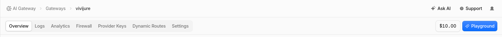

# Deploying Vivijure Studio

This is the start-to-finish guide to stand up your own Vivijure Studio: the API keys you need,
where to get them, exactly what permission each needs and **why**, and the deploy order.

Vivijure has three pieces:

1. **The Studio Worker** (this repo) -- a single Cloudflare Worker that owns projects, storyboards,
   cast, and render orchestration, plus a registry of opt-in **module workers** (one per capability).
2. **The GPU backend** (`vivijure-backend`) -- a container on **RunPod Serverless** that does the
   heavy lifting: LoRA training, SDXL keyframes, image-to-video, lip-sync.
3. **The media-stack CPU containers** (`video-finish`, `image-prep`, `audio-beat-sync`,
   `audio-mix`, `audio-master`) -- ffmpeg/CPU work that runs always-on on your own box, reached
   privately over Cloudflare VPC bindings. As of #519 these are part of the **standard** install: the
   film assembly step runs in `video-finish`, so without the media stack you get a folder of separate
   clips, not one finished film. `deploy.sh` creates the tunnel + the VPC Services for you; you bring
   the containers up with `docker compose` (section 5). At render time, if the media tier is
   unreachable the film still COMPLETES with the rendered clips delivered and a loud "finish
   unavailable" status (#519 / #524), never a hard-fail after the GPU spend.

You do NOT need a separate API key per video provider. Seedance, Kling, MiniMax Hailuo, Google Veo, Vidu, Wan,
keyframes, and lip-sync all run **through RunPod**, so one RunPod key covers them.

---

## ⚠️ Security requirement (read first): SINGLE-OPERATOR, auth-gated

Vivijure is a **single-operator** studio. It does **NO per-user authorization** -- every `:id`
route trusts the caller, and `GET /api/cast/export/:id` returns a full character bundle (portrait +
LoRA + bible) by id. Resource ids are unguessable UUIDs as of S9 (migration 0010, defense-in-depth
against enumeration), but that HARDENS the gate, it does not replace it: any caller who holds an id
still gets the whole bundle. Every deploy MUST therefore run an auth gate. The studio has one BUILT IN; pick the mode with the `AUTH_MODE` worker var:

- **`token` (the quickstart default):** the Worker itself requires
  `Authorization: Bearer <token>` on every `/api/*` request, checked against the
  `STUDIO_API_TOKEN` worker secret with a constant-time compare. `deploy.sh` mints a 256-bit
  random token, stores the secret, and prints the token ONCE at the end of the deploy -- save it.
  The studio UI asks for it on first load and keeps it in your browser only. No Zero Trust
  product, no extra dashboard step. Other consumers (bots, satellites) do NOT reuse this
  operator token: mint each one its own named token with
  `scripts/studio-consumer-token.sh mint <name>` (independently revocable; see
  [SECURITY.md](SECURITY.md) section 1b-i).
- **`access`:** the Worker verifies a Cloudflare Access JWT in-code (fail closed) BEHIND an edge
  Access app you configure -- the recommended hardening for team/org deployments (SSO identity,
  device posture, audit logs). Set `ACCESS_TEAM_DOMAIN` + `ACCESS_AUD` (your Zero Trust team
  hostname + the Access application AUD). See [SECURITY.md](SECURITY.md).

Fail closed either way: no mode, an unknown mode, or token mode without its secret denies every
`/api/*` request (`ALLOW_UNAUTHENTICATED` is the dev-only opt-out, local only). Do **NOT** deploy
multi-tenant or unauthenticated, or any visitor can read and delete every project, cast member,
and film by walking the ids. Hostnames: a custom-domain deploy keeps the `*.workers.dev` host
disabled (`workers_dev = false`), and a `*.workers.dev` `DEPLOY_HOSTNAME` is a supported target --
`deploy.sh` flips `workers_dev = true`, drops the custom-domain route, and the auth gate covers
that host exactly the same way.

---

## One-script deploy (recommended)

The fast path: three steps, ONE dashboard visit.

1. **Create a Cloudflare API token** (section 2a) and gather the rest of your keys: RunPod key +
   endpoint id, R2 S3 keys, AI Gateway slug (sections 2b-2d).
2. **Enable R2** for your account -- a one-time ToS/billing acknowledgement Cloudflare only
   accepts in the dashboard. Open <https://dash.cloudflare.com/?to=/:account/r2> and click
   through the enable screen (the `?to=/:account/...` deep link fills in your account id for
   you; no URL hand-editing).
3. **Run the script** (below). It creates the database and buckets, seeds the module secrets,
   renders the config, deploys everything in the right order (modules before the core), mints
   your studio API token (`AUTH_MODE=token`, the default), and prints that token ONCE at the
   end -- save it. It fails closed if anything is missing.

No Zero Trust / Cloudflare Access setup is required: the built-in token mode is the deploy
default, and Access remains available as optional hardening (`AUTH_MODE=access`, see the security
section above).

```bash
npm ci                             # installs wrangler + deps (deploy.sh checks and does this too)
cp deploy.env.example deploy.env   # then edit deploy.env with your keys
./deploy.sh
```

**One prerequisite the script cannot do for you: enable R2 on the account** (a one-time ToS +
billing acceptance). Do it once at `https://dash.cloudflare.com/<ACCOUNT_ID>/r2` before the first
run; without it the script stops at the bucket step with Cloudflare API code 10042 and prints this
same URL.

`deploy.env` is where all your keys go. It is gitignored -- never commit it. Each line has a short
note on what the value is and where to get it, matching sections 2a-2d below.

Pick a profile with `VIVIJURE_PROFILE` in `deploy.env`:

- **standard** (the default) -- the studio core, cloud + own-GPU render, AND the media stack (5
  always-on CPU containers reached over Workers VPC). `deploy.sh` creates the tunnel + the 5 VPC
  Services and wires their ids in automatically (#519); you just bring the containers up with
  `docker compose` (section 5). This is your first deploy.
- **satellites** -- also the 3 opt-in GPU finish modules that each need a separate RunPod endpoint:
  upscale, lip-sync, and speech-upscale.

How the split works: in `wrangler.toml.example`, opt-in blocks are wrapped in comment markers.
`deploy.sh` strips `# >>> SATELLITE:` blocks unless the satellites profile, the `# >>> LOCAL-GPU:`
block unless `INSTALL_LOCAL_GPU=1`, and the `# >>> SELFHOST-SKIP:` (our-fleet-only, e.g. the
`tail_consumers` log shipper) blocks always -- so a binding can never dangle and break the deploy. The
media-stack bindings (the four `[[vpc_services]]` + the media finish modules) are unconditional now
(standard). The media stack is FIVE containers behind FIVE Workers VPC Services: the studio core binds
FOUR of them (`VIDEO_FINISH_VPC`, `IMAGE_PREP_VPC`, `AUDIO_BEAT_SYNC_VPC`, `AUDIO_MIX_VPC`) directly,
and the fifth (`audio-master`) is reached by its own `audio-master` module worker, so the "four" here
and the "5 VPC Services" in section 5 are both correct at their own layer. The local-GPU door stays
opt-in because it needs your own local GPU box.

**Cloudflare plan: free vs Workers Paid (#521).** The full standard install runs on Cloudflare's
**free** plan: install free, render free. This is live-proven -- a brand-new free-plan account stood up
the whole 23-module standard bundle (core, D1, R2, Secrets Store, AI Gateway, tunnel, and the 5-service
media stack) and rendered finished 1080p24 films on all three render paths (own GPU on RunPod, cloud
i2v, and a local-GPU door). You pay only usage: RunPod GPU seconds, cloud render API calls, AI Gateway
credits for the planner, or $0 on your own hardware. **Workers Paid ($5/month) is required only for the
three GPU finish satellites** (finish-upscale, finish-lipsync, speech-upscale); their fan-out at
satellite scale is what needs the larger per-invocation subrequest budget. One operational rule either
way: a plan change (free to paid, or back) only takes effect after you **redeploy the core**
(`./deploy.sh` again), because a running Worker keeps the plan it was deployed under -- so flip the
account plan first, then redeploy. (Cloudflare's free plan caps a Worker at 50 subrequests per
invocation; the S18 subrequest fixes (#526, #538) brought the standard bundle's per-tick fan-out under
that cap.)

For the whole constellation (studio + GPU backend + local doors), `deploy/constellation.sh` is the
top orchestrator that calls into each repo's own deploy script. Today it drives the studio and stubs
the siblings; the sibling scripts land as those repos are brought up to this standard.

The rest of this guide explains every key and every manual step, so you can run the pieces by hand
or understand exactly what the script does.

---

## 1. Accounts you need

| Provider | What it is | Sign up |
|---|---|---|
| **Cloudflare** | Hosts the Worker + your data (D1, R2, Vectorize) and routes LLM calls (AI Gateway). | dash.cloudflare.com |
| **RunPod** | Serverless GPUs that run the render backend (training, keyframes, i2v, lip-sync). | runpod.io |
| **GitHub** (optional) | Only if you build/host the backend image yourself via GHCR + Actions. | github.com |

Everything bills to your own accounts. The Studio is single-user by design -- one operator, your keys.

---

## 2. The keys, their permissions, and WHY

Issue a **separate, narrowly-scoped key per function** -- never one god-token. If a key leaks or you
rotate it, the blast radius is one function, not your whole account.

### 2a. Cloudflare API token (deploy-time)
Create a **user API token**: **dash.cloudflare.com -> My Profile -> API Tokens -> Create Token ->
Custom token** (NOT an account-owned token under Account Home -> API Tokens -- that flow makes the
scope picker painful and hides `Connectivity Directory`). Scope it to **your account only**
(Account Resources -> Include -> your account).

| Permission | Why it's needed |
|---|---|
| `Account > Workers Scripts > Edit` | Deploy the Studio Worker + every module worker (`wrangler deploy`). |
| `Account > D1 > Edit` | Create the `vivijure-studio` database and apply schema migrations on deploy. |
| `Account > Workers R2 Storage > Edit` | Create + write the two buckets: render outputs (`vivijure`) and the doc/RAG store (`skyphusion-llm`). |
| `Account > AI Gateway > Edit` | Resolve the AI Gateway the LLM features route through, AND enable its **Authenticated Gateway** toggle at deploy (a Unified Billing requirement -- Read cannot flip it). |
| `Account > Account Settings > Read` | `wrangler` reads account metadata at deploy time. |
| `Account > Secrets Store > Edit` | Bind module secrets from the Cloudflare Secrets Store at deploy (the `[[secrets_store_secrets]]` blocks). Binding a store secret to a worker is a write-level association, so READ is NOT enough -- without Edit the deploy fails with `Secrets store binding authorization failed [code: 10021]`. |
| `Account > Cloudflare Tunnel > Write` | Create the media-stack tunnel and read its connector token (`deploy.sh` -> `scripts/setup-media-vpc.py`, #519). Part of the standard install. |
| `Account > Connectivity Directory > Admin` | Create the 5 Workers VPC Services the studio reaches the CPU containers through (missing this surfaces as CF error 10196). Part of the standard install. |
| `Account > API Tokens > Edit` (optional) | Lets `deploy.sh` auto-mint the Run-only `CF_AIG_TOKEN` (2d below) so the planner arms with zero extra pastes. Honest trade-off: this scope can mint further API tokens on the account; omit it if that bothers you and paste `CF_AIG_TOKEN` yourself instead. |

> Why so specific: each line maps to a real deploy step below. If a module never touches D1, its
> token never gets D1. This is the whole "least-privilege per function" idea -- you can hand the
> Workers-only token to CI and keep D1/R2 admin off the build runner.
>
> NOTE: `wrangler deploy --dry-run` validates binding CONFIG but does NOT authorize a Secrets
> Store binding against the live API -- only a real deploy does. A dry-run can pass while the deploy
> still 10021s on a token missing `Secrets Store > Edit`. Verify store-backed bindings with a real deploy.

Store it for CI as the repo secret `CLOUDFLARE_API_TOKEN`, plus `CLOUDFLARE_ACCOUNT_ID` (your
account id -- an identifier, not a secret).

### 2b. RunPod API key
Create at **runpod.io -> Settings -> API Keys**. One key with **read/write** (it both *runs* jobs and,
if you let it, *manages* your endpoint).

| Why it's needed |
|---|
| The Studio's GPU modules (`own-gpu`, `keyframe`, `finish-rife`, `finish-upscale`, `finish-lipsync`, and the cloud i2v backends) submit jobs to **your** RunPod Serverless endpoint and poll for results. |

You also need your **endpoint id(s)** (`RUNPOD_ENDPOINT_ID`) -- the id of the Serverless endpoint
running the `vivijure-backend` image (see section 4).

### 2c. R2 S3 access keys (for the GPU backend)
Create at **dash.cloudflare.com -> R2 -> Manage R2 API Tokens -> Create API token**, scoped to
**Object Read & Write**.

> **First install: scope it to "Apply to all buckets in this account".** The render bucket
> (`vivijure`) does not exist yet -- `deploy.sh` Step 2 creates it -- so on a fresh account the
> bucket picker has nothing to select. Once the first deploy has created the bucket you can
> (optionally) rotate to a key scoped to just `vivijure`: same page -> Create API token -> pick the
> `vivijure` bucket, then update `R2_S3_ACCESS_KEY_ID` / `R2_S3_SECRET_ACCESS_KEY` in `deploy.env`
> and re-run.

| Why it's needed |
|---|
| The RunPod backend is NOT a Cloudflare Worker, so it can't use a Worker R2 binding. It talks to R2 over the S3 API to read inputs (refs, bundles) and write outputs (LoRAs, keyframes, clips). Hence a classic access-key/secret pair, scoped to your render bucket (or all buckets on a first install, before that bucket exists -- see the note above). |

These become the backend env `R2_ACCESS_KEY_ID` / `R2_SECRET_ACCESS_KEY` (the handler's names;
`scripts/runpod-provision.py` maps your pasted `R2_S3_*` values onto them) (and the matching
RunPod secrets the GPU modules pass through).

### 2d. AI Gateway (LLM features)
The storyboard planner, cast-image prompts, dialogue/music generation, and cloud-animate scoring
route LLM/AI calls through a **Cloudflare AI Gateway** (for caching, rate-limit, and one bill).

- `GATEWAY_ID` -- the gateway slug. **Optional:** leave it blank and `deploy.sh` creates an
  authenticated gateway named `vivijure` for you (needs **AI Gateway: Edit** on your API token); set
  it only to point at an existing gateway (**dash.cloudflare.com -> AI -> AI Gateway**).
- `CF_AIG_TOKEN` -- an AI Gateway authentication token: a Cloudflare API token with
  **AI Gateway: Run** permission. **It is a deploy prerequisite now, not a later arm step:** since
  #473 the core and the `plan-enhance` module both bind it from the Secrets Store, and `wrangler
  deploy` fails (code 10182) against a store secret that is not yet seeded, so the planner token must
  exist before anything ships. You can still leave it blank in `deploy.env` **if** your deploy token
  carries **Account API Tokens: Edit** (see 2a): `deploy.sh` then auto-mints a purpose-named Run-only
  token and seeds it into the store before the first deploy. If it can neither find a pasted token nor
  auto-mint one, `deploy.sh` STOPS before it deploys anything and prints the exact fix (fail-closed;
  no half-deployed studio). To supply one by hand: dashboard -> AI Gateway -> your gateway ->
  **Settings** -> **Create authentication token** (Run permission), then paste it into `deploy.env`
  and re-run `./deploy.sh`.
  Unified Billing also requires the gateway's **Authenticated Gateway** toggle ON --
  `deploy.sh` enables it via the API, or the banner tells you to flip it in the same
  Settings page. Run tokens are account-scoped (they cannot be pinned to one gateway).
  Tearing an install down to zero? Also delete the auto-minted `vivijure-planner-aig-run`
  API token: the auto-mint refuses to stack a second token of the same name, so a stale
  twin blocks re-arming on the next deploy.

> Why a gateway instead of a raw provider key: it gives you one place to see spend, cache repeat
> prompts, and swap the underlying model without touching code. Anthropic/other model access is
> billed through Cloudflare's Unified Billing, so you don't manage a separate provider key here.

### 2e. Load AI credits (the planner runs on these)

Unified Billing means no Anthropic/provider key -- storyboard planning spends Cloudflare
**AI credits** on your account. A fresh account has $0.00, and the planner will not run on a
$0.00 balance. The ORDER matters: the credits page only appears once your gateway exists, so
create the gateway (2d) first, then load credits.

1. Dashboard -> **AI** -> **AI Gateway** -> click your gateway. The upper right of the Overview
   shows a dollar chip (next to the **Playground** button):

   

2. Click the chip -- or go straight to
   `https://dash.cloudflare.com/<ACCOUNT_ID>/ai/ai-gateway/credits`. The Credits page shows your
   balance and a **Top-up credits** button. The **Auto recharge** toggle under it is your call:
   on means the planner never dies mid-project on an empty balance; off means no surprise charges.

   

3. Click **Top-up credits**, pick an amount, confirm. Expect a **$10 minimum plus a small
   card-processing fee** (a $10 load invoices about $10.83), charged to the account's default
   payment method.

   

Credits pay for **AI Gateway usage only** (storyboard planning). GPU renders bill your RunPod
account, and storage bills your Cloudflare account, separately.

---

## 3. Deploy the Studio (Cloudflare)

Prereqs: Node 22+, `npm install`, and `npx wrangler login` (or `CLOUDFLARE_API_TOKEN` exported).

```bash
# 3a. Create the data resources (one time)
npx wrangler d1 create vivijure-studio          # then paste the database_id into wrangler.toml
npx wrangler r2 bucket create vivijure           # render outputs (keyframes/clips/films/loras) -- R2_RENDERS
npx wrangler r2 bucket create skyphusion-llm     # document / RAG store -- the R2 binding

# 3b. Set the runtime secrets (prompts for each value)
echo "<your-account-id>"            | npx wrangler secret put CLOUDFLARE_ACCOUNT_ID
# #238: RUNPOD_API_KEY, RUNPOD_ENDPOINT_ID (store name BACKEND_RUNPOD_ENDPOINT_ID), R2_S3_ACCESS_KEY_ID,
# R2_S3_SECRET_ACCESS_KEY, GATEWAY_ID and CF_AIG_TOKEN are NO LONGER wrangler-secret-put -- they bind
# declaratively from the Cloudflare Secrets Store ([[secrets_store_secrets]] in wrangler.toml). Seed them
# ONCE in the store (see "Module secrets via the Secrets Store" below); every deploy re-binds them.
# R2_S3_ENDPOINT + R2_S3_BUCKET are identifiers, not secrets, and are NO LONGER wrangler-secret-put.
# They render into wrangler.toml [vars] automatically at deploy (ci.yml / deploy.sh) from
# CLOUDFLARE_ACCOUNT_ID: endpoint = https://<account-id>.r2.cloudflarestorage.com, bucket defaults
# to `vivijure` (the R2_RENDERS bucket). Override the bucket with the optional R2_S3_BUCKET repo
# variable (CI) or env var (deploy.sh). Nothing to set here.

# Token auth mode (AUTH_MODE = "token" in wrangler.toml [vars]): mint the studio API token.
# SAVE the printed value -- it is your only login; the UI asks for it on first load.
TOKEN="$(openssl rand -hex 32)"; echo "STUDIO API TOKEN: $TOKEN"
printf %s "$TOKEN"                  | npx wrangler secret put STUDIO_API_TOKEN

# 3c. Apply the database schema
npx wrangler d1 migrations apply vivijure-studio --remote
# The numbered chain builds the CURRENT (post-identity-strip) schema directly; a fresh install
# needs nothing else. Only an install created before 2026-07-02 that never applied
# migrations/manual/0004_drop_user_email.sql must apply that file once (see its header).
# scripts/verify-migration-squash.sh proves fresh chain == prod history.

# 3d. Deploy. Module workers MUST deploy before the core (the core binds each as a service;
#     a binding to a not-yet-deployed module makes the core deploy fail).
# The standard modules (this list mirrors STANDARD_MODULES in deploy.sh; the last five are the
# media-stack finish modules, reached over Workers VPC):
for m in own-gpu seedance kling keyframe cloud-keyframe finish-rife plan-enhance cast-image \
         notify-email music-gen narration-gen dialogue-gen minimax-hailuo google-veo vidu-q3 \
         alibaba-wan alibaba-wan-lora film-titles subtitle beat-sync audio-master; do
  npx wrangler deploy -c modules/$m/wrangler.toml
done
# The satellites profile also deploys (SATELLITE_MODULES in deploy.sh; each needs a separate RunPod
# endpoint): finish-upscale finish-lipsync speech-upscale
npm run deploy   # the core Studio Worker
```

Module worker secrets are NOT set with `wrangler secret put`. They are bound declaratively from an
account-level **Cloudflare Secrets Store**, so every `wrangler deploy` re-establishes them and a
freshly (re)created module worker can never start secretless and silently degrade (the bug that
shipped finish-upscale as a passthrough in v0.2.2). The values are seeded ONCE into the store and
never touch CI or GitHub. See **Module secrets via the Secrets Store** below.

> The whole of 3c--3d is automated in CI on push to `main` (`.github/workflows/ci.yml`), gated behind
> typecheck + tests. For a hosted deploy, set `CLOUDFLARE_API_TOKEN` + `CLOUDFLARE_ACCOUNT_ID` as repo
> secrets and let Actions do it.

### Module secrets via the Secrets Store

Every RunPod-backed module needs `RUNPOD_API_KEY`, and the GPU/finish ones additionally a
per-module endpoint id bound to `RUNPOD_ENDPOINT_ID`; the AI-Gateway modules (`dialogue-gen`,
`cast-image`, `cloud-keyframe`, `music-gen`) need `GATEWAY_ID`. Each module's `wrangler.toml` binds these
from an account-level Secrets Store via `[[secrets_store_secrets]]`, so the binding is declarative
config that ships with every deploy -- no per-deploy `wrangler secret put`, and nothing to lose on a
fresh-create.

`RUNPOD_ENDPOINT_ID` is bound from one store secret PER ENDPOINT, because the modules target
different RunPod endpoints (keyframe / i2v on the main backend, upscale on the upscale endpoint,
lip-sync on the MuseTalk endpoint). The binding name in code stays `RUNPOD_ENDPOINT_ID`; only the
store `secret_name` differs. Modules that share an endpoint share one secret (single source of truth):

| module(s)                      | store secret_name (RUNPOD_ENDPOINT_ID) | RunPod endpoint |
| ------------------------------ | -------------------------------------- | --------------- |
| own-gpu, keyframe, finish-rife | `BACKEND_RUNPOD_ENDPOINT_ID`           | main backend    |
| finish-upscale                 | `VIDEO_UPSCALE_RUNPOD_ENDPOINT_ID`     | video upscale   |
| finish-lipsync                 | `MUSETALK_RUNPOD_ENDPOINT_ID`          | MuseTalk        |
| speech-upscale                 | `AUDIO_UPSCALE_RUNPOD_ENDPOINT_ID`     | audio upscale   |

> **The satellite ENDPOINTS themselves also need R2 credentials (#522).** The store secret above only
> carries each satellite's endpoint *id*. Every GPU satellite (finish-upscale, finish-lipsync,
> speech-upscale) reads its inputs from, and writes its outputs to, YOUR R2 bucket directly, so its
> RunPod endpoint template must ALSO set `R2_ENDPOINT_URL`, `R2_ACCESS_KEY_ID`, `R2_SECRET_ACCESS_KEY`,
> and `R2_BUCKET` in the endpoint env (the same R2 values the backend endpoint uses in section 4). Miss
> them and the first full render fails at finish with the satellite's honest error (`R2 mode needs
> R2_ENDPOINT_URL + R2_ACCESS_KEY_ID/SECRET in the endpoint env`), correctly, after the keyframe/i2v
> GPU spend. **RunPod gotcha:** editing an endpoint's template env does NOT reach already-warm
> workers -- FlashBoot keeps cached containers alive, so you must trigger an **endpoint release**
> (redeploy/bump the endpoint) for env changes to take effect.

The `plan-enhance` module binds two: the shared `GATEWAY_ID` slug, plus `CF_AIG_TOKEN` -- a
Unified-Billing AI Gateway token scoped to THAT module (per-function key). To keep it independent of
the core Worker's own `CF_AIG_TOKEN`, plan-enhance binds it from a module-scoped store secret named
`PLAN_ENHANCE_CF_AIG_TOKEN` (the in-code binding stays `CF_AIG_TOKEN`; only the store `secret_name`
differs, the same per-resource pattern as the `RUNPOD_ENDPOINT_ID` secrets above). With neither set,
plan-enhance runs entirely on the free local Workers AI model.

Seed the store ONCE, from a trusted box that already holds the values. The hidden prompt keeps the
value out of shell history -- never pass `--value` on the command line:

> **PASTE THE BARE VALUE ONLY.** The store keeps whatever you type into the prompt VERBATIM -- it does
> not parse, trim, or unquote it. Paste the token alone (e.g. `rpa_...`), with NO `VAR=` prefix, NO
> surrounding quotes, and NO leading/trailing whitespace or newline. A paste of `RUNPOD_API_KEY=rpa_...`
> stores the literal string `RUNPOD_API_KEY=rpa_...`, so every module then sends
> `Bearer RUNPOD_API_KEY=rpa_...` and RunPod returns **401 at submit**. This is exactly what broke v0.6.6
> (#237): a prefixed paste, not a code bug. `secretValue()` resolves and uses the stored string
> correctly -- a 401 at submit means the stored VALUE is malformed.

```bash
# 1. Use your account Secrets Store. Cloudflare provisions one default store per account
#    (`wrangler secrets-store store list --remote` shows it); create one only if absent:
#    `npx wrangler secrets-store store create <name> --remote`. Note the store id.

# 2. Put that store id into every module wrangler.toml (replace the placeholder).
grep -rl REPLACE_WITH_VIVIJURE_SECRETS_STORE_ID modules/*/wrangler.toml \
  | xargs sed -i 's/REPLACE_WITH_VIVIJURE_SECRETS_STORE_ID/<your-store-id>/'

# 3. Create each secret in the store (hidden prompt; --scopes workers is required).
S=<your-store-id>
npx wrangler secrets-store secret create $S --name RUNPOD_API_KEY                 --scopes workers --remote
npx wrangler secrets-store secret create $S --name GATEWAY_ID                     --scopes workers --remote
npx wrangler secrets-store secret create $S --name CF_AIG_TOKEN                   --scopes workers --remote  # core AI Gateway auth (#238; distinct from PLAN_ENHANCE_CF_AIG_TOKEN)
npx wrangler secrets-store secret create $S --name R2_S3_ACCESS_KEY_ID            --scopes workers --remote  # core R2 SigV4 presign (#238)
npx wrangler secrets-store secret create $S --name R2_S3_SECRET_ACCESS_KEY        --scopes workers --remote  # core R2 SigV4 presign (#238)
npx wrangler secrets-store secret create $S --name PLAN_ENHANCE_CF_AIG_TOKEN      --scopes workers --remote
npx wrangler secrets-store secret create $S --name BACKEND_RUNPOD_ENDPOINT_ID       --scopes workers --remote
npx wrangler secrets-store secret create $S --name VIDEO_UPSCALE_RUNPOD_ENDPOINT_ID --scopes workers --remote
npx wrangler secrets-store secret create $S --name MUSETALK_RUNPOD_ENDPOINT_ID      --scopes workers --remote
npx wrangler secrets-store secret create $S --name AUDIO_UPSCALE_RUNPOD_ENDPOINT_ID --scopes workers --remote
```

**Defensive seed (recommended): strip the value so a bad paste cannot poison the store.** Stage the
value in a `0600` file, then pipe a sanitized copy via stdin instead of using the interactive prompt.
`cut -d= -f2-` drops any `VAR=` prefix (a bare token passes through unchanged) and `tr -d` removes all
whitespace/newlines/CR, so a `RUNPOD_API_KEY=rpa_...` line and a bare `rpa_...` token seed identically:

```bash
S=<your-store-id>
# ~/.runpod-api.txt is mode 0600, holding the value (bare token OR a VAR=value line -- both work).
printf '%s' "$(cut -d= -f2- < ~/.runpod-api.txt | tr -d '[:space:]')" \
  | npx wrangler secrets-store secret create $S --name RUNPOD_API_KEY --scopes workers --remote
# To re-seed an EXISTING secret, swap `create` for `update $S --secret-id <id>` (list ids:
# `npx wrangler secrets-store secret list $S --remote`). `shred -u ~/.runpod-api.txt` once seeded.
# Verify with a live module /invoke: a NON-401 from RunPod /run (a job id, or a 404-on-bundle)
# confirms auth; a 401 means the stored value is still bad (re-mint the key).
```
Once the store is seeded and `store_id` is filled in, deploy as in 3d -- each module reads its secret
through the binding. A `wrangler deploy` against a secret that does not yet exist in the store fails
at deploy time, so a misconfigured module can no longer ship a silent passthrough.

> The core Studio Worker's own credentials (RUNPOD_*, R2_S3_ACCESS_KEY_ID / R2_S3_SECRET_ACCESS_KEY,
> GATEWAY_ID, CF_AIG_TOKEN) now bind from this SAME Secrets Store (#238/#473); only STUDIO_API_TOKEN
> stays a direct `wrangler secret put` (section 3b). There is no longer a `wrangler secret put`
> migration pending for the core.

You now have a working Studio for everything except the GPU render itself.

---

## 4. Deploy the GPU backend (RunPod)

The render backend is the `vivijure-backend` container image, run as a **RunPod Serverless endpoint**.

> **Three version lines, do not conflate them.** The GPU render image is cut from a `backend-vX.Y.Z`
> git tag in the `vivijure-backend` repo and published to GHCR as `:X.Y.Z` (the image tag drops the
> `backend-v` prefix). The Studio (this repo) ships on its own `vX.Y.Z` deploy tags. The HOSTED
> control plane is a separate product in the `vivijure-control-plane` repo, versioned and deployed
> independently again -- you do not need it, and this document does not cover it; self-hosting the
> Studio never requires running a hosted service. A `backend-v0.2.26` image and a Studio `v0.2.2`
> deploy are independent release lines; pin the RunPod endpoint to the **GHCR image tag**, not the
> Studio deploy tag.

1. Build/pull the image. The image is published to GHCR (`ghcr.io/skyphusion-labs/vivijure-backend`);
   build it yourself from the `vivijure-backend` repo, or pull the public image.

**Scripted standup (recommended).** One command creates the template + endpoint via the RunPod API,
idempotent by name (re-running reuses what exists). Secrets are read from the environment only,
never argv:

```bash
set -a; . ./deploy.env; set +a       # loads RUNPOD_API_KEY, CLOUDFLARE_ACCOUNT_ID, R2_S3_* keys
python3 scripts/runpod-provision.py  # last line prints RUNPOD_ENDPOINT_ID=<id>
```

Put the printed id in `deploy.env` as `RUNPOD_ENDPOINT_ID` and run `./deploy.sh`. The endpoint is
created scale-to-zero (workersMin=0): it costs nothing until a render job runs.

> **Image tag: pinned by default (#518).** `runpod-provision.py` defaults to a specific backend
> release (`ghcr.io/skyphusion-labs/vivijure-backend:X.Y.Z`), never `:latest`, so your endpoint runs a
> known image instead of silently changing on the next push (the section-4 pin rule, enforced in the
> script). Run a different release with `--image ghcr.io/skyphusion-labs/vivijure-backend:X.Y.Z`. A
> bare `:latest` is REJECTED unless you pass `--allow-latest` (a deliberate opt-in to a floating tag);
> a git-sha tag is always rejected (it does not re-provision correctly).

**GPU class: Blackwell / Hopper only (#517).** The serverless backend runs on a **CUDA 12.8** baked
image, so it requires a **Blackwell- or Hopper-class** GPU. The proven set is **RTX PRO 6000
Blackwell, H200, and B200**; recommend **H200 or B200**. This is not a preference. A consumer card
(RTX 4090 / A5000 / L4 and the like) carries an older driver, so the container fails to start with
`nvidia-container-cli: requirement error: unsatisfied condition: cuda>=12.8` and RunPod crash-loops
the worker roughly every 15 seconds -- billing you the whole time while never rendering a frame.
Consumer cards are the LOCAL-GPU door's territory (the `vivijure-local-12gb` / `-local-16gb` repos),
never the rented serverless pool. Why top cards only: the GPU-rationing thesis -- rent the fastest
cards by the second and scale to zero, rather than own a slow one. Pass the pool explicitly:

```bash
python3 scripts/runpod-provision.py --gpu-types "NVIDIA H200,NVIDIA B200"
```

Since #530 the built-in default is a datacenter set (`NVIDIA H200,NVIDIA B200`), so running with no
`--gpu-types` is safe; override it only with other same-class (Blackwell/Hopper, sm_90+) SKUs you have
allocated -- a consumer card will crash-loop as above. `--help` lists the other knobs (disk,
workers-max, idle-timeout). No network volume is attached (the backend self-preloads models from R2
on cold start), so the first cold worker pulls the full baked image (~60 GB+): **expect roughly 10
minutes before the first frame** on a cold endpoint. For a warm setup, attach a network volume so the
weights stay resident between jobs.

**By hand instead:**

2. In **runpod.io -> Serverless -> New Endpoint**, point it at the image, pick a **Blackwell/Hopper
   class** GPU (RTX PRO 6000 Blackwell, H200, or B200; recommend H200/B200 -- a consumer card
   crash-loops the CUDA 12.8 image, see above), and attach a **network volume** for the model weights
   (they self-preload from R2 on first run, then stay warm -- avoid scaling fully to zero between jobs
   or every cold worker re-pulls the image).
3. Set the backend env on the endpoint: `R2_ACCESS_KEY_ID`, `R2_SECRET_ACCESS_KEY`, `R2_BUCKET`,
   `R2_ENDPOINT` (your `https://<account>.r2.cloudflarestorage.com`), and the HuggingFace/offline
   flags the image documents.
4. Copy the endpoint id into the Studio's `RUNPOD_ENDPOINT_ID` secret (section 3b).

If your GHCR image is private, the endpoint needs registry credentials; a public image needs none
(make sure no stale registry credential is configured, or RunPod will try it and fail even a public
pull).

---

## 5. The media-stack CPU containers (STANDARD)

`video-finish` / `image-prep` / `audio-beat-sync` / `audio-mix` / `audio-master` run always-on as
Docker on your own box, reached privately over **Workers VPC**. As of #519 this is part of the
**standard** install: `deploy.sh` already created the Cloudflare tunnel and the 5 VPC Services for you
(`scripts/setup-media-vpc.py`), rendered their ids into the configs, and wrote the connector token to
`containers/tunnel.env` (0600). All that is left is to bring the containers up:

```bash
docker network create vivijure          # once, if it does not exist
docker compose -f containers/compose.yaml up -d --build
```

The `cloudflared` service in that compose file reads the token from `tunnel.env` and joins the
`vivijure` network, so each VPC Service resolves its container by service name. Without the containers
running, a render still delivers the per-shot clips and reports "finish unavailable" rather than
failing (the honest degrade, #519); bring them up to get the assembled/finished film.

Doing it by hand instead of `deploy.sh`? Run `scripts/setup-media-vpc.py --token-file
containers/tunnel.env` with `CLOUDFLARE_ACCOUNT_ID` + `CLOUDFLARE_API_TOKEN` set (the token needs
`Cloudflare Tunnel: Write` + `Connectivity Directory: Admin`); it prints the service ids as JSON and
writes the token file, both idempotent on a re-run.

> **Upgrading from a pre-media-stack (pre-#519) install?** Your existing `deploy.env` keeps working as
> is EXCEPT the Cloudflare API token: it predates the two media-stack scopes above. Re-mint it per
> section 2a (a user token with `Cloudflare Tunnel: Write` + `Connectivity Directory: Admin` added) and
> update `deploy.env`, then re-run `./deploy.sh`. If the old token is still in place, step 4 stops with
> the exact missing scope named (`your token lacks 'Cloudflare Tunnel: Write'`), not a raw error. The
> re-run **adopts** the tunnel your existing VPC services already point at -- it does not create a
> second one (#531).

---

## 6. The local-GPU door (opt-in): render on your own GPU

The local-GPU doors (`vivijure-local-12gb` / `vivijure-local-16gb`) let you render on your own
graphics card instead of renting a serverless GPU. They are off by default. Stand up the door on your
GPU box first (follow that repo's README); the core binds to the door's URL and token, so those must
exist before you deploy the core with the door enabled.

**Two required inputs (#534).** When `INSTALL_LOCAL_GPU=1`, `deploy.env` must also set
`LOCAL_BACKEND_URL` and `LOCAL_BACKEND_TOKEN`; `deploy.sh` fails early (fail-closed) if either is blank,
so you cannot half-configure the door. Both values come from the door box: bring the
`vivijure-local-12gb` / `-16gb` container up FIRST, then copy them from its startup banner (the door
also keeps them in its own `.env`). `LOCAL_BACKEND_URL` is the Cloudflare tunnel URL that terminates at
your door box (production fleet: `https://door-fatmike.skyphusion.org`; see fleet-chezmoi rename CR
2026-07-21); `LOCAL_BACKEND_TOKEN` is the shared token the door checks on each render call.
`deploy.sh` seeds both into the Secrets Store and the `local-gpu` module binds them from there, which is
why the door must be running before you deploy the studio with the door enabled: an unseeded binding
hard-fails `wrangler deploy` (CF error 10182), and #534 makes `deploy.sh` catch a blank value up front
instead of dying late. So the order is: door up, copy the URL and token into `deploy.env`, run
`./deploy.sh`.

### Moving a local-GPU door to a different studio or account (#539)

A local-GPU door holds its OWN R2 credentials in its `.env` (`R2_ACCOUNT_ID`, `R2_ACCESS_KEY_ID`,
`R2_SECRET_ACCESS_KEY`, `R2_BUCKET`): it reads keyframes from, and writes finished clips to, the
STUDIO's R2 bucket directly, not through the studio Worker. So the studio-side switch (update the two
Secrets Store secrets `LOCAL_BACKEND_URL` + `LOCAL_BACKEND_TOKEN`) is complete only when the new studio
shares the SAME R2 account and bucket. If you point a door at a studio on a DIFFERENT Cloudflare account
(or a different bucket), you must ALSO re-wire the door's own `.env` R2 credentials to the new studio's
bucket, then recreate the container.

Two things to pin when you recreate the door container:

- **Pin `LOCAL_BACKEND_TOKEN` in the door's `.env` before recreating it.** Left blank, the door
  auto-generates a fresh token on start, which no longer matches the value the studio has stored, so
  every render is rejected. Pin the token, and seed that SAME value into the studio's
  `LOCAL_BACKEND_TOKEN` secret.
- **Restart only the backend service, not the whole stack,** to keep the door's tunnel URL stable.
  A full recreate can hand you a new URL, which then also has to be re-seeded into the studio's
  `LOCAL_BACKEND_URL` secret. Production fleet uses the standing named tunnel
  `https://door-fatmike.skyphusion.org` (see fleet-chezmoi CR 2026-07-21 hostname rename); do not
  push a live Secrets Store update without an explicit apply GO.

**Failure signature (self-diagnosis).** If you moved a door but skipped the R2 re-wire, the film fails
fast at the clips phase with a keyframe 404 even though the keyframe plainly exists in the studio's
bucket:

```
local-gpu job failed: "i2v_clip: could not fetch keyframe
'renders/<project>/keyframes/<shot>.png': ... (404) ... Not Found"
```

The 404 is the door looking in the OLD account's bucket. Re-wire the door's `.env` R2 credentials to
the new studio's account/bucket and recreate the container to clear it.

---

## 7. Email notifications (optional)

The `notify-email` module sends "your film is done" mail via Cloudflare Email. It is the **only**
place an operator email matters. Bind your sending domain to Cloudflare Email and set the module's
config; everything else in the Studio is single-user and needs no email.

---

## 8. Optional BYOK provider keys (advanced)

Two optional worker secrets let you bring your own provider key for a specific feature. Most installs
need neither: storyboard planning bills through the AI Gateway on Unified Billing (section 2d), and
image work runs on the AI binding. Set one only if you want that specific provider path:

- `OPENAI_API_KEY` -- BYOK OpenAI image generation (transparent-PNG output via gpt-image-1.5). Unset
  by default; the studio renders keyframes/images on its normal path without it.
- `XAI_API_KEY` -- BYOK xAI for the storyboard planner. Unset by default; the planner runs on the AI
  Gateway path instead.

Both are worker secrets (set with `wrangler secret put`, or left unset):

```bash
printf %s "<your-key>" | npx wrangler secret put OPENAI_API_KEY
printf %s "<your-key>" | npx wrangler secret put XAI_API_KEY
```

They are the only provider keys not routed through the AI Gateway, so each bills that provider
directly rather than your Cloudflare Unified Billing balance.

---

## 9. The Studio MCP Worker (optional): drive the studio from an AI agent

The repo also ships a small, separate Worker that exposes the studio to MCP clients (Claude Code,
Cursor, any Model Context Protocol agent). It is opt-in and off by default: a standard deploy never
ships it, and nothing above depends on it. It has its own config (`wrangler.mcp.toml.example`), its
own two secrets, and its own deploy command; the tag-deploy CI ships it ONLY when the `MCP_HOST` +
`MCP_STUDIO_URL` repo variables are set (a clean no-op otherwise). The full deploy walkthrough,
agent wiring, tool reference, and security boundary live in **[docs/mcp.md](mcp.md)** -- if you want
an agent driving your studio, that page is the one to follow.

---

## Quick checklist

- [ ] Cloudflare API token (Workers/D1/R2/AI-Gateway/Secrets-Store/Tunnel/Connectivity scopes above) + account id
- [ ] R2 enabled on the account (one dashboard click: <https://dash.cloudflare.com/?to=/:account/r2>)
- [ ] auth mode picked: `token` (default; SAVE the printed token) or `access` (Zero Trust team + AUD)
- [ ] RunPod API key + a Serverless endpoint running `vivijure-backend` (its id)
- [ ] R2 S3 access key/secret (scope to all buckets on a first install; the render bucket does not exist yet -- see 2c)
- [ ] AI Gateway slug (`GATEWAY_ID`) + `CF_AIG_TOKEN` (a deploy PREREQUISITE -- the planner token; auto-minted or pasted, see 2d)
- [ ] AI credits loaded on the gateway ($10 minimum; the planner will not run on $0.00 -- see 2e)
- [ ] `wrangler d1 create` + both `r2 bucket create`s, ids in `wrangler.toml`
- [ ] secrets set, migrations applied, **modules deployed before core**
- [ ] (standard) media-stack containers up: `docker compose -f containers/compose.yaml up -d` (deploy.sh already made the tunnel + VPC services)
- [ ] render a test project end to end
