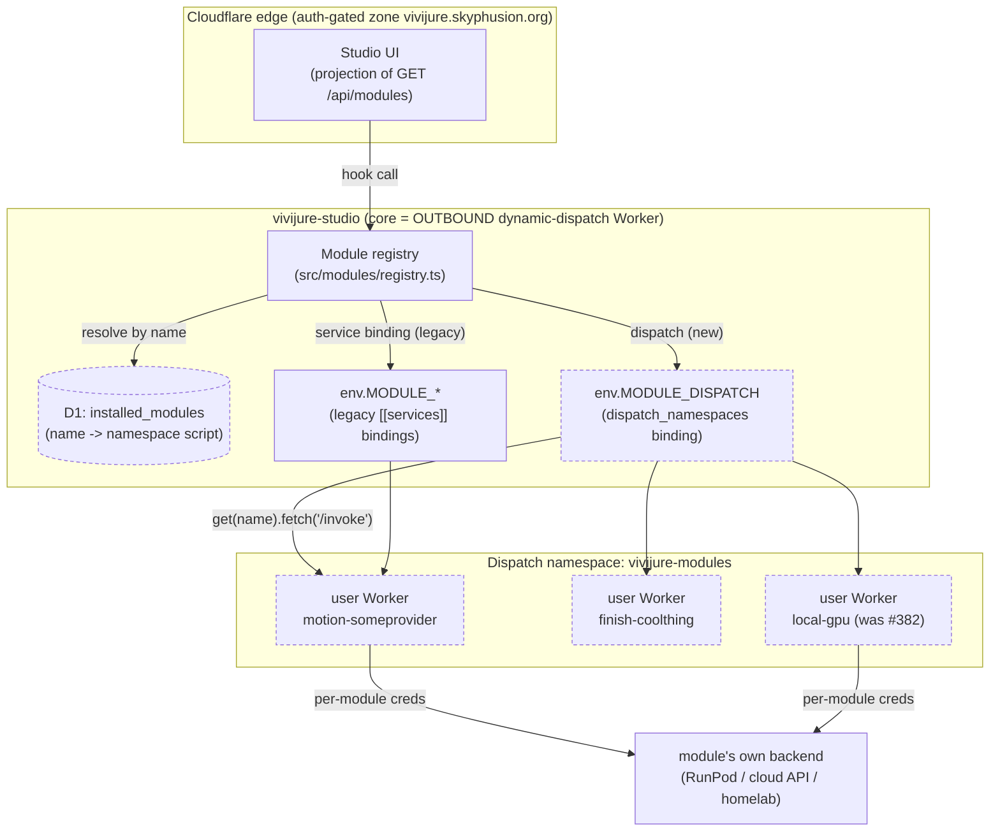
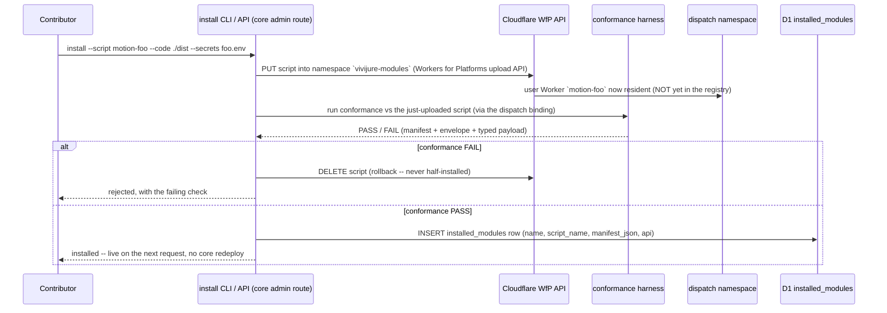

# Module dispatch (Workers for Platforms)

> Status: **HOST-SIDE IMPLEMENTED, not yet deployed** (roadmap Phase 3). The core now speaks dispatch:
> registry resolution, the D1 `installed_modules` store, the install/uninstall/disable/list admin routes
> (behind CF Access), the conformance install-gate, the host capability flag, and the `install-module`
> CLI all ship in the studio Worker. What is NOT yet done is the DEPLOY step -- creating the
> `vivijure-modules` dispatch namespace and uncommenting the `[[dispatch_namespaces]]` binding (an
> operator action gated on a real WfP-enabled account; see the deploy runbook). Until then the binding is
> unbound and the whole dispatch layer is a no-op: the studio runs exactly as before on service bindings.
>
> This is an **infrastructure + onboarding** spec layered UNDER the existing module contract
> (`docs/module-api.md`, `src/modules/types.ts` = `vivijure-module/2`). It changes WHERE a module lives
> and HOW the core reaches it; it does not (by design, see section 6) change WHAT a module is. Read
> `docs/module-api.md` first; this is the transport story beneath it.
>
> **Implementation note (transport ref).** The illustrative `RegisteredModule.dispatch` descriptor in
> section 3.2 shipped as a strictly-internal simplification: a module's transport is encoded in its
> single `binding` REF string -- `MODULE_<NAME>` for a service binding, `dispatch:<script>` for a
> namespace upload -- resolved by one primitive, `registry.resolveFetcher`. One string (not a second
> field) means a module's transport persists cleanly through render job state, so a dispatch module works
> uniformly across the multi-request finish/speech/master chains, not just the in-request pick_one hooks.
> Nothing on the module-facing contract or the public wire changes (the ref is stripped by `toPublic`).

## 0. Why this exists

Today a module is a standalone Worker bound to the core by a `[[services]]` entry named
`MODULE_<NAME>` (see `docs/module-authoring.md`). The registry (`src/modules/registry.ts`) discovers
every `MODULE_*` binding, reads each manifest, and dispatches hook calls over that service binding.
That works, but installing a module is a **core redeploy**: you add a `[[services]]` block to
`wrangler.toml.example`, the module must already be deployed (a binding to a missing service makes
`wrangler deploy` of the core fail), and the core ships again. The deploy order (modules first, core
second) is load-bearing and enforced in CI (`.github/workflows/ci.yml`).

Two of the project's own promises are throttled by that:

- *"The frontend is a projection of the registry."* True, but only as of the **last core deploy**: a
  new capability cannot appear until the core ships again.
- *"Modules = community territory."* A docs promise, not infrastructure: a contributor cannot install
  their module without a PR into our tree and a release.

Cloudflare **Workers for Platforms** (activated on the account 2026-06-30) removes the redeploy. A
module becomes a **user Worker** uploaded into a **dispatch namespace**; the core becomes the
**outbound dynamic-dispatch Worker** that looks the module up by name at request time and routes the
hook call to it. *Projection of the registry* becomes a **runtime** truth, and *community territory*
becomes **install-without-us** infrastructure.

### The mapping (one line)

| Module contract noun | Service-binding world (today) | Dispatch world (this doc) |
|---|---|---|
| **Module** | a Worker bound as `MODULE_<NAME>` (`[[services]]`) | a **user Worker** uploaded into the **dispatch namespace** |
| **Core** | a Worker holding N static `MODULE_*` Fetchers | the **outbound dynamic-dispatch Worker** holding ONE namespace binding |
| **Install** | edit `wrangler.toml` + redeploy the core | upload the user Worker + insert a registry row (no core deploy) |
| **Reach a module** | `env.MODULE_X.fetch(...)` | `env.MODULE_DISPATCH.get(name).fetch(...)` |

The crucial seam: `DispatchNamespace.get(name)` returns a **`Fetcher`** -- the exact shape the
pipeline already consumes. Everything downstream of "resolve a module to a Fetcher" (the `/invoke`,
`/poll`, `/cancel` envelope handling in `registry.ts`) is **unchanged**. Dispatch is a new way to
RESOLVE a module to a Fetcher, not a new way to TALK to one.

## 1. Topology



The core gains **one** binding (the dispatch namespace) and keeps the legacy `MODULE_*` service
bindings working side by side (see section 6, dual-resolution). A hook call resolves a module name to
a Fetcher by **either** path, then the existing envelope code does the rest.

## 2. The dispatch namespace + the outbound dynamic-dispatch worker

### 2.1 Concept

Workers for Platforms gives an account **dispatch namespaces**: collections of "user Workers" that are
NOT individually routable from the internet. A single **dynamic-dispatch Worker** (here: the core)
holds a binding to the namespace and, per request, calls `namespace.get(scriptName)` to obtain a
`Fetcher` for one user Worker, then `.fetch()`es it. The core is the ONLY ingress to every module in
the namespace -- which preserves the module trust boundary from `docs/module-authoring.md` (a module
has no public surface; the core, behind Access, is its only caller).

### 2.2 Proposed `wrangler.toml.example` diff (NOT applied)

A dispatch namespace is bound exactly like any other resource. The binding name follows the existing
`MODULE_*` convention so it reads as "the module transport", and the namespace name is account-scoped.

```diff
  # --- Opt-in MODULE workers: service bindings named MODULE_<NAME>; the registry discovers them.
  [[services]]
  binding = "MODULE_PLANENHANCE"
  service = "vivijure-module-plan-enhance"

  # ... (existing first-party [[services]] module bindings stay as-is) ...

+ # --- Phase 3: Workers for Platforms dynamic dispatch. The core is the OUTBOUND dynamic-dispatch
+ # --- Worker for the `vivijure-modules` dispatch namespace; a module uploaded into that namespace is
+ # --- reached at request time via env.MODULE_DISPATCH.get(<script>).fetch(...), with NO core redeploy.
+ # --- The namespace must EXIST at deploy time (like any [[services]] target) or `wrangler deploy`
+ # --- fails; create it once, out of band (see section 3.1), before this binding ships. Mirror this in
+ # --- src/env.ts (MODULE_DISPATCH: DispatchNamespace).
+ [[dispatch_namespaces]]
+ binding = "MODULE_DISPATCH"
+ namespace = "vivijure-modules"
+
+ # OPTIONAL hardening (deferred, see section 7): an OUTBOUND worker can intercept every module's
+ # outbound fetch (egress allow-list, spend metering). Wire it only when that worker exists, or the
+ # core deploy fails on a dangling outbound reference -- same dangling-binding discipline as a service.
+ # outbound = { service = "vivijure-module-egress-guard" }
```

> Deploy-ordering note (infra): a `[[dispatch_namespaces]]` binding is subject to the SAME
> existence rule as a `[[services]]` target -- the namespace must exist before the core that binds it
> deploys, or `wrangler deploy` fails (and `typecheck` will not catch it, only a real deploy will).
> So the namespace is created **once, out of band** (section 3.1), ahead of the first core deploy that
> carries this binding. After that, modules come and go **inside** the namespace with no core deploy.

### 2.3 Proposed `src/env.ts` diff (NOT applied)

Every binding is mirrored in the hand-authored `Env`. `DispatchNamespace` is provided by the pinned
`@cloudflare/workers-types` devDep (no new dependency).

```diff
   // Opt-in module workers: `MODULE_<NAME>` service bindings. Discovered by the registry.
   [key: `MODULE_${string}`]: Fetcher | undefined;
+
+  // Phase 3 (Workers for Platforms): the outbound dynamic-dispatch binding to the `vivijure-modules`
+  // dispatch namespace. A module uploaded into the namespace is resolved at request time by
+  // env.MODULE_DISPATCH.get(<script-name>) -> Fetcher, then invoked over the SAME /invoke envelope as a
+  // service-bound module. Optional so a deploy without WfP (or a self-host that only uses [[services]]
+  // modules) still typechecks and runs; the registry falls back to service bindings when it is absent.
+  MODULE_DISPATCH?: DispatchNamespace;
```

> `MODULE_DISPATCH` is a DISTINCT key from the `` [key: `MODULE_${string}`] `` index signature: that
> index maps to `Fetcher | undefined`, but a dispatch namespace is a `DispatchNamespace` (it has
> `.get()`, not `.fetch()`). Declaring it explicitly (and as a name the registry's `MODULE_*`
> service-binding scan must EXCLUDE, see section 6.3) keeps the two transports from colliding -- a
> `DispatchNamespace` is not a `Fetcher` and must never be mistaken for a service-bound module.

## 3. Registry -> dispatch routing

### 3.1 What the core stores

In the service-binding world the registry is **discovered** from `env` (scan `MODULE_*`, read each
`module.json`). In the dispatch world there is no per-module `env` binding to scan -- every module
lives behind ONE namespace binding. So the set of installed modules moves into **D1** (the core
already binds `DB`), one row per installed module:

```
TABLE installed_modules (
  name          TEXT PRIMARY KEY,   -- the module id (matches manifest.name)
  script_name   TEXT NOT NULL,      -- the user-Worker script name inside the namespace
  manifest_json TEXT NOT NULL,      -- the module.json captured + conformance-checked at upload (section 4)
  api           TEXT NOT NULL,      -- manifest.api, so an epoch the host no longer supports is filtered out
  installed_at  INTEGER NOT NULL,
  enabled       INTEGER NOT NULL DEFAULT 1
)
```

The manifest is captured **at upload time** (after it passes conformance, section 4) rather than
re-fetched on every boot, because a dispatch module is not enumerable from `env`. The registry's
existing `validateManifest` still guards what goes into the row; a future module redeploy that changes
its manifest re-runs the upload path (section 3.4), so the stored copy never silently drifts.

### 3.2 Resolving a name to a Fetcher

`registry.ts` today resolves a `RegisteredModule` to a Fetcher with `fetcherFor(env, module)`, which
reads `env[module.binding]`. Dynamic dispatch adds ONE branch: when a module is namespace-backed,
resolve through the dispatch binding instead of an `env` key.

```ts
// PROPOSED (illustrative): the only new resolution logic. Everything after "got a Fetcher" is the
// existing invokeModule / pollModule / cancelModule / awaitInvoke path, unchanged.
function fetcherFor(env: Env, module: RegisteredModule): FetcherLike | null {
  if (module.dispatch) {
    // WfP path: get() THROWS if the script is absent from the namespace, so guard it -- a missing
    // script becomes an honest ok:false degrade (a dropped chain step / a failed pick_one), never a
    // core crash, exactly like an unbound service binding does today.
    try {
      return env.MODULE_DISPATCH?.get(module.dispatch.script_name) ?? null;
    } catch {
      return null;
    }
  }
  const v = env[module.binding]; // legacy service-binding path
  return isFetcher(v) ? v : null;
}
```

`RegisteredModule` gains an optional internal `dispatch` descriptor (`{ script_name }`), the namespace
analogue of `binding`. Like `binding`, it is **internal topology** and is stripped by `toPublic()`
before it reaches `GET /api/modules` (the public projection still carries only the manifest -- info
disclosure boundary #18 is preserved; the wire payload never names a script or a binding).

### 3.3 The hook call is byte-for-byte the same

Once `fetcherFor` returns a Fetcher, the dispatch path and the service-binding path are identical:

```
core: env.MODULE_DISPATCH.get(script).fetch("https://module/invoke", { method: "POST", body:
        JSON.stringify({ hook, input, config, context }) })
-> module returns { ok: true, output } | { ok: true, pending: true, poll } | { ok: false, error }
```

This is what preserves the contract's discipline:

- **One typed input/output per hook.** The `InvokeRequest`/`InvokeResponse` shapes are the contract;
  dispatch does not touch them.
- **One declaration, one hop, same words down.** The module still declares its knobs in
  `config_schema`; the core still clamps the user's values with `validateConfig` against that schema
  BEFORE dispatching; the module receives the same already-validated `config`. The transport changed,
  the words did not.
- **No override grab-bag.** Nothing about dispatch adds a side channel; a module's only inputs remain
  `{ hook, input, config, context }`.

`pick_one` vs `chain` cardinality, `ui.order` folding, soft-degrade handling, the async poll loop, and
`/cancel` orphan-honesty all live above `fetcherFor` and are untouched.

### 3.4 Cardinality + discovery, restated for dispatch

`discoverModules(env)` (the `MODULE_*` scan) is joined by a `discoverDispatchModules(env, db)` that
reads `installed_modules` and reconstructs `RegisteredModule[]` from the stored manifests, tagging each
with its `dispatch` descriptor instead of a `binding`. The two lists merge into the one registry the
pipeline and `GET /api/modules` already consume. `indexByHook`, `resolvePickOne`, `servingForHook`,
`dispatchChain`, `dispatchPickOne` need NO change -- they operate on `RegisteredModule[]`, agnostic to
how each entry will resolve to a Fetcher.

## 4. The upload / install contract

Installing a module is **upload the user Worker -> conformance-gate it -> insert the registry row**.
All three steps are code/API, no dashboard click (the IaC / no-dashboard doctrine).

### 4.1 Onboarding flow (IaC, no dashboard)



A module is **resident** (uploaded into the namespace) the moment the WfP upload succeeds, but it is
**not installed** until its row exists in `installed_modules`. The conformance gate (section 4.3) sits
BETWEEN those two states, so a resident-but-failing module is never in the registry and never
dispatched. That two-state split is what makes the gate load-bearing rather than advisory.

### 4.2 Per-module credentials (bounded blast radius)

The per-function-key rule (own AI-Gateway token per worker, own scoped RunPod key per identity) is
UNCHANGED and, if anything, more important here: a namespace module is community territory. Secrets are
bound to the **user Worker**, not the core:

- A module's backend creds (`RUNPOD_API_KEY`, a cloud-provider key, a homelab `LOCAL_BACKEND_TOKEN`)
  are set as **secrets on that uploaded script** via the WfP script-settings/secrets API at upload
  time -- the analogue of how first-party modules bind from the account Secrets Store today. The core
  never holds a module's backend creds (the contract already says so: a module cancels with its OWN
  creds because the core never has them).
- The core hands a module only the credential-LESS `InvokeContext` (`{ project, job_id }`) plus
  presigned, short-lived R2 URLs for the specific objects a hook needs -- exactly as today. WfP does
  not widen that surface.
- Blast radius of a leaked/compromised module key is one module's backend, never the core or another
  module. Section 7 covers the OPEN question of whether an outbound-Worker egress guard should also
  fence where a module is even allowed to call.

### 4.3 Conformance gate integration

This is the operational teeth of "a module that implements the interface but fails conformance is not
installable" (CLAUDE.md, Module conformance).

- The harness already exists: `src/modules/conformance.ts` (`checkManifest`, `checkInvokeResponse`,
  `checkHookOutput`) and `tests/conformance.live.test.ts`, run today as
  `MODULE_URL=<deployed-url> npm run conformance` against a deployed worker.
- In the dispatch world the gate runs in the **install path** (section 4.1), against the
  just-uploaded script reached **through the dispatch binding** (not a public URL -- the module has
  none). The live conformance check is pointed at `env.MODULE_DISPATCH.get(script_name)` so it
  exercises the real dispatch transport it will run on.
- **Gate placement is the whole point:** the `INSERT` into `installed_modules` happens ONLY on a green
  suite. Resident-but-not-conformant = rolled back (script deleted) or left orphaned-and-unlisted; it
  is never dispatched because the registry only ever reads installed rows.
- **Gate SCOPE (be honest about the async limit).** The install gate proves the contract WIRING:
  manifest shape, the invoke/degrade envelope, and -- for a **synchronous** hook (a module that answers
  `ok:true + output` immediately, e.g. `plan.enhance`) -- the typed hook output via `checkHookOutput`. It
  deliberately does **not** validate the typed output of an **async** hook (`motion.backend` / `keyframe`
  / `finish` / `speech` / `master`), which answers `ok:true + pending + poll`: proving that shape would
  require polling the job **to completion**, i.e. running the module's real (often GPU) work just to
  install it -- an unacceptable side effect + cost for an install gate. Typed-output conformance for an
  async hook stays the **module author's** responsibility, proven by its own conformance CI
  (`checkHookOutput` over a controlled completion in `tests/conformance.live.test.ts` /
  `npm run conformance`), not by this install-time gate. The gate blocks a mis-wired or non-degrading
  module; it does not re-run an async hook's per-shot output contract.

### 4.4 install / uninstall / list

| Operation | Mechanism | Core redeploy? |
|---|---|---|
| **install** | WfP upload -> conformance PASS -> `INSERT installed_modules` | no |
| **uninstall** | `DELETE installed_modules WHERE name=?` (stop dispatching) then WfP delete script (evict) | no |
| **disable** | `UPDATE installed_modules SET enabled=0` (registry skips it; script stays resident for quick re-enable) | no |
| **list** | `SELECT * FROM installed_modules` -> merged into the registry -> projected by `GET /api/modules` | no |

`uninstall` removes the registry row FIRST (so the next request stops dispatching) and evicts the
script SECOND (so an in-flight request mid-`/poll` is not torn out from under). All four are admin API
routes on the core, callable from an `install` CLI checked into the repo -- the reproducible,
no-dashboard onboarding the doctrine asks for.

## 5. Contract-version implications (DECIDED)

**The question:** does dynamic dispatch require a bump of `vivijure-module/2`, or is it host-side-only
and additive (module contract unchanged)?

**The ruling (Mackaye, design-only): ADDITIVE, NO bump. The contract stays `vivijure-module/2`.** Both
readings are recorded below; section 5.3 carries the decision and the one refinement (a host
capability flag, not a version) that satisfies the change-control instinct host-side.

### 5.1 The case for ADDITIVE (no bump) -- the strong reading

- The contract is `module.json` + the `/invoke` `/poll` `/cancel` envelope + the typed hook payloads.
  Dispatch changes **none** of them. A module that conforms to `vivijure-module/2` over a service
  binding conforms over dispatch **without a single byte changed** -- `get(name).fetch("/invoke")` and
  `env.MODULE_X.fetch("/invoke")` deliver the identical request.
- Everything new lives **host-side**: a binding, a D1 table, a resolution branch in `fetcherFor`, an
  install path. None of it is visible to a module author or vendored into `src/contract.ts`.
- The contract has a precedent for "additive, no bump": `ui.locality`, `cancelable`, `jobId`, and
  `config_schema` `scope` were all added without a version change because they narrowed nothing a
  module relied on. Dispatch is even less invasive -- it touches the module-facing types not at all.
- Practical weight: a bump forces a migration story across ~28 modules (the `/1`->`/2` note in
  `types.ts` already records how costly a simultaneous cutover is). Spending that on a change no module
  can observe is a poor trade.

### 5.2 The case for a BUMP -- the honest counter

- A module MAY legitimately want to **know** it is running under dispatch (e.g. to assert it has no
  public route, or to emit observability tagged by transport). If we ever pass a transport hint in
  `InvokeContext`, that is a new field on a module-facing type and DOES bump.
- If dispatch ever needs a per-module capability the manifest must DECLARE (a tenancy class, a
  resource-limit request mapped to `DynamicDispatchLimits`, an outbound-egress allow-list), that is a
  manifest schema addition. Additive manifest fields have not bumped before -- but a REQUIRED one
  would.
- Change-control instinct (aviation-grade): a transport this significant arguably deserves a version
  marker even if the shapes are unchanged, purely so a deployment can assert "this host speaks
  dispatch" distinctly from "this host speaks service bindings".

### 5.3 The decision (Mackaye): additive on `vivijure-module/2`

**Dispatch ships as additive host-side infrastructure. NO `MODULE_API` bump. The contract stays
`vivijure-module/2`** -- because the module-facing contract is genuinely untouched
(`get(name).fetch("/invoke")` delivers the identical request a service binding does), and a bump's cost
(the ~28-module migration) buys nothing a module can observe. The two decisions section 5.2 raised are
both ruled NO, which is what keeps this additive:

1. **Transport hint to modules: NO.** A module stays BLIND to which door it came through. A
   `context.transport` (or any "you are running under dispatch" signal) would leak host topology into a
   module-facing type and break "no override grab-bag" -- a module's only inputs remain
   `{ hook, input, config, context }`, and `context` stays `{ project, job_id }`. A module that wants
   to assert it has no public route does so in its OWN config (`workers_dev = false`, no route), not by
   reading a host hint.
2. **Required manifest dispatch field: NO.** Any dispatch knob (a tenancy class, a
   `DynamicDispatchLimits` request, an egress allow-list) is OPTIONAL with a host default. Optional
   manifest fields have never bumped (precedent: `ui.locality`, `cancelable`, `jobId`,
   `config_schema` `scope`); a REQUIRED one would, so we keep them all optional and host-defaulted.

**Refinement -- "this host speaks dispatch" is a HOST CAPABILITY FLAG, never a `MODULE_API` version.**
Section 5.2's change-control instinct (a deployment wanting to assert it speaks dispatch) is real, and
it is satisfied **host-side**, not by versioning the module contract. The core advertises its own
capabilities in the `GET /api/modules` projection -- a `host` / `meta` block (e.g.
`host: { dispatch: true }`) that is the CORE describing itself, orthogonal to `api`
(`vivijure-module/2`, which describes the module contract). A module never reads it; an operator,
the studio UI, or a health probe does. This keeps two distinct facts distinct: WHAT the module
contract is (the `api` version, unchanged) versus WHAT transports the host offers (a host capability,
newly advertised). Adding a host capability flag bumps nothing in `src/modules/types.ts`.

## 6. Migration: in-tree-behind-a-flag -> namespace upload

### 6.1 The `local-gpu` case (#382)

Rollins's `local-gpu` door is the textbook first migration. Today it is fenced out of the v0.7.6
deploy by an `EXCLUDE` in CI (`.github/workflows/ci.yml`): it is in `modules/` but NOT bound to the
core (no `MODULE_LOCAL_GPU` `[[services]]`), and its `LOCAL_BACKEND_URL` / `LOCAL_BACKEND_TOKEN`
secrets are not seeded, so a `wrangler deploy` of it fails (code 10182) -- which is exactly why it was
excluded to stop breaking the release.

That whole failure mode **disappears** under dispatch:

- No core `[[services]]` binding to dangle -> nothing for the core deploy to trip over.
- No CI `EXCLUDE` entry -> the door is not gated on a core release at all.
- Its secrets bind to the **uploaded user Worker** at install time (section 4.2), not seeded into the
  core's account-level store ahead of a core deploy. The homelab operator installs `local-gpu` into
  the namespace WHEN their box is up, with THEIR backend URL + token, and it goes live on the next
  request.

`local-gpu` keeps the EXACT same `motion.backend` hook signature (`MotionBackendInput` ->
`MotionBackendOutput`) and the same `ui.locality: "local"` door tag (#380/#381). Dispatch changes only
how it is installed, not what it is. The three motion doors (`local` | `byo` | `cloud`) still plug the
ONE `motion.backend` hook; under dispatch they are simply three namespace uploads instead of in-tree
modules behind a flag.

### 6.2 Future community doors

A community `motion.backend` (a new cloud provider, a different homelab runtime) follows the same
path: clone the module template, implement the one hook, pass conformance, and get **installed** --
never a PR into our tree, never a core release. That is "modules = community territory" as
infrastructure.

One important boundary (decided, see risk #1): community-territory does NOT mean self-serve upload into
OUR namespace. For v1 a community module is installed into the vivijure-operated namespace by the
**operator** (who vets it), or -- the true self-serve path -- the contributor runs the studio on THEIR
OWN account and uploads into THEIR OWN namespace (the BYO-accounts model, #244). Either way the module
is the same four files behind the same hook; what differs is whose namespace it lands in.

### 6.3 Dual-resolution during migration (no big-bang)

The migration is **incremental and reversible**, which is the whole point of keeping both transports:

- First-party modules stay on `[[services]]` bindings until each is deliberately moved. The registry
  resolves a module by whichever descriptor it carries (`binding` for service-bound, `dispatch` for
  namespace-resident) -- see section 3.2. Both kinds coexist in one registry, one `GET /api/modules`.
- The `MODULE_*` env scan (`moduleBindingNames`) MUST exclude the dispatch binding key itself
  (`MODULE_DISPATCH`): it is a `DispatchNamespace`, not a module `Fetcher`. The scan's `isFetcher`
  guard already rejects a value without `.fetch()`, and a `DispatchNamespace` has `.get()` not
  `.fetch()`, so it is filtered out today -- but the exclusion should be made explicit (a named
  skip), not left to rely on shape, so a future types change cannot accidentally enroll the namespace
  as a module.
- A module can be moved one at a time: upload it to the namespace, install the row, then remove its
  `[[services]]` block in a later, ordinary core deploy. At no point is the studio down a capability.
- Rollback is symmetric: if a namespace module misbehaves, `uninstall` it (row delete) and, if it was
  a migrated first-party one, its `[[services]]` binding can be restored. No release is blocked on the
  experiment.

## 7. Decisions + open questions

Items 1 and 2 are **DECIDED** (Mackaye, design-only). Items 3 through 7 are correctly-deferred
follow-ups -- they want a measured number or a follow-up spike, not a v1 ruling, and none blocks this
design landing.

1. **Upload auth / who may install -- DECIDED: operator-gated install for v1.** A module upload is
   authenticated by a **core admin API route behind CF Access** (operator-only, mirroring the studio's
   own auth) plus a **scoped install-CLI token** for the WfP upload itself (option (a) + (b) combined).
   **Self-serve upload into OUR namespace is NOT built** -- letting an outside contributor push an
   arbitrary Worker into the vivijure-operated namespace runs untrusted code on our account, which we
   do not open. The genuine self-serve story is **BYO-accounts (#244)**: a contributor runs the studio
   on THEIR OWN Cloudflare account, uploads into THEIR OWN namespace, and the core dispatches outbound;
   "modules = community territory" is fulfilled by #244, not by opening our namespace. So for the
   vivijure-operated deployment, the operator vets and installs a community module via the admin route.

2. **Namespace tenancy -- DECIDED: single namespace for v1.** The vivijure-operated deployment uses ONE
   dispatch namespace (`vivijure-modules`); multi-operator tenancy is NOT a v1 concern. The
   `installed_modules` schema (section 3.1) stays able to grow a `tenant` column without a rewrite, and
   the multi-tenant question (namespace-per-tenant vs a tenant key) is decided **with the BYO-accounts /
   unified-deploy research (#244)**, not here. v1 ships single-namespace; the schema is forward-compatible.

3. **User-Worker cold start.** A namespace module is not always warm. For a synchronous hook
   (`plan.enhance`) a cold start adds latency; for an async GPU hook (`motion.backend`) it is in the
   noise vs the render. The `readManifest` retry/timeout discipline (`registry.ts`) already tolerates a
   warming module; confirm the same tolerance covers a cold dispatch `get().fetch()`. Low risk, worth a
   measured number before we claim parity.

4. **Observability.** Service-binding calls show in the core's tail today (-> `vivijure-tail` -> Loki/
   Grafana). Dispatched user Workers are separate scripts; their logs/exceptions need to reach the same
   pipeline. WfP supports tail on dispatch; the OPEN item is whether each user Worker ships its own tail
   consumer or the outbound worker aggregates. Needs an observability follow-up (pairs with
   `docs/observability.md`).

5. **Rollback + bad-actor eviction.** `uninstall` (section 4.4) is the happy-path stop. The harder case:
   a module that PASSED conformance but misbehaves at runtime (burns spend, returns slow garbage). We
   need a fast kill (disable flag = one D1 write, already in section 4.4) AND, longer term, the
   outbound-egress guard (section 2.2, deferred) to cap where a module can call and how much it can
   spend. The disable flag covers v1; the egress guard is the hardening follow-up.

6. **Egress / spend fencing (the deferred outbound worker).** WfP lets the dynamic-dispatch worker
   declare an `outbound` Worker that intercepts every user Worker's outbound fetch. That is the natural
   home for an egress allow-list (a module may call its declared backend, nothing else) and per-module
   spend metering. Deferred from v1 (it is a dangling-binding hazard if wired before the worker exists,
   per section 2.2), but it is the right long-term answer to risk #5 and the per-module blast-radius
   story in section 4.2.

7. **Conformance at install vs at runtime drift.** Conformance runs at upload (section 4.3). A module
   that later changes behavior (a backend swap behind the same Worker) is not re-gated until its next
   upload. Acceptable for v1 (same trust model as a deployed service-bound module today), but a
   periodic re-conformance sweep over installed modules is a candidate follow-up.

## 8. What this doc does NOT do

- It does not create the namespace, upload any module, or apply any `wrangler.toml` / `env.ts` change.
  The diffs in sections 2.2 / 2.3 are PROPOSED, shown inline for review.
- It does not change the module-facing contract (`docs/module-api.md`, `src/modules/types.ts`). The
  api-version ruling (section 5) is **additive, no bump** -- so this stays a pure host-side +
  onboarding spec layered under the existing `vivijure-module/2` contract. "This host speaks dispatch"
  is advertised as a host capability flag, never a `MODULE_API` version (section 5.3).
