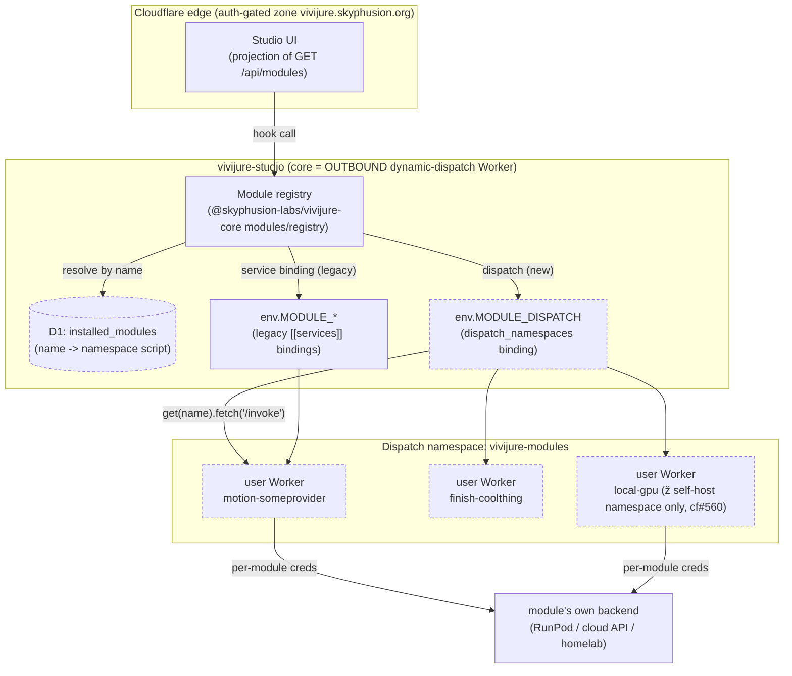
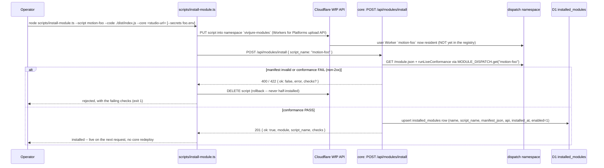

# Module dispatch (Workers for Platforms)

> Status: **SHIPPED as an opt-in capability (v0.8.0, roadmap Phase 3).** The core speaks dispatch:
> registry resolution, the D1 `installed_modules` store (migration `0006_installed_modules.sql`), the
> install/uninstall/disable/list admin routes (operator scope, section 4.4), the conformance
> install-gate, the `host.dispatch` capability flag on `GET /api/modules`, and the
> `scripts/install-module.ts` operator CLI all ship in the studio Worker. The binding is **opt-in per
> deploy**: `wrangler.toml.example` keeps the `[[dispatch_namespaces]]` block COMMENTED (the free
> self-host default, since WfP is a paid add-on and a binding to a missing namespace fails the deploy),
> and the CI "Render core wrangler.toml" step in `.github/workflows/ci.yml` uncomments it only when the
> repo variable `vars.ENABLE_WFP_DISPATCH == "1"` (the namespace having been created out of band; see
> `docs/deploy-runbook.md`). `src/env.ts` declares `MODULE_DISPATCH?: DispatchNamespace`. On a deploy
> without the binding the whole dispatch layer is a no-op (outside demo mode, section 3.4): the studio
> runs exactly as before on service bindings.
>
> This is an **infrastructure + onboarding** spec layered UNDER the existing module contract
> (`docs/module-api.md`, `@skyphusion-labs/vivijure-core modules/types` = `vivijure-module/2`). It changes WHERE a module lives
> and HOW the core reaches it; it does not (by design, see section 6) change WHAT a module is. Read
> `docs/module-api.md` first; this is the transport story beneath it.
>
> **Implementation note (transport ref).** The `RegisteredModule.dispatch` descriptor originally
> proposed for section 3.2 did NOT ship; the shipped design is a strictly-internal simplification: a
> module's transport is encoded in its single `binding` REF string -- `MODULE_<NAME>` for a service
> binding, `dispatch:<script>` (prefix `DISPATCH_REF_PREFIX`, built by `dispatchRef`) for a namespace
> upload -- resolved by one primitive, `resolveFetcher(env, binding)` in
> `@skyphusion-labs/vivijure-core modules/registry`. One string (not a second
> field) means a module's transport persists cleanly through render job state, so a dispatch module works
> uniformly across the multi-request finish/speech/master chains, not just the in-request pick_one hooks.
> Nothing on the module-facing contract or the public wire changes (the ref is stripped by `toPublic`).

## 0. Why this exists

Today a module is a standalone Worker bound to the core by a `[[services]]` entry named
`MODULE_<NAME>` (see `docs/module-authoring.md`). The registry (`@skyphusion-labs/vivijure-core modules/registry`) discovers
every `MODULE_*` binding, reads each manifest, and dispatches hook calls over that service binding.
That works, but installing a module is a **core redeploy**: you add a `[[services]]` block to
`wrangler.toml.example`, the module must already be deployed (a binding to a missing service makes
`wrangler deploy` of the core fail), and the core ships again. The deploy order (modules first, core
second) is load-bearing and enforced in CI (`.github/workflows/ci.yml`).

Two of the project's own promises are throttled by that:

- *"The frontend is a projection of the registry."* True, but only as of the **last core deploy**: a
  new capability cannot appear until the core ships again.
- *"Modules = community territory."* A docs promise, not infrastructure: a contributor cannot install
  their module without a PR into our tree and a release.

Cloudflare **Workers for Platforms** (activated on the account 2026-06-30) removes the redeploy. A
module becomes a **user Worker** uploaded into a **dispatch namespace**; the core becomes the
**outbound dynamic-dispatch Worker** that looks the module up by name at request time and routes the
hook call to it. *Projection of the registry* becomes a **runtime** truth, and *community territory*
becomes **install-without-us** infrastructure.

### The mapping (one line)

| Module contract noun | Service-binding world (today) | Dispatch world (this doc) |
|---|---|---|
| **Module** | a Worker bound as `MODULE_<NAME>` (`[[services]]`) | a **user Worker** uploaded into the **dispatch namespace** |
| **Core** | a Worker holding N static `MODULE_*` Fetchers | the **outbound dynamic-dispatch Worker** holding ONE namespace binding |
| **Install** | edit `wrangler.toml` + redeploy the core | upload the user Worker + insert a registry row (no core deploy) |
| **Reach a module** | `env.MODULE_X.fetch(...)` | `env.MODULE_DISPATCH.get(name).fetch(...)` |

The crucial seam: `DispatchNamespace.get(name)` returns a **`Fetcher`** -- the exact shape the
pipeline already consumes. Everything downstream of "resolve a module to a Fetcher" (the `/invoke`,
`/poll`, `/cancel` envelope handling in `@skyphusion-labs/vivijure-core modules/registry`) is **unchanged**. Dispatch is a new way to
RESOLVE a module to a Fetcher, not a new way to TALK to one.

## 1. Topology


```mermaid
flowchart TD
  subgraph edge["Cloudflare edge (auth-gated zone vivijure.skyphusion.org)"]
    UI["Studio UI<br/>(projection of GET /api/modules)"]
  end

  subgraph core["vivijure-studio (core = OUTBOUND dynamic-dispatch Worker)"]
    REG["Module registry<br/>(@skyphusion-labs/vivijure-core modules/registry)"]
    DB[("D1: installed_modules<br/>(name -> namespace script)")]
    DISP["env.MODULE_DISPATCH<br/>(dispatch_namespaces binding)"]
    SB["env.MODULE_*<br/>(legacy [[services]] bindings)"]
  end

  subgraph ns["Dispatch namespace: vivijure-modules"]
    M1["user Worker<br/>motion-someprovider"]
    M2["user Worker<br/>finish-coolthing"]
    M3["user Worker<br/>local-gpu (#382; self-host namespace only, cf#560)"]
  end

  RUNPOD["module's own backend<br/>(RunPod / cloud API / homelab)"]

  UI -->|hook call| REG
  REG -->|"resolve by name"| DB
  REG -->|"dispatch (new)"| DISP
  REG -->|"service binding (legacy)"| SB
  DISP -->|"get(name).fetch('/invoke')"| M1
  DISP --> M2
  DISP --> M3
  SB --> M1
  M1 -->|"per-module creds"| RUNPOD
  M3 -->|"per-module creds"| RUNPOD

  classDef new stroke-dasharray: 4 3;
  class DISP,DB,M1,M2,M3 new;
```

The core gains **one** binding (the dispatch namespace) and keeps the legacy `MODULE_*` service
bindings working side by side (see section 6, dual-resolution). A hook call resolves a module name to
a Fetcher by **either** path, then the existing envelope code does the rest.

## 2. The dispatch namespace + the outbound dynamic-dispatch worker

### 2.1 Concept

Workers for Platforms gives an account **dispatch namespaces**: collections of "user Workers" that are
NOT individually routable from the internet. A single **dynamic-dispatch Worker** (here: the core)
holds a binding to the namespace and, per request, calls `namespace.get(scriptName)` to obtain a
`Fetcher` for one user Worker, then `.fetch()`es it. The core is the ONLY ingress to every module in
the namespace -- which preserves the module trust boundary from `docs/module-authoring.md` (a module
has no public surface; the core, behind Access, is its only caller).

### 2.2 The `wrangler.toml.example` binding (opt-in)

A dispatch namespace is bound exactly like any other resource. The binding name follows the existing
`MODULE_*` convention so it reads as "the module transport", and the namespace name is account-scoped.

**As shipped:** `wrangler.toml.example` carries the three lines below **commented out**
(`# [[dispatch_namespaces]]`, `# binding = "MODULE_DISPATCH"`, `# namespace = "vivijure-modules"`), so
the committed template deploys on a free account. The CI "Render core wrangler.toml" step
(`.github/workflows/ci.yml`) uncomments exactly those three lines when `vars.ENABLE_WFP_DISPATCH` is
`"1"`, and fails the deploy (`ENABLE_WFP_DISPATCH=1 but dispatch block did not uncomment (example
drifted)`) if they do not all appear uncommented afterwards. A self-host operator with WfP uncomments
them by hand after creating the namespace. The diff below is the **historical design proposal**, kept
for its rationale; it shows the block active, which is what the rendered config looks like with the
variable set.

```diff
  # --- Opt-in MODULE workers: service bindings named MODULE_<NAME>; the registry discovers them.
  [[services]]
  binding = "MODULE_PLANENHANCE"
  service = "vivijure-module-plan-enhance"

  # ... (existing first-party [[services]] module bindings stay as-is) ...

+ # --- Phase 3: Workers for Platforms dynamic dispatch. The core is the OUTBOUND dynamic-dispatch
+ # --- Worker for the `vivijure-modules` dispatch namespace; a module uploaded into that namespace is
+ # --- reached at request time via env.MODULE_DISPATCH.get(<script>).fetch(...), with NO core redeploy.
+ # --- The namespace must EXIST at deploy time (like any [[services]] target) or `wrangler deploy`
+ # --- fails; create it once, out of band (see section 3.1), before this binding ships. Mirror this in
+ # --- src/env.ts (MODULE_DISPATCH: DispatchNamespace).
+ [[dispatch_namespaces]]
+ binding = "MODULE_DISPATCH"
+ namespace = "vivijure-modules"
+
+ # OPTIONAL hardening (deferred, see section 7): an OUTBOUND worker can intercept every module's
+ # outbound fetch (egress allow-list, spend metering). Wire it only when that worker exists, or the
+ # core deploy fails on a dangling outbound reference -- same dangling-binding discipline as a service.
+ # outbound = { service = "vivijure-module-egress-guard" }
```

> Deploy-ordering note (infra): a `[[dispatch_namespaces]]` binding is subject to the SAME
> existence rule as a `[[services]]` target -- the namespace must exist before the core that binds it
> deploys, or `wrangler deploy` fails (and `typecheck` will not catch it, only a real deploy will).
> So the namespace is created **once, out of band** (section 3.1), ahead of the first core deploy that
> carries this binding. After that, modules come and go **inside** the namespace with no core deploy.

### 2.3 The `src/env.ts` mirror

Every binding is mirrored in the hand-authored `Env`. `DispatchNamespace` is provided by the pinned
`@cloudflare/workers-types` devDep (no new dependency). **As shipped:** `src/env.ts` declares
`MODULE_DISPATCH?: DispatchNamespace` (optional, so a deploy without WfP still typechecks). The diff
below is the **historical design proposal**; one detail differs in the shipped code, see the note after
it.

```diff
   // Opt-in module workers: `MODULE_<NAME>` service bindings. Discovered by the registry.
   [key: `MODULE_${string}`]: Fetcher | undefined;
+
+  // Phase 3 (Workers for Platforms): the outbound dynamic-dispatch binding to the `vivijure-modules`
+  // dispatch namespace. A module uploaded into the namespace is resolved at request time by
+  // env.MODULE_DISPATCH.get(<script-name>) -> Fetcher, then invoked over the SAME /invoke envelope as a
+  // service-bound module. Optional so a deploy without WfP (or a self-host that only uses [[services]]
+  // modules) still typechecks and runs; the registry falls back to service bindings when it is absent.
+  MODULE_DISPATCH?: DispatchNamespace;
```

> `MODULE_DISPATCH` is declared as an explicit key alongside the `` [key: `MODULE_${string}`] `` index
> signature. Because TypeScript requires an explicit property to be assignable to a matching index
> signature, the shipped index type is `Fetcher | DispatchNamespace | undefined` (not the
> `Fetcher | undefined` the proposal shows). A dispatch namespace is a `DispatchNamespace` (it has
> `.get()`, not `.fetch()`); declaring it explicitly, and as a name the registry's `MODULE_*`
> service-binding scan EXCLUDES (section 6.3), keeps the two transports from colliding -- a
> `DispatchNamespace` is not a `Fetcher` and must never be mistaken for a service-bound module.

## 3. Registry -> dispatch routing

### 3.1 What the core stores

In the service-binding world the registry is **discovered** from `env` (scan `MODULE_*`, read each
`module.json`). In the dispatch world there is no per-module `env` binding to scan -- every module
lives behind ONE namespace binding. So the set of installed modules moves into **D1** (the core
already binds `DB`), one row per installed module (`migrations/0006_installed_modules.sql`):

```
TABLE installed_modules (
  name          TEXT PRIMARY KEY,   -- the module id (matches manifest.name)
  script_name   TEXT NOT NULL,      -- the user-Worker script name inside the namespace
  manifest_json TEXT NOT NULL,      -- the module.json captured + conformance-checked at upload (section 4)
  api           TEXT NOT NULL,      -- manifest.api, so an epoch the host no longer supports is filtered out
  installed_at  INTEGER NOT NULL,
  enabled       INTEGER NOT NULL DEFAULT 1
)
```

The manifest is captured **at upload time** (after it passes conformance, section 4) rather than
re-fetched on every boot, because a dispatch module is not enumerable from `env`. The registry's
existing `validateManifest` still guards what goes into the row; a future module redeploy that changes
its manifest re-runs the upload path (section 3.4), so the stored copy never silently drifts.

### 3.2 Resolving a name to a Fetcher

**As shipped:** `@skyphusion-labs/vivijure-core modules/registry` resolves a module with
`resolveFetcher(env, module.binding)`. If the `binding` ref starts with `DISPATCH_REF_PREFIX`
(`"dispatch:"`), it calls `env.MODULE_DISPATCH.get(<script>)` (the ref minus the prefix), catching the
throw `get()` raises for an absent script and returning `null` (also `null` when `MODULE_DISPATCH` is
unbound); otherwise it reads `env[binding]` and
returns it only if it is a Fetcher. A `null` is the same honest `ok:false` degrade an unbound service
binding produces. There is no separate `dispatch` descriptor on `RegisteredModule`.

The historical proposal below (a `fetcherFor` with a `module.dispatch` branch) is kept for its
rationale; the shipped code folds the same two branches into the single ref string.

```ts
// HISTORICAL PROPOSAL (illustrative, not the shipped code): the only new resolution logic. Everything after "got a Fetcher" is the
// existing invokeModule / pollModule / cancelModule / awaitInvoke path, unchanged.
function fetcherFor(env: Env, module: RegisteredModule): FetcherLike | null {
  if (module.dispatch) {
    // WfP path: get() THROWS if the script is absent from the namespace, so guard it -- a missing
    // script becomes an honest ok:false degrade (a dropped chain step / a failed pick_one), never a
    // core crash, exactly like an unbound service binding does today.
    try {
      return env.MODULE_DISPATCH?.get(module.dispatch.script_name) ?? null;
    } catch {
      return null;
    }
  }
  const v = env[module.binding]; // legacy service-binding path
  return isFetcher(v) ? v : null;
}
```

In the shipped design the namespace analogue of `binding` is the `dispatch:<script>` value OF `binding`
itself. Like any `binding`, it is **internal topology** and is stripped by `toPublic()`
before it reaches `GET /api/modules` (the public projection still carries only the manifest -- info
disclosure boundary #18 is preserved; the wire payload never names a script or a binding).

### 3.3 The hook call is byte-for-byte the same

Once `resolveFetcher` returns a Fetcher, the dispatch path and the service-binding path are identical:

```
core: env.MODULE_DISPATCH.get(script).fetch("https://module/invoke", { method: "POST", body:
        JSON.stringify({ hook, input, config, context }) })   // + optional r2, see below
-> module returns { ok: true, output } | { ok: true, pending: true, poll } | { ok: false, error }
```

`InvokeRequest` (`@skyphusion-labs/vivijure-core modules/types`) also has an optional `r2?:
TenantR2Config` sibling of `context`: the tenant's per-job R2 credential (cp#270), attached only for a
module whose manifest sets `needs_tenant_r2` and only on a host that carries a full credential set. The
core refuses to attach it to a dispatch (community) module even when the flag is set, so over the
dispatch transport the envelope is exactly `{ hook, input, config, context }`. `context` itself stays
secret-free; the envelope as a whole is not, for a service-bound module that declares
`needs_tenant_r2`.

This is what preserves the contract's discipline:

- **One typed input/output per hook.** The `InvokeRequest`/`InvokeResponse` shapes are the contract;
  dispatch does not touch them.
- **One declaration, one hop, same words down.** The module still declares its knobs in
  `config_schema`; the core still clamps the user's values with `validateConfig` against that schema
  BEFORE dispatching; the module receives the same already-validated `config`. The transport changed,
  the words did not.
- **No override grab-bag.** Nothing about dispatch adds a side channel; a module's only inputs remain
  `{ hook, input, config, context }`.

`pick_one` vs `chain` cardinality, `ui.order` folding, soft-degrade handling, the async poll loop, and
`/cancel` orphan-honesty all live above `resolveFetcher` and are untouched.

### 3.4 Cardinality + discovery, restated for dispatch

The `MODULE_*` service-binding scan is joined by `discoverDispatchModules(env)`
(`@skyphusion-labs/vivijure-core modules/registry`), which runs `SELECT name, script_name,
manifest_json, api FROM installed_modules WHERE enabled = 1` on `env.DB`, re-validates each stored
`manifest_json` with `validateManifest` (a row with invalid JSON or a manifest that no longer validates
is logged and skipped), and reconstructs each `RegisteredModule` with `binding: "dispatch:<script_name>"`.
It returns `[]` without touching D1 when `MODULE_DISPATCH` is unbound, with ONE exception: in demo mode
(`AUTH_MODE=demo`, #625) it reads the table anyway, because the demo binds no namespace but seeds
`installed_modules` with captured manifests so `/api/modules` projects the real catalog (display-only:
the demo gate denies mutations and the seeded refs are never invocable). A D1 error is logged and
yields `[]`.

`discoverModules(env)` returns the merge of both halves via `mergeRegistries(service, dispatch)`:
service entries first, then dispatch-only entries. On a NAME collision (a module both service-bound and
installed in the namespace, the transient migration overlap of section 6.3) the **service binding
wins** and the dispatch duplicate is dropped with a warning. The dispatch half is re-read from D1 on
EVERY call, so an install / uninstall / enable toggle takes effect on the next request; only the
service-binding scan is cached per isolate. The merged list is the one registry the pipeline and
`GET /api/modules` consume. `indexByHook`, `resolvePickOne`, `servingForHook`,
`dispatchChain`, `dispatchPickOne` need NO change -- they operate on `RegisteredModule[]`, agnostic to
how each entry will resolve to a Fetcher.

## 4. The upload / install contract

Installing a module is **upload the user Worker -> conformance-gate it -> insert the registry row**.
All three steps are code/API, no dashboard click (the IaC / no-dashboard doctrine).

### 4.1 Onboarding flow (IaC, no dashboard)


```mermaid
sequenceDiagram
  participant C as Operator
  participant CLI as scripts/install-module.ts
  participant CF as Cloudflare WfP API
  participant CORE as core: POST /api/modules/install
  participant NS as dispatch namespace
  participant DB as D1 installed_modules

  C->>CLI: node scripts/install-module.ts --script motion-foo --code ./dist/index.js --core <studio-url> [--secrets foo.env]
  CLI->>CF: PUT script into namespace `vivijure-modules` (Workers for Platforms upload API)
  CF->>NS: user Worker `motion-foo` now resident (NOT yet in the registry)
  CLI->>CORE: POST /api/modules/install { script_name: "motion-foo" }
  CORE->>NS: GET /module.json + runLiveConformance via MODULE_DISPATCH.get("motion-foo")
  alt manifest invalid or conformance FAIL (non-2xx)
    CORE-->>CLI: 400 / 422 { ok: false, error, checks? }
    CLI->>CF: DELETE script (rollback -- never half-installed)
    CLI-->>C: rejected, with the failing checks (exit 1)
  else conformance PASS
    CORE->>DB: upsert installed_modules row (name, script_name, manifest_json, api, installed_at, enabled=1)
    CORE-->>CLI: 201 { ok: true, module, script_name, checks }
    CLI-->>C: installed -- live on the next request, no core redeploy
  end
```

The CLI (`scripts/install-module.ts`, run with `node scripts/install-module.ts`) takes
`--script <name>` (required; the user-Worker script name), `--code <path>` (required; the ESM entry
file, uploaded as the `main_module`), `--core <studio-url>` (required), and optionally
`--secrets <dotenv-file>` (each `KEY=VALUE` line becomes a `secret_text` binding on the uploaded script),
`--namespace` (default `vivijure-modules`), `--compat-date` (default `2024-11-01`), and `--name` (sent
in the install body, but the core route reads only `script_name` and takes the module name from the
manifest). Auth
comes from the environment, never argv: `CLOUDFLARE_ACCOUNT_ID` and `CLOUDFLARE_API_TOKEN` (a
WfP-scoped token, Workers Scripts:Edit) for the upload/delete, and `CF_ACCESS_CLIENT_ID` /
`CF_ACCESS_CLIENT_SECRET` (a CF Access service token) sent as `CF-Access-Client-Id` /
`CF-Access-Client-Secret` on the core call. The CLI sends no `Authorization: Bearer` header, so as
written it reaches an Access-mode core, not a token-mode one (section 4.4 for the route's auth). The
conformance run and the row insert are done by the **core route**, not the CLI.

A module is **resident** (uploaded into the namespace) the moment the WfP upload succeeds, but it is
**not installed** until its row exists in `installed_modules`. The conformance gate (section 4.3) sits
BETWEEN those two states, so a resident-but-failing module is never in the registry and never
dispatched. That two-state split is what makes the gate load-bearing rather than advisory.

### 4.2 Per-module credentials (bounded blast radius)

The per-function-key rule (own AI-Gateway token per worker, own scoped RunPod key per identity) is
UNCHANGED and, if anything, more important here: a namespace module is community territory. Secrets are
bound to the **user Worker**, not the core:

- A module's backend creds (`RUNPOD_API_KEY`, a cloud-provider key, a homelab `LOCAL_BACKEND_TOKEN`)
  are set as **secrets on that uploaded script** via the WfP script-settings/secrets API at upload
  time -- the analogue of how first-party modules bind from the account Secrets Store today. The core
  never holds a module's backend creds (the contract already says so: a module cancels with its OWN
  creds because the core never has them).
- The core hands a module only the credential-LESS `InvokeContext` (`{ project, job_id }`) plus
  presigned, short-lived R2 URLs for the specific objects a hook needs -- exactly as today. WfP does
  not widen that surface: the one secret the envelope can carry, `InvokeRequest.r2` (section 3.3), is
  withheld from dispatch modules even when their manifest sets `needs_tenant_r2`.
- Blast radius of a leaked/compromised module key is one module's backend, never the core or another
  module. Section 7 covers the OPEN question of whether an outbound-Worker egress guard should also
  fence where a module is even allowed to call.

### 4.3 Conformance gate integration

This is the operational teeth of "a module that implements the interface but fails conformance is not
installable" (CLAUDE.md, "Verifying changes").

- The harness already exists: `@skyphusion-labs/vivijure-core modules/conformance` (`checkManifest`, `checkInvokeResponse`,
  `checkHookOutput`) and `tests/conformance.live.test.ts`, run today as
  `MODULE_URL=<deployed-url> npm run conformance` against a deployed worker.
- In the dispatch world the gate runs in the **install path** (section 4.1), against the
  just-uploaded script reached **through the dispatch binding** (not a public URL -- the module has
  none). The live conformance check (`runLiveConformance(fetcher)` from
  `@skyphusion-labs/vivijure-core modules/conformance`) is pointed at
  `env.MODULE_DISPATCH.get(script_name)` so it exercises the real dispatch transport it will run on.
  It makes exactly three probes: (1) `GET /module.json` through `checkManifest` (a failure here stops
  the run); (2) one `POST /invoke` for the manifest's FIRST hook only (`hooks[0]`), with a fixed
  `plan.enhance`-shaped input and `context { project: "conformance", job_id: "install-gate" }`, checked
  with `checkInvokeResponse` (plus `checkHookOutput` when the answer is synchronous `ok:true` without
  `pending`); a module whose first hook is not `plan.enhance` is expected to degrade (`ok:false`),
  which is still a conformant envelope; (3) a degrade probe, `POST /invoke` with an unknown hook, that
  must answer HTTP 200 + `ok:false`. Hooks after `hooks[0]` are not probed at install.
- **Gate placement is the whole point:** the `INSERT` into `installed_modules` happens ONLY on a green
  suite. Resident-but-not-conformant = rolled back (script deleted) or left orphaned-and-unlisted; it
  is never dispatched because the registry only ever reads installed rows.
- **Gate SCOPE (be honest about the async limit).** The install gate proves the contract WIRING:
  manifest shape, the invoke/degrade envelope, and -- for a **synchronous** hook (a module that answers
  `ok:true + output` immediately, e.g. `plan.enhance`) -- the typed hook output via `checkHookOutput`. It
  deliberately does **not** validate the typed output of an **async** hook (`motion.backend` / `keyframe`
  / `finish` / `speech` / `master`), which answers `ok:true + pending + poll`: proving that shape would
  require polling the job **to completion**, i.e. running the module's real (often GPU) work just to
  install it -- an unacceptable side effect + cost for an install gate. Typed-output conformance for an
  async hook stays the **module author's** responsibility, proven by its own conformance CI
  (`checkHookOutput` over a controlled completion in `tests/conformance.live.test.ts` /
  `npm run conformance`), not by this install-time gate. The gate blocks a mis-wired or non-degrading
  module; it does not re-run an async hook's per-shot output contract.

### 4.4 install / uninstall / list

| Operation | Mechanism | Core redeploy? |
|---|---|---|
| **install** | WfP upload -> conformance PASS -> `INSERT installed_modules` | no |
| **uninstall** | `DELETE installed_modules WHERE name=?` (stop dispatching) then WfP delete script (evict) | no |
| **disable** | `UPDATE installed_modules SET enabled=0` (registry skips it; script stays resident for quick re-enable) | no |
| **list** | `SELECT * FROM installed_modules` -> merged into the registry -> projected by `GET /api/modules` | no |

`uninstall` removes the registry row FIRST (so the next request stops dispatching) and evicts the
script SECOND (so an in-flight request mid-`/poll` is not torn out from under). All four are admin API
routes on the core, callable from an `install` CLI checked into the repo -- the reproducible,
no-dashboard onboarding the doctrine asks for.

> **Known deviation (#764, MD-6):** today `DELETE /api/modules/install/:name` only deletes the
> `installed_modules` row, and `scripts/install-module.ts` has no uninstall mode (it deletes a script
> only as the rollback of a failed install), so the WfP script-evict step is not implemented: an
> uninstalled script stays resident in the namespace until removed out of band.

**The routes (as shipped).** All four are in `API_ROUTES` (`src/index.ts`) with `scope: "operator"`:
the caller must pass the `/api/*` auth gate AND hold operator scope (an Access identity in access
mode, or the `STUDIO_API_TOKEN` secret / a named API token whose row grants `operator` in token mode;
a consumer-scoped credential gets `403`). The demo studio (`AUTH_MODE=demo`) grants only consumer
scope, so all four answer `403` there. JSON bodies; errors are `{ "error": "<message>" }` unless noted.

| Route | Body | Success | Failures |
|---|---|---|---|
| `GET /api/modules/installed` | none | `200 { ok: true, modules: [{ name, script_name, api, installed_at, enabled }] }` (every row, enabled or not, ordered by `name`; `enabled` is a boolean) | auth only |
| `POST /api/modules/install` | `{ "script_name": "<script>" }` | `201 { ok: true, module, script_name, checks }` | `400` when `MODULE_DISPATCH` is unbound (`dispatch is not enabled on this host (no MODULE_DISPATCH namespace bound)`), `script_name required`, the script is not resident, `module unreachable: ...` (the `GET /module.json` fetch failed after its timeout/retry), or `module.json is not valid JSON`; `422 { ok: false, error: "invalid manifest: ..." }`; `422 { ok: false, error: "conformance failed", checks: [<failing checks>] }` |
| `DELETE /api/modules/install/:name` | none | `200 { ok: true, module, removed: true }` | `404 module not installed` |
| `PATCH /api/modules/install/:name` | `{ "enabled": true \| false }` | `200 { ok: true, module, enabled }` | `400` `` body needs a boolean `enabled` ``; `404 module not installed` |

`:name` is the module name (`manifest.name`, the row's primary key), not the script name. Install is
an **upsert**: re-installing a name that already has a row (a new version that re-passed the gate)
replaces its `script_name`, `manifest_json`, `api`, and `installed_at` in place and sets `enabled = 1`,
so a re-install also re-enables a disabled module. The stored `manifest_json` is the exact raw text
that passed the gate.

## 5. Contract-version implications (DECIDED)

**The question:** does dynamic dispatch require a bump of `vivijure-module/2`, or is it host-side-only
and additive (module contract unchanged)?

**The ruling (Mackaye, design-only): ADDITIVE, NO bump. The contract stays `vivijure-module/2`.** Both
readings are recorded below; section 5.3 carries the decision and the one refinement (a host
capability flag, not a version) that satisfies the change-control instinct host-side.

### 5.1 The case for ADDITIVE (no bump) -- the strong reading

- The contract is `module.json` + the `/invoke` `/poll` `/cancel` envelope + the typed hook payloads.
  Dispatch changes **none** of them. A module that conforms to `vivijure-module/2` over a service
  binding conforms over dispatch **without a single byte changed** -- `get(name).fetch("/invoke")` and
  `env.MODULE_X.fetch("/invoke")` deliver the identical request.
- Everything new lives **host-side**: a binding, a D1 table, a resolution branch (`resolveFetcher`),
  an install path. None of it is visible to a module author or added to the module-facing types in
  `@skyphusion-labs/vivijure-core modules/types`.
- The contract has a precedent for "additive, no bump": `ui.locality`, `cancelable`, `jobId`, and
  `config_schema` `scope` were all added without a version change because they narrowed nothing a
  module relied on. Dispatch is even less invasive -- it touches the module-facing types not at all.
- Practical weight: a bump forces a migration story across every module in `modules/` (the
  `/1`->`/2` note in `@skyphusion-labs/vivijure-core modules/types` already records how costly a simultaneous cutover is). Spending that on a change no module
  can observe is a poor trade.

### 5.2 The case for a BUMP -- the honest counter

- A module MAY legitimately want to **know** it is running under dispatch (e.g. to assert it has no
  public route, or to emit observability tagged by transport). If we ever pass a transport hint in
  `InvokeContext`, that is a new field on a module-facing type and DOES bump.
- If dispatch ever needs a per-module capability the manifest must DECLARE (a tenancy class, a
  resource-limit request mapped to `DynamicDispatchLimits`, an outbound-egress allow-list), that is a
  manifest schema addition. Additive manifest fields have not bumped before -- but a REQUIRED one
  would.
- Change-control instinct (aviation-grade): a transport this significant arguably deserves a version
  marker even if the shapes are unchanged, purely so a deployment can assert "this host speaks
  dispatch" distinctly from "this host speaks service bindings".

### 5.3 The decision (Mackaye): additive on `vivijure-module/2`

**Dispatch ships as additive host-side infrastructure. NO `MODULE_API` bump. The contract stays
`vivijure-module/2`** -- because the module-facing contract is genuinely untouched
(`get(name).fetch("/invoke")` delivers the identical request a service binding does), and a bump's cost
(a migration of every module in `modules/`) buys nothing a module can observe. The two decisions section 5.2 raised are
both ruled NO, which is what keeps this additive:

1. **Transport hint to modules: NO.** A module stays BLIND to which door it came through. A
   `context.transport` (or any "you are running under dispatch" signal) would leak host topology into a
   module-facing type and break "no override grab-bag" -- a module's only inputs remain
   `{ hook, input, config, context }`, and `context` stays `{ project, job_id }`. A module that wants
   to assert it has no public route does so in its OWN config (`workers_dev = false`, no route), not by
   reading a host hint.
2. **Required manifest dispatch field: NO.** Any dispatch knob (a tenancy class, a
   `DynamicDispatchLimits` request, an egress allow-list) is OPTIONAL with a host default. Optional
   manifest fields have never bumped (precedent: `ui.locality`, `cancelable`, `jobId`,
   `config_schema` `scope`); a REQUIRED one would, so we keep them all optional and host-defaulted.

**Refinement -- "this host speaks dispatch" is a HOST CAPABILITY FLAG, never a `MODULE_API` version.**
Section 5.2's change-control instinct (a deployment wanting to assert it speaks dispatch) is real, and
it is satisfied **host-side**, not by versioning the module contract. The core advertises its own
capabilities in the `GET /api/modules` projection -- a `host` / `meta` block (e.g.
`host: { dispatch: true }`) that is the CORE describing itself, orthogonal to `api`
(`vivijure-module/2`, which describes the module contract). A module never reads it; an operator,
the studio UI, or a health probe does. This keeps two distinct facts distinct: WHAT the module
contract is (the `api` version, unchanged) versus WHAT transports the host offers (a host capability,
newly advertised). Adding a host capability flag bumps nothing in `@skyphusion-labs/vivijure-core modules/types`.

## 6. Migration: in-tree-behind-a-flag -> namespace upload

### 6.1 The `local-gpu` case (#382)

Rollins's `local-gpu` door was the textbook first migration candidate. *Historically* (v0.7.6) it was
fenced out of the deploy by an `EXCLUDE` in CI because its `LOCAL_BACKEND_URL` / `LOCAL_BACKEND_TOKEN`
secrets were not seeded and a `wrangler deploy` of it failed (code 10182).

**Today the exclusion is policy, not a workaround (cf#560): the HOSTED studio never deploys or binds
`local-gpu`.** The door's own manifest says it is self-host only and that commercial use goes through
vivijure-cf instead, so binding it on the hosted deploy contradicts its licence text. CI enforces this
twice: `export EXCLUDE="${EXCLUDE:-} local-gpu"` in the module-deploy step, and
`scripts/strip-local-gpu.sh` removing the LOCAL-GPU block from the rendered hosted config (called from
both `.github/workflows/ci.yml` and `.github/workflows/studio-release.yml`). Self-host `deploy.sh`
allows it behind `INSTALL_LOCAL_GPU=1`. The same invariant rules out installing `local-gpu` into the
vivijure-operated `vivijure-modules` namespace (that would be the hosted studio dispatching to it). The migration described below is for a **self-hosted** studio's own namespace (the operator
running the studio on their own account with WfP enabled).

For such a self-host, the old failure mode **disappears** under dispatch:

- No core `[[services]]` binding to dangle -> nothing for the core deploy to trip over.
- No deploy-time exclusion or strip to maintain -> the door is not gated on a core release at all.
- Its secrets bind to the **uploaded user Worker** at install time (section 4.2), not seeded into the
  core's account-level store ahead of a core deploy. The homelab operator installs `local-gpu` into
  the namespace WHEN their box is up, with THEIR backend URL + token, and it goes live on the next
  request.

`local-gpu` keeps the EXACT same `motion.backend` hook signature (`MotionBackendInput` ->
`MotionBackendOutput`) and the same `ui.locality: "local"` door tag (#380/#381). Dispatch changes only
how it is installed, not what it is. The three motion doors (`local` | `byo` | `cloud`) still plug the
ONE `motion.backend` hook; under dispatch they are simply three namespace uploads instead of in-tree
modules behind a flag.

### 6.2 Future community doors

A community `motion.backend` (a new cloud provider, a different homelab runtime) follows the same
path: clone the module template, implement the one hook, pass conformance, and get **installed** --
never a PR into our tree, never a core release. That is "modules = community territory" as
infrastructure.

One important boundary (decided, see risk #1): community-territory does NOT mean self-serve upload into
OUR namespace. For v1 a community module is installed into the vivijure-operated namespace by the
**operator** (who vets it), or -- the true self-serve path -- the contributor runs the studio on THEIR
OWN account and uploads into THEIR OWN namespace (the BYO-accounts model, #244). Either way the module
is the same four files behind the same hook; what differs is whose namespace it lands in.

### 6.3 Dual-resolution during migration (no big-bang)

The migration is **incremental and reversible**, which is the whole point of keeping both transports:

- First-party modules stay on `[[services]]` bindings until each is deliberately moved. The registry
  resolves a module by the ref its `binding` carries (`MODULE_<NAME>` for service-bound,
  `dispatch:<script>` for namespace-resident) -- see section 3.2. Both kinds coexist in one registry,
  one `GET /api/modules`; on a name collision the service binding wins (section 3.4).
- The `MODULE_*` env scan (`moduleBindingNames`) excludes the dispatch binding key itself
  (`MODULE_DISPATCH`): it is a `DispatchNamespace`, not a module `Fetcher`. The exclusion is explicit
  (a named skip, `k !== DISPATCH_BINDING`) in addition to the `isFetcher` shape guard, so a future
  types change cannot accidentally enroll the namespace as a module.
- A module can be moved one at a time: upload it to the namespace, install the row, then remove its
  `[[services]]` block in a later, ordinary core deploy. At no point is the studio down a capability.
- Rollback is symmetric: if a namespace module misbehaves, `uninstall` it (row delete) and, if it was
  a migrated first-party one, its `[[services]]` binding can be restored. No release is blocked on the
  experiment.

## 7. Decisions + open questions

Items 1 and 2 are **DECIDED** (Mackaye, design-only). Items 3 through 7 are correctly-deferred
follow-ups -- they want a measured number or a follow-up spike, not a v1 ruling, and none blocks this
design landing.

1. **Upload auth / who may install -- DECIDED: operator-gated install for v1.** A module upload is
   authenticated by a **core admin API route requiring operator scope** (an Access identity, or the
   operator / an operator-scoped API token in token mode; section 4.4) plus a **scoped install-CLI token** for the WfP upload itself (option (a) + (b) combined).
   **Self-serve upload into OUR namespace is NOT built** -- letting an outside contributor push an
   arbitrary Worker into the vivijure-operated namespace runs untrusted code on our account, which we
   do not open. The genuine self-serve story is **BYO-accounts (#244)**: a contributor runs the studio
   on THEIR OWN Cloudflare account, uploads into THEIR OWN namespace, and the core dispatches outbound;
   "modules = community territory" is fulfilled by #244, not by opening our namespace. So for the
   vivijure-operated deployment, the operator vets and installs a community module via the admin route.

2. **Namespace tenancy -- DECIDED: single namespace for v1.** The vivijure-operated deployment uses ONE
   dispatch namespace (`vivijure-modules`); multi-operator tenancy is NOT a v1 concern. The
   `installed_modules` schema (section 3.1) stays able to grow a `tenant` column without a rewrite, and
   the multi-tenant question (namespace-per-tenant vs a tenant key) is decided **with the BYO-accounts /
   unified-deploy research (#244)**, not here. v1 ships single-namespace; the schema is forward-compatible.

3. **User-Worker cold start.** A namespace module is not always warm. For a synchronous hook
   (`plan.enhance`) a cold start adds latency; for an async GPU hook (`motion.backend`) it is in the
   noise vs the render. The `readManifest` retry/timeout discipline (`@skyphusion-labs/vivijure-core modules/registry`) already tolerates a
   warming module; confirm the same tolerance covers a cold dispatch `get().fetch()`. Low risk, worth a
   measured number before we claim parity.

4. **Observability.** Service-binding calls show in the core's tail today (-> `vivijure-tail` -> Loki/
   Grafana). Dispatched user Workers are separate scripts; their logs/exceptions need to reach the same
   pipeline. WfP supports tail on dispatch; the OPEN item is whether each user Worker ships its own tail
   consumer or the outbound worker aggregates. Needs an observability follow-up (pairs with
   `docs/observability.md`).

5. **Rollback + bad-actor eviction.** `uninstall` (section 4.4) is the happy-path stop. The harder case:
   a module that PASSED conformance but misbehaves at runtime (burns spend, returns slow garbage). We
   need a fast kill (disable flag = one D1 write, already in section 4.4) AND, longer term, the
   outbound-egress guard (section 2.2, deferred) to cap where a module can call and how much it can
   spend. The disable flag covers v1; the egress guard is the hardening follow-up.

6. **Egress / spend fencing (the deferred outbound worker).** WfP lets the dynamic-dispatch worker
   declare an `outbound` Worker that intercepts every user Worker's outbound fetch. That is the natural
   home for an egress allow-list (a module may call its declared backend, nothing else) and per-module
   spend metering. Deferred from v1 (it is a dangling-binding hazard if wired before the worker exists,
   per section 2.2), but it is the right long-term answer to risk #5 and the per-module blast-radius
   story in section 4.2.

7. **Conformance at install vs at runtime drift.** Conformance runs at upload (section 4.3). A module
   that later changes behavior (a backend swap behind the same Worker) is not re-gated until its next
   upload. Acceptable for v1 (same trust model as a deployed service-bound module today), but a
   periodic re-conformance sweep over installed modules is a candidate follow-up.

## 8. What this doc does NOT do

- It does not create the namespace or upload any module; those are operator steps
  (`docs/deploy-runbook.md`, then `scripts/install-module.ts`). The binding and `Env` changes it
  proposed have shipped (sections 2.2 / 2.3); the diffs there are kept as historical rationale.
- It does not change the module-facing contract (`docs/module-api.md`, `@skyphusion-labs/vivijure-core modules/types`). The
  api-version ruling (section 5) is **additive, no bump** -- so this stays a pure host-side +
  onboarding spec layered under the existing `vivijure-module/2` contract. "This host speaks dispatch"
  is advertised as a host capability flag, never a `MODULE_API` version (section 5.3).
