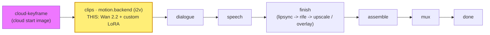

# alibaba-wan-lora

A **`motion.backend`** module (vivijure-module/2): the **Alibaba Wan 2.2** image-to-video backend on
the RunPod **PUBLIC managed endpoint** `wan-2-2-t2v-720-lora` (pay-per-job, no endpoint to deploy). It
turns one shot's start keyframe into a clip at **720p**. Distinctive trait: the operator can bring
**custom LoRAs** (a high-noise pass and a low-noise pass), each an `{ path, scale }` where `path` is a
URL / path to the adapter file (**HuggingFace URLs supported**). Empty LoRA lists = plain Wan 2.2 i2v.
This is the cost-door for controllable cloud i2v: your own trained look, no GPU rental.

## Where it fits

`motion.backend` is a **pick_one** hook: the studio binds exactly one motion backend per render, and
this is one selectable provider among several (seedance, kling, minimax-hailuo, google-veo, vidu-q3,
alibaba-wan, and this LoRA variant). It sits at the **clips** stage, right
after the keyframe is fixed and before dialogue: the keyframe drives the motion, the clip flows on into
the dialogue and speech phases and then finish.

It **pairs with the `cloud-keyframe` module**: that module generates a reference-conditioned start
keyframe in the cloud, and this module animates it. Together they are the **GPU-rental-free** i2v lane
-- cloud keyframe -> this i2v (with your LoRA) -> shot clip -- with no own-GPU keyframe or own-GPU
motion backend in the path.

## Configuration

Operator settings to self-host this module.

**Secrets** (set after deploy, never committed):
- `RUNPOD_API_KEY` -- the RunPod API key for the endpoint. Use a DEDICATED, scoped vivijure key (one
  per module, so a leak's blast radius is this module):
  `npx wrangler secret put RUNPOD_API_KEY -c modules/alibaba-wan-lora/wrangler.toml`.

**Bindings / env** (`wrangler.toml`):
- `R2_RENDERS` -> R2 bucket **`vivijure`** (the shared render bucket; the finished clip is written
  here for the film assembler).
- `account_id` is injected via the `CLOUDFLARE_ACCOUNT_ID` env var, never hardcoded.

**Model / endpoint**: fixed in code -- `ENDPOINT = https://api.runpod.ai/v2/wan-2-2-t2v-720-lora`.
Selecting a different model means binding a different `motion.backend` module, not changing a knob.

**Render knobs** (`config_schema`, set per render in the planner; the core clamps against the schema):
- `high_noise_loras` (string, default `"[]"`) -- a JSON array of `{ path, scale }` LoRAs applied on the
  high-noise pass. `path` is a URL / path to the adapter file (HuggingFace URLs supported), `scale` its
  strength (omit -> `1.0`). Example: `[{"path":"https://huggingface.co/me/look.safetensors","scale":0.9}]`.
- `low_noise_loras` (string, default `"[]"`) -- same shape, applied on the low-noise pass.
- `seed` (int, default `-1`) -- `-1` is a random seed per job; pin it for reproducibility.
- `enable_safety_checker` (bool, default `true`) -- the endpoint's NSFW safety checker; only an explicit
  `false` disables it.

The LoRA lists ride as JSON **strings** because the module contract's config fields are scalar
(int / float / bool / enum / string) -- there is no array field type -- so a structured list is carried
as a string the module parses. An unparseable or empty list falls back to plain Wan 2.2 i2v, never an
error. Output size is fixed at **720p**; per-shot `seconds` becomes the endpoint's `duration`, **snapped to the
endpoint's allowed set {5, 8}s** (`<=6 -> 5, else 8`; the endpoint 400s on any other value, #279). The
snap is recorded (logged) when it changes the requested timing -- never silent. The verified endpoint schema has **no** negative-prompt parameter, so none is sent.

## Contract

- **Hook**: `motion.backend` (cardinality `pick_one`). `provides: i2v-cloud-lora` ("Wan 2.2 (cloud i2v
  + custom LoRA)"), `ui { section: "motion", order: 75 }`.
- **Input** (`MotionBackendInput`): `shot_id`, `keyframe_url` (a presigned, fetchable URL of the start
  keyframe -- passed straight to the endpoint as `image`), `prompt` (the motion description), `seconds`.
- **Config** (`config_schema`): `high_noise_loras`, `low_noise_loras` (JSON `[{path,scale}]` strings,
  default empty), `seed` (default `-1`), `enable_safety_checker` (default `true`).
- **Output** (`MotionBackendOutput`): `shot_id`, `clip_key` (the stored clip), `fps` (24), `frames`.
- **Async**: cloud i2v takes minutes, longer than a Worker request can hold. `POST /invoke` submits to
  RunPod (`/run`) and returns a poll token immediately; `POST /poll` checks status (`/status/{job_id}`)
  and, on completion, finalizes. Bound into the core as `MODULE_ALIBABA_WAN_LORA`.
- **7-day expiry handling**: the endpoint output's `video_url` **expires after 7 days**. On `COMPLETED`
  the module fetches the clip from that URL and writes it to the shared **`vivijure`** R2 bucket under
  the per-shot clip key, then returns the **durable R2 key**. The expiring provider URL is **never**
  passed downstream -- the film assembler only ever sees the R2 key.
- **Failure posture**: a module failure is data, not an exception. A bad request, a `FAILED` job, a
  GC'd job past the grace window, a failed download, or a failed R2 write all return `{ ok: false,
  error }`; the core fails the shot honestly (a missing clip cannot be assembled), matching the
  alibaba-wan / kling reference.

## License

**AGPL-3.0-only.** A labor of love, given freely: use it, learn from it, self-host it, build your own creative visions on it. Run it as a network service and the AGPL has you share your changes back, so it stays a commons. It is not for sale, and not to be resold as a SaaS.
