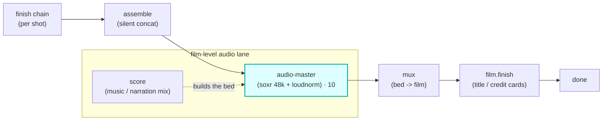

# audio-master

A **`master`**-chain module (vivijure-module/2). It masters a film's audio at **film level** -- a
**music upscale** (VHQ soxr resample to 48 kHz + a gentle high-shelf "air" lift) followed by **two-pass
LUFS loudness normalization** to a web target -- via the always-on **audio-master CPU container** on the
fleet over **Workers VPC** (CPU ffmpeg, no GPU; CPU mastering must never touch a GPU/RunPod -- GPU money
is for GPU work only).

It is the audio sibling of **`finish`** (which polishes a clip) and the **dialogue / speech** lane
(which polishes per-shot voice). Where `finish` and `speech` work per shot, `master` runs **once, on the
whole film's assembled audio bed**, after the mix is built (score + narration) and before that bed is
muxed onto the silent film. A **music-video** maker reaches for `master` as cleanly as a **dialogue**
maker reaches for the voice lane.

## Where it fits

The bed is the mixed `score` / narration track. `master` polishes that bed in place (it rewrites the
film's `audio_key` to the mastered key), and the mux then lays the **mastered** bed onto the silent
film. Duration is invariant -- mastering changes level and sample rate, never length.

## Configuration

Config options (the planner-projected `config_schema`; the core clamps each against it):

| Option | Type | Default | What it does |
| --- | --- | --- | --- |
| `target_lufs` | float (-24..-9) | `-14` | integrated loudness target (LUFS); `-14` is the streaming-web target |
| `upscale` | bool | `true` | music upscale: VHQ soxr resample to 48 kHz + a gentle high-shelf air lift |
| `format` | enum `wav` / `mp3` | `wav` | output bed format (mastering may re-encode) |

To self-host (service `vivijure-module-audio-master`, bound into the core as `MODULE_AUDIO_MASTER`):

- **Env at deploy**: `CLOUDFLARE_ACCOUNT_ID` (account_id is injected, never hardcoded).
- **No secrets**: this worker is credentialless. It holds no R2 creds and no API keys -- the core
  presigns the R2 URLs, and the container is reached over the VPC binding.
- **Binding**: a `[[vpc_services]]` block `AUDIO_MASTER_VPC` pointing at the Workers VPC Service for the
  always-on `audio-master` CPU container (slim ffmpeg, `containers/audio-master/`). The committed
  `service_id` is the live VPC Service (created + bound for v0.3.0); self-hosters replace it with their own.
- **Provision**: deploy the `audio-master` container on the fleet (CPU ffmpeg, SEPARATE from the GPU
  backends) and create the Workers VPC Service that fronts it.

## Contract

- **Hook**: `master` (cardinality `chain`). `ui { section: "master", icon: "sliders", order: 10 }`.
- **Input** (`MasterInput`): `film_id`, `audio_key` (the assembled bed), `audio_url` (presigned GET),
  `output_url` (presigned PUT), `output_key` (the R2 key behind the PUT), optional `seconds` (a length
  hint; the container probes the bed if absent). The core presigns the URLs; this module stays
  credentialless and just forwards them to the container.
- **Output** (`MasterOutput`): `audio_key` (the mastered bed, beside the source with a `_mastered`
  suffix), `applied`, and `degraded` set ONLY on a real passthrough.
- **Synchronous**: `POST /invoke` makes ONE `AUDIO_MASTER_VPC.fetch("http://audio-master/master", ...)`
  round-trip and returns the output -- a two-pass master of a few-minute bed completes within the Worker
  budget, so there is no `/poll`.
- **Credentialless transport**: the core presigns the bed GET + the mastered PUT; the container
  downloads `audioUrl`, masters, and PUTs to `outputUrl`. This worker holds no R2 creds.

## Soft-degrade

*A polish step: never fail the render, never fake the tag (#249 / #77).*

A missing VPC binding or any container failure (unreachable, non-2xx, an unreadable / `ok:false` body, a
result with no mastered key) passes the **input** `audio_key` through unchanged with
`applied: ["passthrough:<reason>"]` and `degraded` set to the honest reason, so the mux always has a bed
to lay down. The only hard `ok:false` is malformed input (missing `film_id` / `audio_key` / `audio_url` /
`output_url` / `output_key`). A master miss therefore degrades to the un-mastered (but intact) audio; it
never drops a fully-rendered film.

## License

**AGPL-3.0-only.** A labor of love, given freely: use it, learn from it, self-host it, build your own creative visions on it. Run it as a network service and the AGPL has you share your changes back, so it stays a commons. It is not for sale, and not to be resold as a SaaS.
