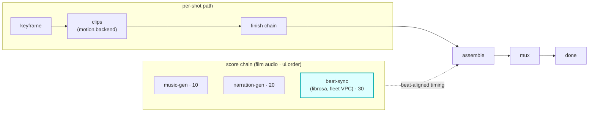

# beat-sync

A `score`-hook module (vivijure-module/2). It runs [librosa](https://librosa.org/) beat analysis on
an always-on container over Workers VPC (Hetzner fleet) and returns **shot timing aligned to the
music bed**, so cuts land on the beat.

## Where it fits

`score` is a film-level audio chain (cardinality `chain`, `0..n`, ordered by `ui.order`), **parallel
to the per-shot path**. beat-sync is the last score step (`ui.order` 30): it reads the music bed
produced upstream (music-gen at 10) and computes beat-aligned timing for the cut. When invoked
without an audio bed (no music in the chain), it passes the `film_key` through unchanged.

The seam is the timing it returns: beat-sync analyzes the bed and reports where the beats fall, which
the assemble step uses to time the cut. It generates no audio of its own; it shapes how the film is
assembled to the audio already there.

## Configuration

`config_schema` (the core clamps against it; the planner projects each field into a control):

| Option | Type | Default | What it does |
|---|---|---|---|
| `clip_seconds` | float | `8` | target seconds per shot (0.5 to 60) |
| `mode` | enum (`beat`, `duration`) | `beat` | timing mode |
| `min_scene_s` | float | `2.5` | minimum shot length, beat mode (0.5 to 30) |
| `max_scene_s` | float | `12` | maximum shot length, beat mode (1 to 60) |
| `force_shots` | int | `0` | force shot count, duration mode (0 = auto) |

The `audio_url` + `audio_key` are runtime fields the core presigns and passes in config at invoke
time, not part of the schema.

**Self-host**: service `vivijure-module-beat-sync`, bound into the core as `MODULE_BEAT_SYNC`.
Binding: `AUDIO_BEAT_SYNC_VPC` (the audio-beat-sync container over Workers VPC; Hetzner fleet, issue
#83). No secrets. See `wrangler.toml`.

## Contract

- **Hook**: `score` (cardinality `chain`). **Provides**: `librosa-beat-sync`,
  "Beat sync (librosa, fleet VPC)". `ui { section: "score", order: 30 }`.
- **Sync**: analysis completes in one `POST /invoke` (no `/poll`).

## License

**AGPL-3.0-only.** A labor of love, given freely: use it, learn from it, self-host it, build your own creative visions on it. Run it as a network service and the AGPL has you share your changes back, so it stays a commons. It is not for sale, and not to be resold as a SaaS.
