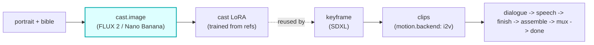

# cast-image

A first-class **`cast.image`**-hook module (vivijure-module/2). It generates a character's LoRA
**training reference set** from a portrait + bible, via the studio's image models (FLUX 2 Klein / Nano
Banana Pro) with a safety-flag fallback.

This is a **pre-render side hook**: it runs at casting time, before any shot is rendered, so the cast
member has a trained look the keyframe stage can lock onto.

## Where it fits

The seam is the reference set: this module writes the generated training images to the shared bucket,
the cast member's LoRA is trained from them, and the **keyframe** stage reuses that adapter so every
shot renders the character on-model. It is pre-render, off the per-shot path entirely.

## Configuration

Config options (the planner-projected `config_schema`; the core clamps each against it):

| Option | Type | Default | What it does |
| --- | --- | --- | --- |
| `model` | enum (see below) | `@cf/black-forest-labs/flux-2-klein-9b` | image model |
| `num_images` | int (4..number of training prompts) | `10` | size of the training reference set |

`model` values: `@cf/black-forest-labs/flux-2-klein-9b`, `google/nano-banana-pro`,
`@cf/black-forest-labs/flux-2-klein-4b`, `@cf/black-forest-labs/flux-2-dev`. A safety-flagged
generation auto-falls back to the configured fallback model mid-run.

To self-host (service `vivijure-module-cast-image`, bound into the core as `MODULE_CAST_IMAGE`):

- **Env at deploy**: `CLOUDFLARE_ACCOUNT_ID` (account_id is injected, never hardcoded).
- **Bindings** (in `wrangler.toml`): `AI` (Workers AI; FLUX 2 runs direct on the binding, proxied
  models via the gateway), `IMAGES` (Cloudflare Images; downscales refs to <=512px, FLUX-2's input
  cap; optional in code but recommended in prod), and `R2_RENDERS` -> R2 bucket `vivijure` (run state +
  generated refs).
- **Secret** (`wrangler secret put`, after deploy): `GATEWAY_ID` (your AI Gateway slug; needed for the
  nano-banana fallback path).
- **Provision**: no RunPod. You need a Cloudflare account with Workers AI, an AI Gateway, and (for
  prod) Cloudflare Images.

## Contract

- **Hook**: `cast.image` (one producer; pre-render). `ui { section: "cast", order: 10 }`.
- **Input** (`CastImageInput`): `cast_id`, `portrait_url` (presigned), optional `portrait_key`,
  `source_urls`, `bible`, `art_style`.
- **Output** (`CastImageOutput`): `cast_id`, `images[]` (`key`, `mime`), `applied`.
- **Async**: `POST /invoke` composes the prompt set and persists run state to R2, returning a stable
  poll pointer; `POST /poll` renders the next prompt(s) (a few per cycle) and returns pending until the
  queue drains. A safety-flagged model auto-falls back to the configured fallback model mid-run.
- **R2 transport**: run state and generated refs land in the shared `vivijure` bucket.

This is a producer stage: a real generation failure (post-fallback) is an honest `ok:false`, not a
fake-success tag.

## License

**AGPL-3.0-only.** A labor of love, given freely: use it, learn from it, self-host it, build your own creative visions on it. Run it as a network service and the AGPL has you share your changes back, so it stays a commons. It is not for sale, and not to be resold as a SaaS.
