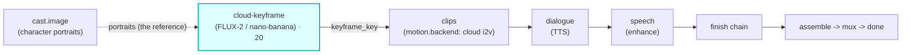

# cloud-keyframe

A first-class **`keyframe`**-hook module (vivijure-module/2), **GPUless**. It turns a project's
storyboard into one **start keyframe per shot** via reference-conditioned **cloud image generation**
(Cloudflare FLUX-2 multiref or `google/nano-banana-pro`) -- **no GPU backend, no RunPod, no LoRA**.

Character consistency comes from the cast **portraits packed in the bundle** (the same portraits a
LoRA would have trained on), passed as reference images to the image model. This is the **cost-door**:
cloud keyframe + cloud i2v (`motion.backend`) is a film path with **zero GPU rental**.

It serves the same `keyframe` hook as the GPU `keyframe` module (cardinality `pick_one`): install
whichever fits the render -- GPU (SDXL + trained cast LoRAs) or cloud (reference-conditioned, no GPU).

## Where it fits

The seam is the keyframe key: this module reads each shot's prompt + character portraits from the
bundle, generates a reference-conditioned keyframe, writes the PNG to the shared `vivijure` bucket at
`renders/<project>/keyframes/<shot>.png`, and reports the key. The core presigns it so
**motion.backend** can pull the frame and animate it.

**Aspect is pinned in two halves**, because the keyframe aspect drives the downstream i2v clip aspect
(a square keyframe forces square clips the assembler then pillarboxes): (1) the model is asked for the
target aspect up front -- FLUX-2 is given `width`/`height`, and nano-banana-pro is given the nearest
standard `aspect_ratio` so it **frames the composition** for that shape (a full-body establishing shot
stays composed for 16:9 instead of being shot square and later body-cropped); then (2) the result is
normalized to exactly `width` x `height` via Cloudflare Images. Because the frame already arrives near
target, that final crop is a trivial trim, not a body-cropping hack -- the model never chooses the
aspect.

## How identity is held (no LoRA)

Cloudflare Workers AI LoRA is a verified dead end for this (inference-only, LLM-only; nano-banana
won't load an adapter). Consistency here is **reference images**, not adapters:

1. `/invoke` reads `storyboard.yaml` (per-shot prompt + `character_slots`) and
   `characters/registry.json` + `characters/char_<SLOT>_*.png` (the canonical cast portraits) out of
   the bundle tarball -- the exact files the core's `bundle-assembler` already writes.
2. Each used portrait is downscaled to <=512px (FLUX-2's input cap) and staged in R2.
3. Per shot, the prompt is composed (project `style_prefix` + scene prompt + each character's
   name/bible) and the staged portraits of that shot's characters are passed as the reference images
   (FLUX-2 `input_image_0..3` / nano-banana `image_input[]`).

A consistency **probe** across 4 different shots (varied pose / setting / framing / lighting) held
one character's face, hair, freckles, and wardrobe on **both** models; nano-banana-pro is the quality
leader, FLUX-2 klein-9b the cost/speed leader.

## Configuration

Config options (the planner-projected `config_schema`; the core clamps each against it):

| Option | Type | Default | What it does |
| --- | --- | --- | --- |
| `model` | enum | `@cf/black-forest-labs/flux-2-klein-9b` | image model (FLUX-2 klein-9b / nano-banana-pro / klein-4b / dev) |
| `width` | int (512..1536) | `1344` | keyframe width (16:9 so the whole chain stays 16:9) |
| `height` | int (512..1536) | `768` | keyframe height |
| `refs_per_slot` | int (1..4) | `1` | reference portraits per character (more = stronger identity, larger payload) |

To self-host (service `vivijure-module-cloud-keyframe`, bound into the core as `MODULE_CLOUD_KEYFRAME`):

- **Env at deploy**: `CLOUDFLARE_ACCOUNT_ID` (account_id is injected, never hardcoded).
- **Secret** (`wrangler secret put`, after deploy): `GATEWAY_ID` -- the AI Gateway slug. Required only
  for the proxied model (`google/nano-banana-pro`); the FLUX-2 default runs direct on the binding.
- **Bindings**: `AI` (Workers AI), `IMAGES` (Cloudflare Images -- downscales refs and pins keyframe
  aspect), `R2_RENDERS` (the shared `vivijure` bucket). See `wrangler.toml`. No GPU, no RunPod.

## Contract

- **Hook**: `keyframe` (cardinality `pick_one`; the first render stage). `ui { section: "keyframe",
  order: 20 }`.
- **Input** (`KeyframeInput`): `project`, `bundle_key` (the storyboard bundle -- self-describing:
  storyboard + cast portraits), optional `shot_ids` (a subset to (re)generate). `pretrained_loras` is
  ignored (this module trains no LoRA; identity is the portraits).
- **Output** (`KeyframeOutput`): `project`, `keyframes[]` (`shot_id` + `keyframe_key`). No
  `trained_loras` (none trained).
- **Async**: `POST /invoke` reads the bundle, stages refs, plans the shots, and returns a poll token;
  `POST /poll` renders one shot per cycle (gen -> normalize -> store) and returns the keys on
  completion.
- **R2 transport**: this worker reads the bundle and writes the keyframes itself (it holds the
  `R2_RENDERS` binding), unlike the GPU `keyframe` module whose backend owns R2.

This is a **producer** stage, not a polish step: a shot it cannot render is an honest `ok:false` (no
soft-degrade, no fake keyframe), because nothing downstream can animate a frame that was never
rendered. Only a real render/store failure or malformed I/O fails loud.

## License

**AGPL-3.0-only.** A labor of love, given freely: use it, learn from it, self-host it, build your own creative visions on it. Run it as a network service and the AGPL has you share your changes back, so it stays a commons. It is not for sale, and not to be resold as a SaaS.
