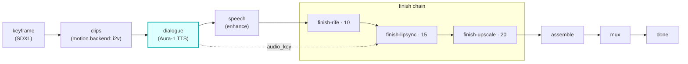

# dialogue-gen

A first-class **`dialogue`**-hook module (vivijure-module/2). It voices each speaking shot's line with
**Deepgram Aura-1** (via Workers AI), in the cast member's assigned voice, and writes one WAV per shot
to the shared render bucket.

This is the **dialogue (TTS) stage**, the audio source for the talking-characters pipeline. The whole
film is one submit+poll: the core sends every speaking shot in ONE batch, not N module round-trips.

## Where it fits

The seam is the audio key: this module produces `job.dialogue_audio[shot]`, the **speech** chain cleans
it, and the cleaned key flows into **finish-lipsync** (MuseTalk) to drive the mouth. A shot with no
spoken line simply has no audio key, and finish-lipsync no-ops for it.

## Configuration

Config options: **none**. There are no user-facing knobs; the voice is the speaking cast member's
assigned `voice_id` (resolved by the core) and the line is the shot's dialogue, both authored upstream
(cast + script), not module config.

To self-host (service `vivijure-module-dialogue-gen`, bound into the core as `MODULE_DIALOGUE`):

- **Env at deploy**: `CLOUDFLARE_ACCOUNT_ID` (account_id is injected, never hardcoded).
- **Bindings** (in `wrangler.toml`): `AI` (Workers AI; runs Aura-1), `R2_RENDERS` -> R2 bucket
  `vivijure` (per-shot WAVs + run state), and `DIALOGUE_WORKFLOW` -> the `DialogueGenWorkflow` class
  (one `step.do` per shot).
- **Secret** (`wrangler secret put`, after deploy): `GATEWAY_ID` (your AI Gateway slug; Aura-1 is
  called through the gateway).
- **Provision**: no RunPod. The model is Deepgram Aura-1 on Workers AI; you need a Cloudflare account
  with Workers AI + an AI Gateway.

## Contract

- **Hook**: `dialogue` (one producer; per-film batch). `ui { section: "dialogue", order: 10 }`.
- **Input** (`DialogueInput`): `project` (the R2 key prefix) + `lines[]`, each `shot_id`, `text`, and
  optional `voice_id` (the cast member's Aura-1 speaker; absent/unknown falls back at synth time).
- **Output** (`DialogueOutput`): `project`, `audio[]` (`shot_id`, `audio_key`, the `voice_id` actually
  used post-fallback), and `applied`.
- **Async**: the blocking Aura-1 synth runs one `step.do` per shot inside a Cloudflare **Workflow**
  (unlimited wall, per-shot retry + checkpoint, survives a recycle), since a request-path `waitUntil`
  is cancelled at ~30s (#155). `POST /invoke` starts the workflow and returns a poll token; `POST
  /poll` reads R2 run state, authoritative for done.
- **R2 transport**: per-shot WAVs and run state land in the shared `vivijure` bucket.

This is a producer stage: a real failure is an honest `ok:false`, not a fake-success tag.

## License

**AGPL-3.0-only.** A labor of love, given freely: use it, learn from it, self-host it, build your own creative visions on it. Run it as a network service and the AGPL has you share your changes back, so it stays a commons. It is not for sale, and not to be resold as a SaaS.
