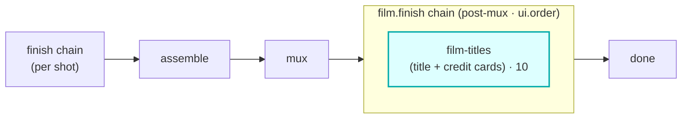

# film-titles

A `film.finish`-hook module (vivijure-module/2). It adds **opening title and end-credit cards to the
finished film** via the video-finish CPU container's `/film-titles` route over Workers VPC (issue
#190).

## Where it fits

`film.finish` is a **film-level** chain (cardinality `chain`, `0..n`, ordered by `ui.order`) that
runs **post-mux, before done** -- after the per-shot finish chain, assemble, and mux have produced
the full film. Unlike `finish` (which processes one clip), `film.finish` operates on the whole
assembled film. film-titles is the first step (`ui.order` 10).

The seam is the assembled film: this module takes the muxed `film_key` and returns the film with
cards prepended/appended. It holds no R2 binding; it only forwards the card spec to the container,
which reads and writes the film itself. It runs on the single-film render path (`/api/render/film`);
the scatter/gather path does not dispatch it yet.

## Configuration

`config_schema` (the core clamps against it; the planner projects each field into a control):

| Option | Type | Default | What it does |
|---|---|---|---|
| `font` | string | `DejaVu Sans` | card font (installed in the video-finish container) |
| `color` | string | `white` | card text color (name or `#rrggbb`) |
| `bg` | string | `black` | card background color |
| `title_seconds` | int | `3` | opening title card duration in s (1 to 15) |
| `credit_seconds` | int | `5` | end credit card duration in s (1 to 30) |

The title / credit text is a runtime input, not part of the schema.

**Styling status:** `title_seconds` / `credit_seconds` are honored by the container. `font` / `color` /
`bg` are accepted and forwarded in the card spec, but the video-finish container does not read them yet,
so cards currently render with the built-in defaults (DejaVu Sans, white text, black background). The
styling pass is tracked separately (M1).

**Self-host**: service `vivijure-module-film-titles`, bound into the core as `MODULE_FILM_TITLES`.
Binding: `VIDEO_FINISH_VPC` (the video-finish CPU container over Workers VPC). No R2 binding, no
secrets (it only forwards the card spec). See `wrangler.toml`.

## Contract

- **Hook**: `film.finish` (cardinality `chain`). **Provides**: `film-titles`,
  "Title + credit cards on the finished film". `ui { section: "film.finish", order: 10 }`.
- **Async job+poll (#602)**: card generation on a LONG film can outlast a Worker request budget, so
  `/invoke` submits to the container's `/async/film-titles` route and returns `{ ok, pending, poll }`;
  the core polls `/poll` across ticks. It FALLS BACK to the synchronous `/film-titles` route when the
  container has no async support (a pre-#602 container), so an old container keeps working unchanged.

## Soft-degrade

A polish step never fails the chain. No title and no credits is an intentional no-op
(`noop:no-cards`); a container failure passes the original film through unchanged tagged
`passthrough:container-failed` with `degraded` set.

## License

**AGPL-3.0-only.** A labor of love, given freely: use it, learn from it, self-host it, build your own creative visions on it. Run it as a network service and the AGPL has you share your changes back, so it stays a commons. It is not for sale, and not to be resold as a SaaS.
