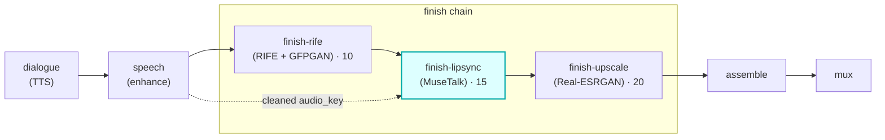

# finish-lipsync

A **`finish`**-chain module (vivijure-module/2). It rewrites a shot's mouth to match its dialogue audio
with **MuseTalk** (v1.5), dispatched to the dedicated **vivijure-musetalk** RunPod endpoint (cu128,
separate from vivijure-backend). This is the "talking characters" finish stage.

It sits in the **middle of the finish chain** (`order: 15`): after rife smooths the motion, before the
upscaler enlarges the synced face region.

## Where it fits

The finish chain runs in ascending `ui.order`: **rife (10) -> lipsync (15) -> upscale (20)**. Two seams
meet here: the clip from rife and the shot's `audio_key` (TTS, cleaned by the speech chain). Order 15 is
deliberately below the upscaler's 20 so a lip-synced shot is then upscaled, the 256px face region wants
it. A shot with no dialogue arrives without an `audio_key` and is an intentional NO-OP.

## Configuration

Config options (the planner-projected `config_schema`; the core clamps each against it):

| Option | Type | Default | What it does |
| --- | --- | --- | --- |
| `version` | enum `v15` / `v1` | `v15` | MuseTalk version (`v15` = v1.5, best) |
| `bbox_shift` | int (-20..20) | `0` | mouth crop shift |

To self-host (service `vivijure-module-finish-lipsync`, bound into the core as `MODULE_LIPSYNC`):

- **Env at deploy**: `CLOUDFLARE_ACCOUNT_ID` (account_id is injected, never hardcoded).
- **Secrets** (`wrangler secret put`, after deploy): `RUNPOD_API_KEY` and `RUNPOD_ENDPOINT_ID` (YOUR
  vivijure-musetalk endpoint id; kept a secret, #38).
- **Provision**: a DEDICATED RunPod serverless endpoint running the `vivijure-musetalk` image (cu128,
  MuseTalk), SEPARATE from vivijure-backend. No R2 binding -- the endpoint reads `clip_key` +
  `audio_key` and writes the output in the shared bucket itself.

## Contract

- **Hook**: `finish` (cardinality `chain`). `ui { section: "finish", icon: "mic", order: 15 }`.
- **Input** (`FinishInput`): `shot_id`, `clip_key`, optional `audio_key` (the shot's dialogue audio;
  absent => no-op passthrough), `src_fps`, `frames`, `width`, `height`.
- **Output** (`FinishOutput`): `shot_id`, `clip_key` (synced clip; fps + frame count preserved),
  `out_fps`, `frames`, `applied`, and `degraded` set ONLY on a real passthrough.
- **Async**: `POST /invoke` submits to RunPod and returns a poll token; `POST /poll` checks
  `/status/{jobId}` (with the GC-grace window, #141) and returns the output on completion.
- **R2 transport**: the endpoint reads `clip_key` + `audio_key` and writes the output in the shared
  bucket itself; this worker holds no R2 creds.

## Soft-degrade

*A polish step: never fail the chain, never fake the tag (#249/#77).*

No `audio_key` is a legitimate NO-OP (`noop:no-dialogue`, not a degrade). A missing endpoint, a submit
failure, or a backend soft-degrade (e.g. no detectable face) passes the **input** `clip_key` through
unchanged with `degraded` set to the honest reason, so the chain always has a clip. The two cases are
never indistinguishable. The only hard `ok:false` is malformed input, a bad poll token, or a genuine
backend crash.

A backend soft-degrade can arrive in TWO envelope shapes (#565): the handler's return
(`COMPLETED` with `output.ok === false`), or, because RunPod lifts a top-level `error` key out of a
handler return into a job-level failure, `FAILED` with the handler's `ok: false` still inside
`output`. Both pass through. A `FAILED` envelope **without** that structured `ok: false` (a raise in
the handler) is a real crash and fails the shot loud.

## License

**AGPL-3.0-only.** A labor of love, given freely: use it, learn from it, self-host it, build your own creative visions on it. Run it as a network service and the AGPL has you share your changes back, so it stays a commons. It is not for sale, and not to be resold as a SaaS.
