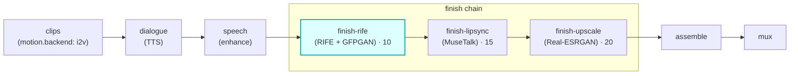

# finish-rife

A **`finish`**-chain module (vivijure-module/2). It smooths a shot's motion with **RIFE** frame
interpolation and optionally relocks faces with **GFPGAN/CodeFormer**, dispatched as `finish_clip` to
the shared **vivijure-backend** RunPod endpoint.

It is the **first link in the finish chain** (`order: 10`), so a clip is smoothed before lip-sync
rewrites the mouth and before the upscaler enlarges it.

## Where it fits

The finish chain runs in ascending `ui.order`: **rife (10) -> lipsync (15) -> upscale (20)**. Smoothing
first means lip-sync and upscale both operate on the higher-frame-rate, face-restored clip.

## Configuration

Config options (the planner-projected `config_schema`; the core clamps each against it):

| Option | Type | Default | What it does |
| --- | --- | --- | --- |
| `interpolate` | bool | `true` | smooth motion (RIFE) |
| `interpolation_factor` | int (1/2/4/8) | `2` | smoothness (`1` = off, else 2x/4x/8x) |
| `face_restore` | enum `none` / `gfpgan` / `codeformer` | `none` | face restore model |
| `face_fidelity` | float (0..1) | `0.7` | `0` = max restore, `1` = max fidelity |
| `only_faces` | bool | `true` | restore faces only, leave background untouched |

To self-host (service `vivijure-module-finish-rife`, bound into the core as `MODULE_FINISH_RIFE`):

- **Env at deploy**: `CLOUDFLARE_ACCOUNT_ID` (account_id is injected, never hardcoded).
- **Binding** (in `wrangler.toml`): `R2_RENDERS` -> R2 bucket `vivijure` (the shared render bucket).
- **Secrets** (`wrangler secret put`, after deploy): `RUNPOD_API_KEY` and `RUNPOD_ENDPOINT_ID` (YOUR
  vivijure-backend endpoint id; kept a secret, #38).
- **Provision**: a RunPod serverless endpoint running the `vivijure-backend` image; this module calls
  its `/run` with `action=finish_clip` (RIFE + GFPGAN). The same endpoint can also serve `keyframe`
  and `own-gpu` (different actions).

## Contract

- **Hook**: `finish` (cardinality `chain`). `ui { section: "finish", icon: "wand", order: 10 }`.
- **Input** (`FinishInput`): `shot_id`, `clip_key`, `src_fps`, `frames`, `width`, `height` (the
  optional `audio_key` is for lipsync; rife ignores it).
- **Output** (`FinishOutput`): `shot_id`, `clip_key` (the finished clip), `out_fps`, `frames`,
  `applied`, and `degraded` set ONLY on a real passthrough.
- **Async**: `POST /invoke` submits to RunPod and returns a poll token; `POST /poll` checks
  `/status/{jobId}` (with the GC-grace window, #141) and returns the output on completion.
- **R2 transport**: the GPU endpoint reads `clip_key` and writes the finished clip in the shared bucket
  itself; the clip bytes never pass through this worker.

## Soft-degrade

*A polish step: never fail the chain, never fake the tag (#249/#77).*

Nothing enabled is a legitimate NO-OP (`applied` tagged, `degraded` unset). A missing endpoint or any
backend failure passes the **input** `clip_key` through unchanged with `degraded` set to the honest
reason, so the chain always has a clip to hand on. The only hard `ok:false` is malformed input (no
`shot_id`/`clip_key`) or a bad poll token.

## License

**AGPL-3.0-only.** A labor of love, given freely: use it, learn from it, self-host it, build your own creative visions on it. Run it as a network service and the AGPL has you share your changes back, so it stays a commons. It is not for sale, and not to be resold as a SaaS.
