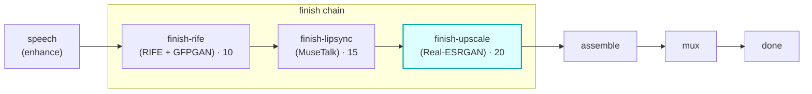

# finish-upscale

A **`finish`**-chain module (vivijure-module/2). It upscales a shot's resolution (2x/4x) with
**Real-ESRGAN**, dispatched to the dedicated **vivijure-upscale** RunPod endpoint (CUDA, separate from
vivijure-backend).

It is the **last link in the finish chain** (`order: 20`), so it enlarges a clip that has already been
smoothed (rife) and lip-synced (MuseTalk); upscaling last means the polish steps above operate at the
cheaper native resolution.

## Where it fits

The finish chain runs in ascending `ui.order`: **rife (10) -> lipsync (15) -> upscale (20)**. Upscaling
is the final spatial polish; the enlarged clip then flows on to
assemble.

## Configuration

Config options (the planner-projected `config_schema`; the core clamps each against it):

| Option | Type | Default | What it does |
| --- | --- | --- | --- |
| `scale` | int (2..4) | `2` | upscale factor (`2` = 2x, `4` = 4x) |
| `model` | enum `realesr-animevideov3` / `RealESRGAN_x4plus` | `realesr-animevideov3` | Real-ESRGAN model. `RealESRGAN_x4plus` (photoreal texture, #585) is an explicit opt-in and currently CUDA-OOMs on long/high-fps clips until the handler gains tiled inference (upscale v0.2.9) |

To self-host (service `vivijure-module-finish-upscale`, bound into the core as `MODULE_UPSCALE`):

- **Env at deploy**: `CLOUDFLARE_ACCOUNT_ID` (account_id is injected, never hardcoded).
- **Secrets** (`wrangler secret put`, after deploy): `RUNPOD_API_KEY` and `RUNPOD_ENDPOINT_ID` (YOUR
  vivijure-upscale endpoint id; kept a secret, #38).
- **Provision**: a DEDICATED RunPod serverless endpoint running the `vivijure-upscale` image (CUDA,
  Real-ESRGAN), SEPARATE from vivijure-backend. No R2 binding -- the endpoint reads `clip_key` and
  writes the output in the shared bucket itself.

## Contract

- **Hook**: `finish` (cardinality `chain`). `ui { section: "finish", icon: "expand", order: 20 }`.
- **Input** (`FinishInput`): `shot_id`, `clip_key`, `src_fps`, `frames`, `width`, `height` (the
  optional `audio_key` is for lipsync; the upscaler ignores it).
- **Output** (`FinishOutput`): `shot_id`, `clip_key` (the upscaled clip), `out_fps`, `frames`,
  `applied`, and `degraded` set ONLY on a real passthrough.
- **Async**: `POST /invoke` submits to RunPod and returns a poll token; `POST /poll` checks
  `/status/{jobId}` (with the GC-grace window, #141) and returns the output on completion.
- **R2 transport**: the endpoint reads `clip_key` and writes the output in the shared bucket itself;
  this worker holds no R2 creds.

## Soft-degrade

*A polish step: never fail the chain, never fake the tag (#249/#77).*

A missing endpoint or any backend failure passes the **input** `clip_key` through unchanged with
`degraded` set to the honest reason, so the chain always has a clip to hand on. The only hard
`ok:false` is malformed input (no `shot_id`/`clip_key`) or a bad poll token.

## License

**AGPL-3.0-only.** A labor of love, given freely: use it, learn from it, self-host it, build your own creative visions on it. Run it as a network service and the AGPL has you share your changes back, so it stays a commons. It is not for sale, and not to be resold as a SaaS.
