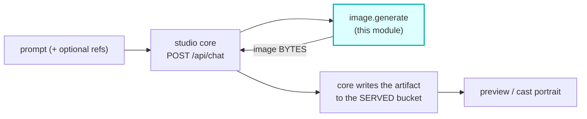

# image-generate

A first-class **`image.generate`**-hook module (vivijure-module/2). Prompt in, one generated image
out. It is where the studio's image **model names** live: the core hardcodes none, so
`GET /api/models` projects its image rows from this module's manifest (cf#129 phase 2).

Install it and the studio offers image generation. Do not, and the image catalog is honestly empty
and the picker offers nothing -- no hardcoded fallback, no invented default.

## Where it fits

## It returns bytes, not a storage key -- deliberately

This module holds **no bucket binding** and never writes storage. The core persists what it returns.

That is [cf#140](https://github.com/skyphusion-labs/vivijure-cf/issues/140) made structural: chat
image artifacts were written to one bucket and served from another, so every preview 404'd in
production while every gate stayed green. A module that cannot write cannot reintroduce that split,
and a third-party image module cannot invent its own key namespace.

It differs from `cast-image`, which does write its own artifacts and return keys. That inconsistency
is **known and deliberate**: `cast-image` produces a *set* of LoRA training references destined for
training rather than a single artifact to serve back. Do not "fix" this module into that shape --
the base64 hop is the point, and it is cheap at image sizes.

## Failure posture: FAIL LOUD

Image generation has no honest passthrough. There is no previous artifact to return and no such
thing as a partially-generated picture, so a provider refusal, an empty result, or zero bytes
returns `ok:false` **naming the model**, never a fake success. An unknown model id is clamped to the
declared default rather than passed upstream, where it would surface as an opaque provider error.

## Config

| knob | type | notes |
|---|---|---|
| `model` | enum | The declared image models. **This is what the studio catalog projects.** Add a model here and the studio offers it with no core deploy. |

## Bindings

| binding | required | why |
|---|---|---|
| `AI` | yes | Workers AI. FLUX 2 runs direct (multipart, gateway-incompatible); proxied and plain `@cf` models ride the gateway when `GATEWAY_ID` is set. |
| `GATEWAY_ID` | no | AI Gateway slug, from the Secrets Store. Without it models still run, ungatewayed. |
| `OPENAI_API_KEY` | no | Per-function key enabling the only path to a **transparent PNG** on `openai/gpt-image-1.5` -- the Unified Billing proxy 7003-rejects `background`/`output_format`. Absent, that model returns an opaque image: an honest degradation, not a failure. |

No R2 bucket, by design (see above).

## Adding a model

Append its id to `MODELS` in `src/index.ts` and confirm `src/image-gen.ts` can dispatch it. Every id
in that list must be executable -- a row the module cannot run is a lie in the studio picker, which
is the defect class cf#129 exists to remove.
