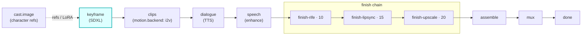

# keyframe

A first-class **`keyframe`**-hook module (vivijure-module/2). It turns a project's storyboard into one
**start keyframe per shot** with SDXL, dispatched to the **vivijure-backend** RunPod endpoint in its
keyframes-only mode (`action=preview`).

This is the **first render stage**: every later stage animates, finishes, and assembles off these
frames. It is a PROJECT-level pass (one job emits every shot's keyframe and trains/reuses the cast
LoRAs once), never a per-shot job, so a render never re-trains an adapter it already has.

## Where it fits

The seam is the keyframe key: the backend writes each shot's PNG to the shared `vivijure` bucket, this
module reports the keys, and the core presigns them so the **motion.backend** stage can pull each frame
and animate it. Freshly trained cast LoRAs are reported back so they are reused across projects.

## Configuration

Config options (the planner-projected `config_schema`; the core clamps each against it):

| Option | Type | Default | What it does |
| --- | --- | --- | --- |
| `quality_tier` | enum `draft` / `standard` / `final` | `final` | render quality tier |
| `width` | int (512..1536) | `1344` | keyframe width (16:9 so the whole chain stays 16:9) |
| `height` | int (512..1536) | `768` | keyframe height |
| `steps` | int (1..60) | `30` | diffusion steps |
| `guidance_scale` | float (0..20) | `6.5` | prompt adherence |
| `seed` | int (>= -1) | `-1` | seed (`-1` = random) |

To self-host (service `vivijure-module-keyframe`, bound into the core as `MODULE_KEYFRAME`):

- **Env at deploy**: `CLOUDFLARE_ACCOUNT_ID` (account_id is injected, never hardcoded).
- **Secrets** (`wrangler secret put`, after deploy): `RUNPOD_API_KEY` (a dedicated, scoped vivijure
  RunPod key) and `RUNPOD_ENDPOINT_ID` (YOUR vivijure-backend endpoint id; kept a secret so the public
  repo never exposes it, #38).
- **Provision**: a RunPod serverless endpoint running the `vivijure-backend` image; this module calls
  its `/run` with `action=preview` (SDXL keyframes). No R2 binding -- the backend writes the keyframe
  PNGs to the shared bucket with its own creds. The same endpoint can also serve `own-gpu` and
  `finish-rife` (different actions).

## Contract

- **Hook**: `keyframe` (one producer; first render stage). `ui { section: "keyframe", order: 10 }`.
- **Input** (`KeyframeInput`): `project`, `bundle_key` (the storyboard bundle), optional `shot_ids`
  and `pretrained_loras` (slot -> R2 key of an already-trained adapter to reuse).
- **Output** (`KeyframeOutput`): `project`, `keyframes[]` (`shot_id` + `keyframe_key`), and optional
  `trained_loras` (slot -> R2 key) the core records back onto the cast so future renders reuse them.
- **Async**: `POST /invoke` submits to RunPod and returns a poll token; `POST /poll` checks
  `/status/{jobId}` (with the GC-grace window, #141) and returns the keys on completion.
- **R2 transport**: the backend reads/writes the shared bucket itself; this worker holds no R2 creds.

This is a producer stage, not a polish step: a real failure is an honest `ok:false` (no soft-degrade,
no fake keyframes), because nothing downstream can animate a frame that was never rendered.

## License

**AGPL-3.0-only.** A labor of love, given freely: use it, learn from it, self-host it, build your own creative visions on it. Run it as a network service and the AGPL has you share your changes back, so it stays a commons. It is not for sale, and not to be resold as a SaaS.
