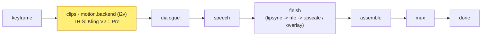

# kling

A **`motion.backend`** module (vivijure-module/2): the **Kuaishou Kling V2.1 Pro**
image-to-video backend, run on RunPod (`kling-v2-1-i2v-pro`). It turns one shot's start keyframe
into a clip. Distinctive trait: Kling accepts only a **discrete duration enum {5, 10} seconds** (not
a continuous range), and exposes generation knobs other backends don't -- a guidance scale, a
negative prompt, and a safety checker.

## Where it fits

`motion.backend` is a **pick_one** hook: the studio binds exactly one motion backend per render, and
this is one selectable provider among several (seedance, kling, minimax-hailuo, google-veo, vidu-q3,
alibaba-wan). It sits at the **clips** stage, right after the keyframe is
fixed and before dialogue: the keyframe drives the motion, the clip flows on into the dialogue and
speech phases and then finish.

## Configuration

Operator settings to self-host this module.

**Secrets** (set after deploy, never committed):
- `RUNPOD_API_KEY` -- the RunPod API key for the endpoint. Use a DEDICATED, scoped vivijure key (one
  per module, so a leak's blast radius is this module):
  `npx wrangler secret put RUNPOD_API_KEY -c modules/kling/wrangler.toml`.

**Bindings / env** (`wrangler.toml`):
- `R2_RENDERS` -> R2 bucket **`vivijure`** (the shared render bucket; the finished clip is written
  here for the film assembler).
- `account_id` is injected via the `CLOUDFLARE_ACCOUNT_ID` env var, never hardcoded.

**Model / endpoint**: fixed in code -- `ENDPOINT = https://api.runpod.ai/v2/kling-v2-1-i2v-pro`.
Selecting a different model means binding a different `motion.backend` module, not changing a knob.

**Render knobs** (`config_schema`, set per render in the planner; the core clamps against the
schema):
- `guidance_scale` (float, `0`--`1`, default `0.5`) -- prompt-adherence strength.
- `negative_prompt` (string, default `""`) -- content to steer away from.
- `enable_safety_checker` (bool, default `true`) -- the provider safety filter.
- Per-shot `seconds` snaps **up** to the nearest of **{5, 10}** in code (not a knob).

## Contract

- **Hook**: `motion.backend` (cardinality `pick_one`). `provides: i2v-cloud` ("Kling V2.1 Pro
  (cloud i2v)"), `ui { section: "motion", order: 20 }`.
- **Input** (`MotionBackendInput`): `shot_id`, `keyframe_url` (a presigned, fetchable URL of the
  start keyframe), `prompt`, `seconds`.
- **Config** (`config_schema`): `guidance_scale` (0--1, default 0.5), `negative_prompt`,
  `enable_safety_checker` (default on). Per-shot `seconds` snaps **up** to the nearest allowed
  duration in **{5, 10}** (never shorter than the shot, which would clip the dialogue).
- **Output** (`MotionBackendOutput`): `shot_id`, `clip_key` (the stored clip), `fps` (24), `frames`.
- **Async**: cloud i2v takes minutes, longer than a Worker request can hold. `POST /invoke` submits
  to RunPod and returns a poll token immediately; `POST /poll` checks status and, on completion,
  downloads the clip and stores it to the shared **`vivijure`** R2 bucket (where the film assembler
  finds it). Bound into the core as `MODULE_KLING`.

## License

**AGPL-3.0-only.** A labor of love, given freely: use it, learn from it, self-host it, build your own creative visions on it. Run it as a network service and the AGPL has you share your changes back, so it stays a commons. It is not for sale, and not to be resold as a SaaS.
