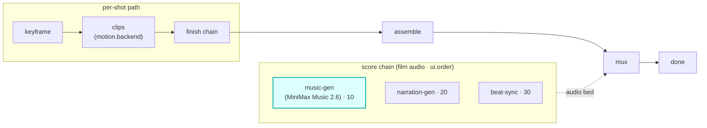

# music-gen

A `score`-hook module (vivijure-module/2). It generates a **music bed for the whole film** with
[MiniMax Music 2.6](https://www.minimax.io/) through Workers AI and the AI Gateway (Unified Billing,
keyless), then writes the track to R2 for muxing onto the assembled film.

## Where it fits

`score` is a film-level audio chain (cardinality `chain`, `0..n`, ordered by `ui.order`). It runs
**parallel to the per-shot path**: while keyframe / clips / finish work shot by shot, the score chain
produces the film's audio bed, which video-finish muxes onto the assembled cut. music-gen is the
first score step (`ui.order` 10), ahead of narration-gen (20) and beat-sync (30).

The seam is the muxed bed: the score chain produces audio keyed in R2; muxing it onto the film is
video-finish's job, not this module's. So music-gen never touches a clip; it only adds a track.

## Configuration

`config_schema` (the core clamps against it; the planner projects each field into a control):

| Option | Type | Default | What it does |
|---|---|---|---|
| `prompt` | string | `""` | music prompt; blank derives one from the storyboard |
| `lyrics` | string | `""` | optional lyrics; blank uses `[Instrumental]` unless `lyrics_optimizer` is on |
| `is_instrumental` | bool | `true` | instrumental (no vocals) |
| `lyrics_optimizer` | bool | `false` | auto-generate lyrics from the prompt |
| `format` | enum (`mp3`, `wav`) | `mp3` | audio format |
| `bitrate` | enum (`32000`, `64000`, `128000`, `256000`) | `128000` | output bitrate |
| `sample_rate` | enum (`16000`, `24000`, `32000`, `44100`) | `44100` | output sample rate |

**Self-host**: service `vivijure-module-music-gen`, bound into the core as `MODULE_MUSIC_GEN`.
Bindings: `AI` (Workers AI + AI Gateway), `R2_RENDERS` (R2 bucket `vivijure`), `SCORE_WORKFLOW`
(Durable Workflow `MusicGenWorkflow`). Secret: `GATEWAY_ID` (the AI Gateway slug;
`wrangler secret put GATEWAY_ID`). See `wrangler.toml`.

## Contract

- **Hook**: `score` (cardinality `chain`). **Provides**: `minimax-music`,
  "MiniMax Music 2.6 (Workers AI)". `ui { section: "score", order: 10 }`.
- **Async**: a MiniMax generation is a single blocking `env.AI.run` with no async handle, so the
  module runs it inside the `SCORE_WORKFLOW`. `POST /invoke` starts the workflow and returns a poll
  token; `POST /poll` returns the result when the track is written to R2.

## License

**AGPL-3.0-only.** A labor of love, given freely: use it, learn from it, self-host it, build your own creative visions on it. Run it as a network service and the AGPL has you share your changes back, so it stays a commons. It is not for sale, and not to be resold as a SaaS.
