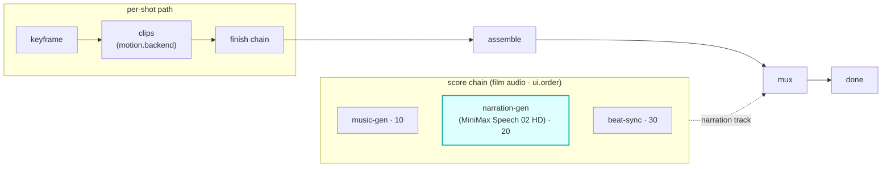

# narration-gen

A `score`-hook module (vivijure-module/2). It synthesizes **narration / voice-over for the whole
film** with [MiniMax Speech 02 HD](https://www.minimax.io/) on a RunPod endpoint, then writes the
track to R2 for muxing onto the assembled film.

## Where it fits

`score` is a film-level audio chain (cardinality `chain`, `0..n`, ordered by `ui.order`), **parallel
to the per-shot path**. Note the distinction: this is narration laid **over the film** on the score
lane, not the per-shot `dialogue` hook (lip-synced speech per cast member). narration-gen sits at
`ui.order` 20, after music-gen (10) and before beat-sync (30).

The seam is the muxed track: narration-gen produces audio keyed in R2; muxing it onto the film is
video-finish's job. The per-shot `dialogue` hook is a separate lane and is unaffected.

## Configuration

`config_schema` (the core clamps against it; the planner projects each field into a control):

| Option | Type | Default | What it does |
|---|---|---|---|
| `text` | string | `""` | narration script; blank derives one from the storyboard |
| `voice_id` | string | `Wise_Woman` | MiniMax voice id |
| `emotion` | enum | `neutral` | delivery emotion |
| `format` | enum (`mp3`, `flac`, `wav`) | `mp3` | audio format |
| `pitch` | int | `0` | pitch shift (-12 to 12) |
| `speed` | float | `1` | speaking rate (0.5 to 2) |
| `volume` | float | `1` | output volume (0 to 10) |
| `sample_rate` | enum (`8000`..`44100`) | `44100` | output sample rate |

**Self-host**: service `vivijure-module-narration-gen`, bound into the core as `MODULE_NARRATION_GEN`.
Binding: `R2_RENDERS` (R2 bucket `vivijure`). Secret: `RUNPOD_API_KEY` (the hosted
`minimax-speech-02-hd` RunPod endpoint; `wrangler secret put RUNPOD_API_KEY`). See `wrangler.toml`.

## Contract

- **Hook**: `score` (cardinality `chain`). **Provides**: `minimax-speech`,
  "MiniMax Speech 02 HD (RunPod)". `ui { section: "score", order: 20 }`.
- **Async**: `POST /invoke` submits the RunPod job and returns a poll token immediately (no blocking
  on the wire); `POST /poll` returns the track when the job completes. Failures are **data**
  (`ok:false`), never thrown across the wire.

## License

**AGPL-3.0-only.** A labor of love, given freely: use it, learn from it, self-host it, build your own creative visions on it. Run it as a network service and the AGPL has you share your changes back, so it stays a commons. It is not for sale, and not to be resold as a SaaS.
