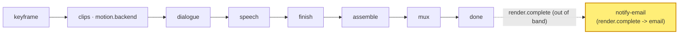

# notify-email

A **`notify`** module (vivijure-module/2): the **email backend** of the notify hook. On a
`render.complete` event it mails the film owner a download link via the native **Cloudflare Email
Service**. It is **out-of-band** -- it hangs off render completion and is not in the render path, so
it never gates or delays a film.

## Where it fits

The `notify` hook fires **after** the render is done. notify-email is a side effect of completion,
not a stage in the chain: the keyframe -> clips -> dialogue -> speech -> finish -> assemble -> mux
pipeline reaches **done**, and only then does the core hand a `render.complete` event to notify. A
notify failure is best-effort data (`ok:false`), never a reason to fail the render.

## Configuration

Operator settings to self-host this module.

**Secrets**: none. Email is sent through the native Cloudflare Email Service binding, not an API key.

**Bindings / env** (`wrangler.toml`):
- `EMAIL` -> the native Cloudflare Email Service `send_email` binding (`[[send_email]] name =
  "EMAIL"`). There is **no `remote` flag**, so prod sends for real and `wrangler dev` simulates (no
  send). The binding is optional in code: with no `EMAIL` bound, `/invoke` is a no-op (empty
  `delivered`), not an error.
- `account_id` is injected via the `CLOUDFLARE_ACCOUNT_ID` env var, never hardcoded.

**One-time domain onboarding**: the from-domain must be enabled for Email Sending before the first
real send (a prerequisite, not part of `wrangler.toml`):
`npx wrangler email sending enable skyphusion.org`.

**From-identity**: fixed in code -- `FROM = render@skyphusion.org` (display name "Vivijure") in
`src/notify.ts`. To send from a different domain, change `FROM` and onboard that domain.

**Recipient**: an `install`-scope `config_schema` field, `notify_email`, the operator sets ONCE on
the studio settings page; the core persists it in the operator-config store and injects it at
notify-invoke time (it is NOT a per-render knob). The recipient is NOT a per-user identity: after the
identity strip (#292) the core sends completion facts only, never a recipient. No `notify_email` set
(or no `EMAIL` binding) -> no-op.

## Contract

- **Hook**: `notify` (out-of-band; not in the render path). `provides: notify-email` ("Email
  notification (Cloudflare Email Service)"), `ui { section: "notify", order: 10 }`.
- **Input** (`NotifyInput`): `event` (`render.complete`), `film_id`, `project`, optional
  `download_url`, `seconds`. There is NO recipient in the input (the identity strip removed it); the
  recipient comes from the operator-set `notify_email` install-config (see Configuration).
- **Output** (`NotifyOutput`): `delivered` -- e.g. `["email:<to>"]` on a send, or `[]` for a no-op.
- **Synchronous**: an email send is fast, well within a Worker request. `POST /invoke` composes the
  render-complete email and sends it, then returns. No recipient or no `EMAIL` binding -> empty
  `delivered` (a no-op, not an error); a real send failure is returned as `ok:false` (best-effort).
- **Transport**: the native Cloudflare Email Service `send_email` binding (`EMAIL`). The from-domain
  (`render@skyphusion.org`) must be onboarded once for Email Sending
  (`wrangler email sending enable skyphusion.org`). In `wrangler dev` the send is simulated; prod
  sends for real. Bound into the core as `MODULE_NOTIFY_EMAIL`.

## License

**AGPL-3.0-only.** A labor of love, given freely: use it, learn from it, self-host it, build your own creative visions on it. Run it as a network service and the AGPL has you share your changes back, so it stays a commons. It is not for sale, and not to be resold as a SaaS.
