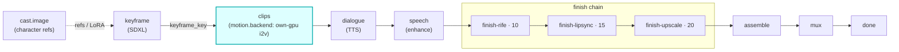

# own-gpu

A first-class **`motion.backend`**-hook module (vivijure-module/2). It animates each start keyframe into
a clip (image-to-video, Wan2.2-I2V) on **your own GPU** via the **vivijure-backend** RunPod endpoint
(`i2v_clip` action).

This is the **clips stage**: it occupies the `motion.backend` slot, the one backend that turns
keyframes into motion. It is the BYO-GPU default (own keys, no per-clip rent), so it sorts ahead of the
cloud i2v modules (Veo, Sora, Kling, Hailuo, Seedance, Vidu, Wan cloud) that fill the same slot.

## Where it fits

The seam is R2: unlike a cloud i2v backend, ours SHARES the `vivijure` bucket. It reads the keyframe by
key and WRITES the finished clip itself, so this module never downloads or re-uploads; it submits,
polls, and surfaces the `clip_key` the backend reported. The next stage (dialogue, then finish) drives
off that clip.

## Configuration

Config options (the planner-projected `config_schema`; the core clamps each against it):

| Option | Type | Default | What it does |
| --- | --- | --- | --- |
| `quality` | enum `draft` / `standard` / `final` | `standard` | i2v quality tier |
| `fps` | int (8..30) | `16` | output frame rate |
| `flow_shift` | float (1..12) | `5.0` | motion amount (lower = faster) |
| `negative_prompt` | string | `""` | additive negative prompt |
| `seed` | int (>= -1) | `-1` | seed (`-1` = random) |

To self-host (service `vivijure-module-own-gpu`, bound into the core as `MODULE_OWN_GPU`):

- **Env at deploy**: `CLOUDFLARE_ACCOUNT_ID` (account_id is injected, never hardcoded).
- **Secrets** (`wrangler secret put`, after deploy): `RUNPOD_API_KEY` (a dedicated, scoped vivijure
  RunPod key) and `RUNPOD_ENDPOINT_ID` (YOUR own i2v endpoint id; kept a secret, #38).
- **Provision**: a RunPod serverless endpoint running the `vivijure-backend` image (Wan2.2-I2V); this
  module calls its `/run` with the `i2v_clip` action. No R2 binding -- the backend shares the bucket
  and does the clip I/O. The same endpoint can also serve `keyframe` and `finish-rife` (different
  actions).

## Contract

- **Hook**: `motion.backend` (the clips backend slot). `ui { section: "motion", order: 5 }` -- low
  order so the own-GPU backend is the default pick over the rented cloud i2v modules.
- **Input** (`MotionBackendInput`): `shot_id`, `keyframe_url` (presigned, for cloud backends),
  `keyframe_key` (the R2 key this backend reads directly), `prompt`, `seconds`.
- **Output** (`MotionBackendOutput`): `shot_id`, `clip_key`, `fps`, `frames`.
- **Async**: `POST /invoke` submits `i2v_clip` to RunPod and returns a poll token; `POST /poll` checks
  `/status/{jobId}` (with the GC-grace window, #141) and surfaces the clip on completion.
- **R2 transport**: the backend reads the keyframe and writes the clip in the shared bucket itself;
  this worker holds no R2 creds.

This is a producer stage, not a polish step: a real failure is an honest `ok:false` (no soft-degrade),
because a missing clip cannot be finished or assembled.

## License

**AGPL-3.0-only.** A labor of love, given freely: use it, learn from it, self-host it, build your own creative visions on it. Run it as a network service and the AGPL has you share your changes back, so it stays a commons. It is not for sale, and not to be resold as a SaaS.
