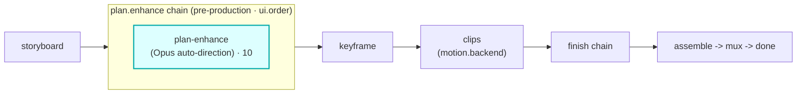

# plan-enhance

A `plan.enhance`-hook module (vivijure-module/2). A **pre-production director pass**: it enriches a
storyboard's shot prompts with cinematic direction (camera, lighting, framing) using the latest Opus
through Cloudflare AI Gateway (Unified Billing, keyless), before any frame is rendered.

## Where it fits

`plan.enhance` is a **pre-production** chain (cardinality `chain`, `0..n`, ordered by `ui.order`): it
runs on the storyboard **before keyframe**, so every downstream stage renders from the enriched plan.
plan-enhance is the step (`ui.order` 10).

The seam is the storyboard itself: this module returns an enriched storyboard, structurally
unchanged (same scenes), that keyframe and the rest of the pipeline render from.

## Configuration

`config_schema` (the core clamps against it; the planner projects each field into a control):

| Option | Type | Default | What it does |
|---|---|---|---|
| `intensity` | enum (`light`, `medium`, `bold`) | `medium` | how strongly the director pass rewrites each shot prompt |

**Two providers, one contract**: Opus first (via AI Gateway) when both `GATEWAY_ID` and
`CF_AIG_TOKEN` are set; otherwise (or on any Opus error) it degrades to the free Workers AI local
model (`@cf/meta/llama-3.3-70b-instruct-fp8-fast`). Swapping an expensive cloud model for a free
local one without touching the hook is the Vivijure modularity thesis in one module.

**Self-host**: service `vivijure-module-plan-enhance`, bound into the core as `MODULE_PLANENHANCE`.
Binding: `AI` (Workers AI runner + AI Gateway accessor). Secrets (optional; both required to use
Opus): `GATEWAY_ID`, `CF_AIG_TOKEN`. Optional var `ENHANCE_MODEL` overrides the cloud model
(default `claude-opus-4-8`). See `wrangler.toml`.

## Contract

- **Hook**: `plan.enhance` (cardinality `chain`). **Provides**: `auto-direction`,
  "Opus auto-direction". `ui { section: "plan", order: 10 }`.
- **Sync**: `POST /invoke` returns the enriched storyboard in one call.

## Soft-degrade

A failure is **data**, never an exception. No model available, or an unparseable reply, returns the
storyboard passed through unchanged with an honest note rather than failing pre-production.

## License

**AGPL-3.0-only.** A labor of love, given freely: use it, learn from it, self-host it, build your own creative visions on it. Run it as a network service and the AGPL has you share your changes back, so it stays a commons. It is not for sale, and not to be resold as a SaaS.
