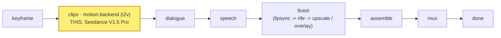

# seedance

A **`motion.backend`** module (vivijure-module/2): the **ByteDance Seedance V1.5 Pro**
image-to-video backend, run on RunPod (`seedance-v1-5-pro-i2v`). It turns one shot's start keyframe
into a clip. It is the **first** reference motion backend and the most configurable of the set:
selectable resolution (480p / 720p / 1080p), aspect ratio, a camera lock, and optional native audio.

## Where it fits

`motion.backend` is a **pick_one** hook: the studio binds exactly one motion backend per render, and
this is one selectable provider among several (seedance, kling, minimax-hailuo, google-veo, vidu-q3,
alibaba-wan). It sits at the **clips** stage, right after the keyframe is
fixed and before dialogue: the keyframe drives the motion, the clip flows on into the dialogue and
speech phases and then finish.

## Configuration

Operator settings to self-host this module.

**Secrets** (set after deploy, never committed):
- `RUNPOD_API_KEY` -- the RunPod API key for the endpoint. Use a DEDICATED, scoped vivijure key (one
  per module, so a leak's blast radius is this module):
  `npx wrangler secret put RUNPOD_API_KEY -c modules/seedance/wrangler.toml`.

**Bindings / env** (`wrangler.toml`):
- `R2_RENDERS` -> R2 bucket **`vivijure`** (the shared render bucket; the finished clip is written
  here for the film assembler).
- `account_id` is injected via the `CLOUDFLARE_ACCOUNT_ID` env var, never hardcoded.

**Model / endpoint**: fixed in code -- `ENDPOINT = https://api.runpod.ai/v2/seedance-v1-5-pro-i2v`.
Selecting a different model means binding a different `motion.backend` module, not changing a knob.

**Render knobs** (`config_schema`, set per render in the planner; the core clamps against the
schema):
- `resolution` (enum `480p` / `720p` / `1080p`, default `720p`).
- `aspect_ratio` (enum `16:9` / `9:16` / `1:1`, default `16:9`).
- `camera_fixed` (bool, default `false`) -- lock the camera (no pan/zoom).
- `generate_audio` (bool, default `false`) -- native provider audio; off lets the core score/mux
  chain own audio.
- `seed` (int, default `-1` = random; min `-1`).
- Per-shot `seconds` is clamped to **4--12s** in code (not a knob).

## Contract

- **Hook**: `motion.backend` (cardinality `pick_one`). `provides: i2v-cloud` ("Seedance V1.5 Pro
  (cloud i2v)"), `ui { section: "motion", order: 10 }`.
- **Input** (`MotionBackendInput`): `shot_id`, `keyframe_url` (a presigned, fetchable URL of the
  start keyframe), `prompt`, `seconds`.
- **Config** (`config_schema`): `resolution` (480p / 720p / 1080p, default 720p), `aspect_ratio`
  (16:9 / 9:16 / 1:1), `camera_fixed`, `generate_audio` (default off -- the core score/mux chain
  owns audio), `seed` (-1 = random). Per-shot `seconds` is clamped to **4--12s**.
- **Output** (`MotionBackendOutput`): `shot_id`, `clip_key` (the stored clip), `fps` (24), `frames`.
- **Async**: cloud i2v takes minutes, longer than a Worker request can hold. `POST /invoke` submits
  to RunPod and returns a poll token immediately; `POST /poll` checks status and, on completion,
  downloads the clip and stores it to the shared **`vivijure`** R2 bucket (where the film assembler
  finds it). Bound into the core as `MODULE_SEEDANCE`.

## License

**AGPL-3.0-only.** A labor of love, given freely: use it, learn from it, self-host it, build your own creative visions on it. Run it as a network service and the AGPL has you share your changes back, so it stays a commons. It is not for sale, and not to be resold as a SaaS.
