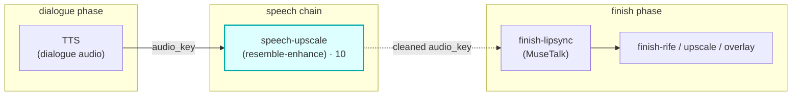

# speech-upscale

A first-class **`speech`**-hook module (vivijure-module/2). It enhances one shot's **dialogue
audio** with [resemble-enhance](https://github.com/resemble-ai/resemble-enhance) (denoise + restore +
bandwidth-extend), dispatched to the dedicated **vivijure-audio-upscale** RunPod endpoint (CUDA).

Pure audio: `audio_key` in -> enhanced `audio_key` out. No clip, no video. The `speech` chain runs
between the **dialogue** (TTS) phase and **finish**, so finish-lipsync (MuseTalk) drives off the
cleaned audio. That ordering is the whole point: lip-sync quality follows the audio it's driven by.

## Where it fits

The seam is the audio key: TTS produces `job.dialogue_audio[shot]`, this module cleans it, and the
cleaned key flows on to MuseTalk -- clean audio in, better lip-sync out. On a soft-degrade the
**original** key passes through unchanged, so finish-lipsync always has audio to work with.

## Contract

- **Hook**: `speech` (cardinality `chain`).
- **Input** (`SpeechInput`): `shot_id` + `audio_key` (the shot's dialogue audio, from
  `job.dialogue_audio`).
- **Config** (`config_schema`): `{ enable: bool = false, denoise: bool = false }` -- **opt-in**; the
  step is in the chain by default but no-ops until `enable` is set. `ui { section: "speech", order:
  10 }`.
- **Output** (`SpeechOutput`) on success: `shot_id`, `audio_key` = the **enhanced** key,
  `applied = ["speech-upscale:resemble-enhance"]`.
- **Async**: `POST /invoke` submits to RunPod and returns a poll token; `POST /poll` checks
  `/status/{jobId}` (with a 150s GC grace, #141) and returns the output on completion.
- **R2 transport**: the endpoint reads `audio_key` and writes `output_key` (`<name>_enh.wav`) in the
  shared bucket itself; this worker holds no R2 creds.

## Soft-degrade (a polish step -- never fail the chain, never fake the tag; #249/#77)

Disabled, missing endpoint, or any endpoint failure all return `ok:true` with the **input**
`audio_key` passed through unchanged, `applied: []` (no fake success tag), and `degraded` set to the
honest reason. The only hard `ok:false` is malformed input or a bad poll token.

## Deploy

Service `vivijure-module-speech-upscale`, bound into the core as `MODULE_SPEECH_UPSCALE`. Secrets
(set after deploy): `RUNPOD_API_KEY`, `RUNPOD_ENDPOINT_ID` (= your vivijure-audio-upscale
endpoint id from the RunPod console). See `wrangler.toml`.
