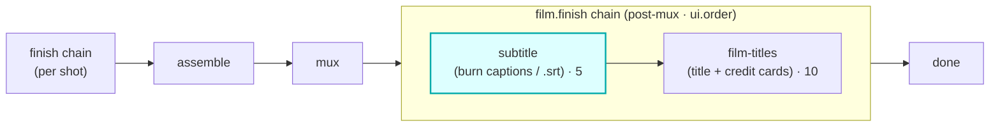

# subtitle

A `film.finish`-hook module (vivijure-module/2). It burns **time-synced dialogue captions** onto the
finished film (and/or emits a soft `.srt` sidecar) via the video-finish CPU container's `/subtitle`
route over Workers VPC.

**Scope:** dialogue captions with **real** per-shot timing. Narration captions are **pending
per-line narration timing -- intentionally not guessed** (see [Caption timing](#caption-timing-how-cues-are-sourced)).

## Where it fits

`film.finish` is a **film-level** chain (cardinality `chain`, `0..n`, ordered by `ui.order`) that
runs **post-mux, before done** -- after the per-shot finish chain, assemble, and mux have produced
the full film. Unlike `finish` (which processes one clip), `film.finish` operates on the whole
assembled film. subtitle is the first step (`ui.order` 5): it captions the **0-based assembled
timeline** before film-titles (`ui.order` 10) wraps that captioned film in title / credit cards. The
order matters -- a title card prepended first would shift every cue's start time.

The seam is the assembled film: this module takes the muxed `film_key` and returns the film with
captions burned in. It holds no R2 binding; it only forwards the SRT + style spec to the container,
which reads and writes the film itself. It runs on the single-film render path (`/api/render/film`);
the scatter/gather path does not dispatch it yet.

## Caption timing (how cues are sourced)

Captions MUST sync to the audio, so this module captions **dialogue only** and never guesses timing.
The **core** computes the cues (`src/captions.ts` `buildCaptionCues`) and hands them in the input;
this module only formats the `.srt` and burns it. For each speaking shot, the line's start is the
**cumulative duration of every preceding shot**, and its end is that shot's window end. The per-shot
durations are the **real** ones the hybrid assembler beat-trims each clip to
(`readShotDurationsFromBundle`'s `target_seconds`), with the authored scene seconds as a fallback.
Because each shot's dialogue TTS is baked into that shot's clip, the line is genuinely spoken during
its window -- the caption lands on the audio.

**Narration is intentionally not captioned (a flagged follow-up).** This module ships dialogue
captions with real timing; **narration captions are pending per-line narration timing -- they are
intentionally not guessed.** narration-gen emits a single film-level voiceover track with no per-line
timestamps, so shot-aligned narration cues would be fabricated. Captioning narration needs a separate
score-path change (narration-gen emitting per-line timestamps); when that lands, the cues slot in
alongside these. They are never faked here.

## Configuration

`config_schema` (the core clamps against it; the planner projects each field into a control):

| Option | Type | Default | What it does |
|---|---|---|---|
| `enabled` | bool | `true` | burn captions onto the finished film |
| `mode` | enum | `burn` | `burn` (burned-in), `sidecar` (soft `.srt` only), or `both` |
| `font` | string | `DejaVu Sans` | caption font (installed in the video-finish container) |
| `font_size` | int | `28` | caption font size in px (8 to 120) |
| `color` | string | `white` | caption text color (`white` / `black` / `yellow`, or ASS `&HBBGGRR`) |
| `position` | enum | `bottom` | caption position: `bottom`, `top`, or `middle` |
| `box_style` | enum | `outline` | outline the text, or draw an opaque `box` behind it |
| `margin_v` | int | `36` | vertical margin from the frame edge in px (0 to 400) |

The caption text + timing is a runtime input (the core's cues), not part of the schema.

**Self-host**: service `vivijure-module-subtitle`, bound into the core as `MODULE_SUBTITLE`. Binding:
`VIDEO_FINISH_VPC` (the video-finish CPU container over Workers VPC). No R2 binding, no secrets (it
only forwards the SRT + style spec). See `wrangler.toml`.

## Contract

- **Hook**: `film.finish` (cardinality `chain`). **Provides**: `subtitle`, "Time-synced dialogue
  captions (burned-in + .srt)". `ui { section: "film.finish", order: 5 }`.

- **Async job+poll (#602)**: an SRT burn is a full re-encode; on a LONG film it can outlast a Worker
  request budget, so `/invoke` submits to the container's `/async/subtitle` route and returns
  `{ ok, pending, poll }`; the core polls `/poll` across ticks. It FALLS BACK to the synchronous
  `/subtitle` route on a pre-#602 container, so an old container keeps working unchanged.

## Soft-degrade

A polish step never fails the chain. Nothing to caption is an intentional no-op
(`noop:no-dialogue`); a disabled module is `noop:disabled`. A sidecar-only run with no presigned
sidecar URL, or a container failure, passes the original film through unchanged with `degraded` set
(e.g. `passthrough:container-failed`) -- never a fake "applied" tag, so a degrade is never silent.

## License

**AGPL-3.0-only.** A labor of love, given freely: use it, learn from it, self-host it, build your own creative visions on it. Run it as a network service and the AGPL has you share your changes back, so it stays a commons. It is not for sale, and not to be resold as a SaaS.
