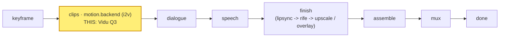

# vidu-q3

A **`motion.backend`** module (vivijure-module/2): the **Vidu Q3**
image-to-video backend, run on RunPod (`vidu-q3-i2v`). It turns one shot's start keyframe into a
clip at **720p**, with shot length clamped to **3--10 seconds**. Distinctive trait: Vidu can emit
both **native audio** and **background music**; here `generate_audio` and `bgm` both default **off**
so the core's score/mux chain owns audio, but each is a one-line opt-in.

## Where it fits

`motion.backend` is a **pick_one** hook: the studio binds exactly one motion backend per render, and
this is one selectable provider among several (seedance, kling, minimax-hailuo, google-veo, vidu-q3,
alibaba-wan). It sits at the **clips** stage, right after the keyframe is
fixed and before dialogue: the keyframe drives the motion, the clip flows on into the dialogue and
speech phases and then finish.

## Configuration

Operator settings to self-host this module.

**Secrets** (set after deploy, never committed):
- `RUNPOD_API_KEY` -- the RunPod API key for the endpoint. Use a DEDICATED, scoped vivijure key (one
  per module, so a leak's blast radius is this module):
  `npx wrangler secret put RUNPOD_API_KEY -c modules/vidu-q3/wrangler.toml`.

**Bindings / env** (`wrangler.toml`):
- `R2_RENDERS` -> R2 bucket **`vivijure`** (the shared render bucket; the finished clip is written
  here for the film assembler).
- `account_id` is injected via the `CLOUDFLARE_ACCOUNT_ID` env var, never hardcoded.

**Model / endpoint**: fixed in code -- `ENDPOINT = https://api.runpod.ai/v2/vidu-q3-i2v`. Selecting a
different model means binding a different `motion.backend` module, not changing a knob.

**Render knobs** (`config_schema`, set per render in the planner; the core clamps against the
schema):
- `generate_audio` (bool, default `false`) -- native Vidu audio; off lets the core score/mux chain
  own audio.
- `bgm` (bool, default `false`) -- provider background music.
- Output size is fixed at **720p** and per-shot `seconds` is clamped to **3--10s** in code (not
  knobs).

## Contract

- **Hook**: `motion.backend` (cardinality `pick_one`). `provides: i2v-cloud` ("Vidu Q3 (cloud
  i2v)"), `ui { section: "motion", order: 60 }`.
- **Input** (`MotionBackendInput`): `shot_id`, `keyframe_url` (a presigned, fetchable URL of the
  start keyframe), `prompt`, `seconds`.
- **Config** (`config_schema`): `generate_audio` (default off; on -> native Vidu audio), `bgm`
  (default off; on -> background music). Output size is **720p**; per-shot `seconds` is clamped to
  **3--10s**.
- **Output** (`MotionBackendOutput`): `shot_id`, `clip_key` (the stored clip), `fps` (24), `frames`.
- **Async**: cloud i2v takes minutes, longer than a Worker request can hold. `POST /invoke` submits
  to RunPod and returns a poll token immediately; `POST /poll` checks status and, on completion,
  downloads the clip and stores it to the shared **`vivijure`** R2 bucket (where the film assembler
  finds it). Bound into the core as `MODULE_VIDU_Q3`.

## License

**AGPL-3.0-only.** A labor of love, given freely: use it, learn from it, self-host it, build your own creative visions on it. Run it as a network service and the AGPL has you share your changes back, so it stays a commons. It is not for sale, and not to be resold as a SaaS.
